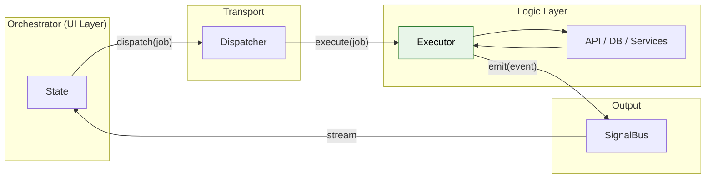
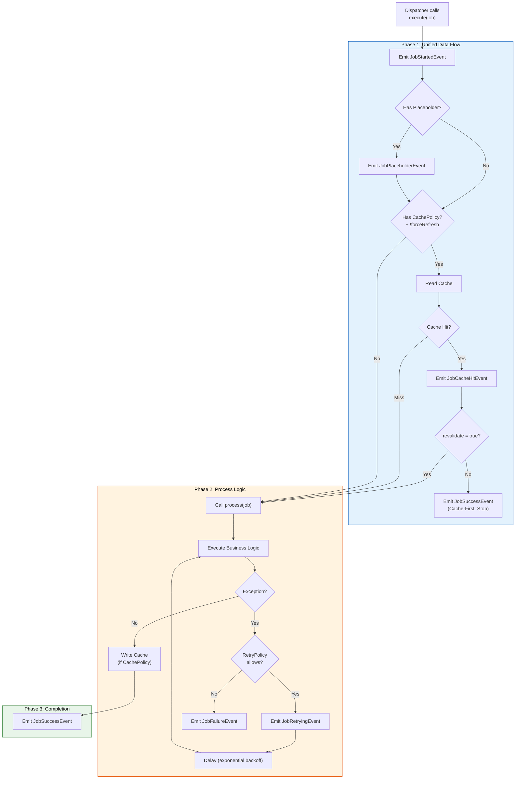

# Executor - Business Logic Processing

Executor is the **"Worker"** of the system. It receives Jobs from Dispatcher, executes pure Business Logic, and sends results back via SignalBus.

> **Role:** Equivalent to Use Case (Clean Architecture), Service Layer, or Command Handler.

### Key Characteristics

- **Pure Dart (Flutter-free):** No UI package imports
- **Automated:** Built-in Error Boundary, Retry, Timeout, Cancellation
- **Unified Data Flow:** Auto-handles Placeholder → Cache → Process → Cache Write

### Position in Architecture



---

## 1. BaseExecutor Structure

```dart
abstract class BaseExecutor<T extends BaseJob> {
  /// Main Entry point - Execute actual logic here
  /// Just return result or throw exception
  Future<dynamic> process(T job);
  
  /// Send success result (auto-called when process returns)
  void emitResult<R>(String correlationId, R data);
  
  /// Send failure (auto-called when process throws)
  void emitFailure(String correlationId, Object error, [StackTrace? stack]);
  
  /// Send progress update
  void emitProgress(String correlationId, {required double progress, ...});
  
  /// Send step progress (auto calc %)
  void emitStep(String correlationId, {required int current, required int total, ...});
  
  /// Send custom event
  void emit(BaseEvent event);
  
  /// Cache operations
  CacheProvider get cacheProvider;
  Future<R?> readCache<R>(String key);
  Future<void> writeCache(String key, dynamic value, {Duration? ttl});
  Future<void> invalidateKey(String key);
  Future<void> invalidatePrefix(String prefix);
  Future<void> invalidateMatching(bool Function(String) predicate);
}
```

---

## 2. Execution Flow

When Dispatcher calls `executor.execute(job)`, the following pipeline runs automatically:



---

## 3. Creating a Simple Executor

```dart
class FetchUserExecutor extends BaseExecutor<FetchUserJob> {
  final ApiService _api;
  
  FetchUserExecutor(this._api);
  
  @override
  Future<User> process(FetchUserJob job) async {
    // Just execute logic and return result
    // Error Boundary auto-catches exceptions
    return await _api.getUser(job.userId);
  }
}
```

**Note:** You only need to `return` the result. The Framework automatically:
- Wraps in `JobSuccessEvent` if success
- Wraps in `JobFailureEvent` if throws
- Handles Timeout, Retry, Cancellation

---

## 4. Registering Executors

```dart
void main() {
  final api = ApiService();
  
  // Register in main() BEFORE runApp()
  Dispatcher().register<FetchUserJob>(FetchUserExecutor(api));
  Dispatcher().register<CreateOrderJob>(CreateOrderExecutor(api));
  Dispatcher().register<DeleteTaskJob>(DeleteTaskExecutor(api));
  
  runApp(MyApp());
}
```

---

## 5. Built-in Features

### 5.1. Error Boundary

Framework wraps `process()` in try-catch:

```dart
@override
Future<User> process(FetchUserJob job) async {
  // If api.getUser() throws exception:
  // → Framework auto-emits JobFailureEvent
  // → With full error and stack trace
  // → App does NOT crash
  return await _api.getUser(job.userId);
}
```

### 5.2. Timeout

Configured on Job, Executor handles automatically:

```dart
// In Job
class SlowApiJob extends BaseJob {
  SlowApiJob() : super(id: generateJobId(), timeout: Duration(seconds: 30));
}

// In Executor - NO CODE NEEDED
// Framework auto-emits JobTimeoutEvent if > 30s
```

### 5.3. Retry with Exponential Backoff

```dart
// In Job
class UnstableApiJob extends BaseJob {
  UnstableApiJob() : super(
    id: generateJobId(),
    retryPolicy: RetryPolicy(
      maxRetries: 3,
      baseDelay: Duration(seconds: 1),
      exponentialBackoff: true,
    ),
  );
}

// In Executor - NO RETRY LOGIC NEEDED
@override
Future<Data> process(UnstableApiJob job) async {
  // Dev writes main logic only, ignores retry details
  // When _api.fetchData() throws:
  // → Framework AUTO-emits JobRetryingEvent
  // → Framework AUTO-delays with exponential backoff
  // → Framework AUTO-calls process() again
  // → After maxRetries failures → Framework emits JobFailureEvent
  return await _api.fetchData();
}
```

### 5.4. Cancellation

```dart
@override
Future<void> process(LongRunningJob job) async {
  for (var item in items) {
    // Check before each heavy step
    job.cancellationToken?.throwIfCancelled();
    
    await processItem(item);
  }
}
```

---

## 6. Progress Reporting

### 6.1. Percentage (0.0 → 1.0)

```dart
@override
Future<void> process(UploadJob job) async {
  emitProgress(job.id, progress: 0.0, message: 'Starting upload...');
  
  for (int i = 0; i < chunks.length; i++) {
    await uploadChunk(chunks[i]);
    emitProgress(
      job.id, 
      progress: (i + 1) / chunks.length,
      message: 'Uploading ${i + 1}/${chunks.length}',
    );
  }
}
```

### 6.2. Steps (Auto Calc %)

```dart
@override
Future<void> process(SyncJob job) async {
  final items = await fetchItems();
  
  for (int i = 0; i < items.length; i++) {
    await syncItem(items[i]);
    emitStep(job.id, current: i + 1, total: items.length);
  }
}
```

---

## 7. Cache Integration

### 7.1. Auto via DataStrategy (on Job)

```dart
// Job with cache policy
class FetchProductsJob extends BaseJob {
  FetchProductsJob() : super(
    id: generateJobId(),
    strategy: DataStrategy(
      cachePolicy: CachePolicy(
        key: 'products_list',
        ttl: Duration(hours: 1),
        revalidate: true, // SWR pattern
      ),
    ),
  );
}

// Executor - NO CACHE CODE NEEDED
// Framework auto: read cache → emit → process → write cache
```

### 7.2. Manual Operations

```dart
@override
Future<void> process(UpdateUserJob job) async {
  // 1. Manual read
  final oldUser = await readCache<User>('user_${job.userId}');
  
  // 2. Perform update
  final newUser = await _api.updateUser(job.userId, job.data);
  
  // 3. Manual write
  await writeCache('user_${job.userId}', newUser, ttl: Duration(hours: 1));
  
  // 4. Invalidate related caches
  await invalidateKey('user_list');
  await invalidatePrefix('user_search_');
  
  return newUser;
}
```

### 7.3. InvalidateCacheJob (Built-in)

Framework provides CacheJobExecutor to invalidate cache:

```dart
// Delete specific key
dispatch(InvalidateCacheJob(key: 'user_123'));

// Delete by prefix
dispatch(InvalidateCacheJob(prefix: 'products_'));

// Delete by predicate
dispatch(InvalidateCacheJob(predicate: (k) => k.contains('temp')));
```

---

## 8. Emit Custom Events

```dart
@override
Future<User> process(LoginJob job) async {
  final user = await _api.login(job.username, job.password);
  
  // Emit custom event for other Orchestrators
  if (user.isFirstLogin) {
    emit(FirstLoginEvent(job.id, user));
  }
  
  if (user.hasUnreadNotifications) {
    emit(NewNotificationsEvent(job.id, count: user.unreadCount));
  }
  
  return user;
}
```

---

## 9. Dependency Injection

Executor is pure Dart → Simple Constructor Injection:

```dart
// In main.dart
void main() {
  final api = ApiService(baseUrl: 'https://api.example.com');
  final db = DatabaseService();
  final logger = LogService();
  
  Dispatcher().register<FetchTasksJob>(FetchTasksExecutor(api));
  Dispatcher().register<SaveLocalJob>(SaveLocalExecutor(db, logger));
  
  runApp(MyApp());
}
```

**With get_it:**

```dart
void main() {
  // Setup DI
  GetIt.I.registerSingleton(ApiService());
  GetIt.I.registerSingleton(DatabaseService());
  
  // Inject from container
  Dispatcher().register<FetchJob>(FetchExecutor(GetIt.I<ApiService>()));
}
```

---

## 10. Unit Testing

Executor is pure Dart → Test is very simple:

```dart
void main() {
  late MockApiService mockApi;
  late FetchUserExecutor executor;
  
  setUp(() {
    mockApi = MockApiService();
    executor = FetchUserExecutor(mockApi);
  });
  
  test('should return user when API succeeds', () async {
    // Arrange
    when(mockApi.getUser('123')).thenAnswer(
      (_) async => User(id: '123', name: 'Ant'),
    );
    
    // Act
    final result = await executor.process(FetchUserJob('123'));
    
    // Assert
    expect(result.name, 'Ant');
    verify(mockApi.getUser('123')).called(1);
  });
  
  test('should throw when API fails', () async {
    when(mockApi.getUser(any)).thenThrow(Exception('Network error'));
    
    expect(
      () => executor.process(FetchUserJob('123')),
      throwsException,
    );
  });
}
```

---

## 11. Examples

### 11.1. Basic Executor

```dart
/// Executor for fetching all tasks
class FetchTasksExecutor extends BaseExecutor<FetchTasksJob> {
  final MockApiService _api;
  FetchTasksExecutor(this._api);

  @override
  Future<List<Task>> process(FetchTasksJob job) async {
    job.cancellationToken?.throwIfCancelled();
    final tasks = await _api.fetchTasks();
    job.cancellationToken?.throwIfCancelled();
    return tasks;
  }
}
```

### 11.2. Retry Executor

```dart
/// Executor with auto-retry for failures
class FetchTasksWithRetryExecutor extends BaseExecutor<FetchTasksWithRetryJob> {
  final EnhancedMockApi _api;
  
  @override
  Future<List<Task>> process(FetchTasksWithRetryJob job) async {
    // RetryPolicy handled automatically by BaseExecutor
    final tasks = await _api.fetchTasksWithFailures(failTimes: 2);
    return tasks;
  }
}
```

### 11.3. Offline Executor

```dart
/// Executor for creating tasks (offline support)
class CreateTaskExecutor extends BaseExecutor<CreateTaskJob> {
  final EnhancedMockApi _api;

  @override
  Future<Task> process(CreateTaskJob job) async {
    if (_api.isOffline) {
      // Return optimistic result if offline
      return job.createOptimisticResult();
    }
    
    return await _api.createTask(job.task);
  }
}
```

---

## 12. Best Practices

### ✅ Do

- **Single Responsibility:** One Executor = One Job type
- **Inject Dependencies:** Via constructor, avoid global/static
- **Check Cancellation:** In loops or before heavy steps
- **Invalidate Cache:** After mutations (POST/PUT/DELETE)
- **Return directly:** No need to call `emitResult` manually

### ❌ Don't

```dart
// ❌ WRONG: Import Flutter packages
import 'package:flutter/material.dart';
import 'package:flutter/widgets.dart';

// ❌ WRONG: Use BuildContext
class BadExecutor extends BaseExecutor<BadJob> {
  final BuildContext context; // NO!
}

// ❌ WRONG: Call emitResult manually
@override
Future<void> process(MyJob job) async {
  final result = await _api.fetch();
  emitResult(job.id, result); // No need, just return result
}

// ❌ WRONG: Forget cancellation check
for (var item in largeList) {
  // Missing: job.cancellationToken?.throwIfCancelled();
  await process(item);
}
```

---

## See Also

- [Job - Action Definition](job.md) - Executor Input
- [Dispatcher - Coordination](dispatcher.md) - Caller
- [Event - Result Types](event.md) - Executor Output
- [Cache & Data Strategy](../advanced/cache.md) - Cache details
