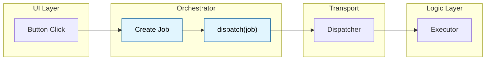
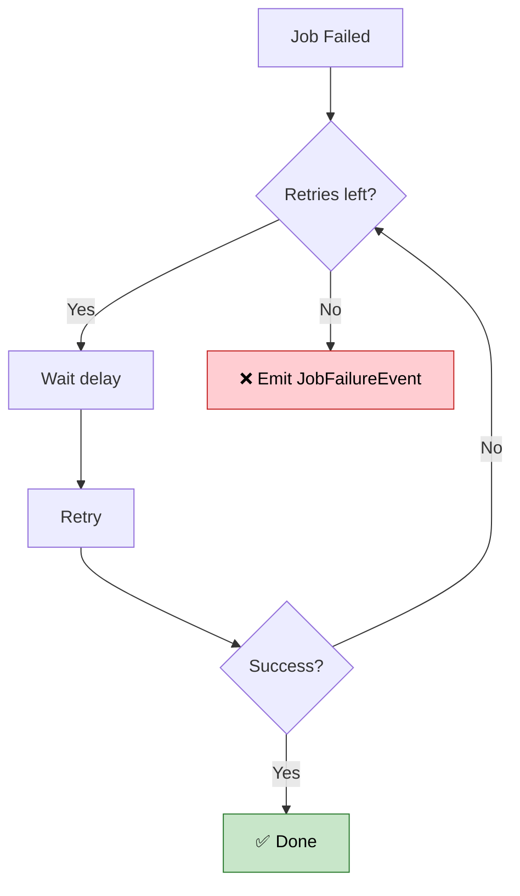
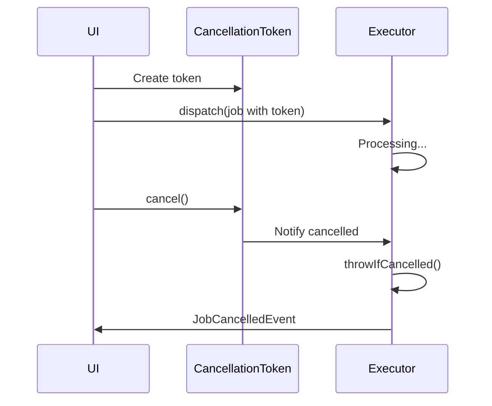
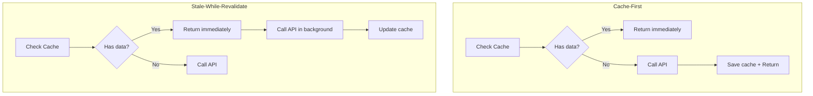

# Job - Action Definition

Job is the **fundamental unit of work** in Flutter Orchestrator. It represents a "Packet of Work" sent from Orchestrator to Executor.

> **Golden Rule:** Job contains Data only (Data Class), **NO** logic. All processing logic resides in the Executor.

### Job's position in architecture



---

## 1. BaseJob Structure

All Jobs must extend `BaseJob`:

```dart
abstract class BaseJob {
  /// Unique ID for tracking (Correlation ID)
  final String id;
  
  /// Job execution timeout (optional)
  final Duration? timeout;
  
  /// Token for cancellation (optional)
  final CancellationToken? cancellationToken;
  
  /// Retry policy for failures (optional)
  final RetryPolicy? retryPolicy;
  
  /// Custom metadata (optional)
  final Map<String, dynamic>? metadata;
  
  /// Data acquisition strategy: cache, placeholder... (optional)
  final DataStrategy? strategy;
  
  /// Bus context - automatically set by Orchestrator
  SignalBus? bus;
}
```

---

## 2. Creating a Simple Job

A basic Job only needs to extend `BaseJob` and call `generateJobId()`:

```dart
class FetchUserJob extends BaseJob {
  final String userId;
  
  FetchUserJob(this.userId) : super(id: generateJobId('fetch_user'));
}

class CreateOrderJob extends BaseJob {
  final List<String> productIds;
  final double totalAmount;
  
  CreateOrderJob({
    required this.productIds,
    required this.totalAmount,
  }) : super(id: generateJobId('create_order'));
}
```

### Naming Conventions
- Use **Verb + Noun**: `FetchUser`, `CreateOrder`, `DeleteItem`, `UpdateProfile`
- Add `Job` suffix: `FetchUserJob`, `CreateOrderJob`

---

## 3. generateJobId() - Unique ID

Helper function to create unique ID for each job instance:

```dart
// Syntax
String generateJobId([String? prefix])

// Example
generateJobId()              // → "job-1703579123456789-a1b2c3"
generateJobId('user')        // → "user-1703579123456789-d4e5f6"
generateJobId('fetch_order') // → "fetch_order-1703579123456789-789abc"
```

### ID Format

Job IDs follow the pattern: `{prefix}-{timestamp}-{randomHex}`

| Component | Description |
|-----------|-------------|
| `prefix` | Custom string from `generateJobId('my_prefix')` or defaults to `'job'` |
| `timestamp` | Microseconds since epoch (ensures ordering and approximate uniqueness) |
| `randomHex` | 6-character cryptographic random hex (ensures uniqueness within same microsecond) |

**Example breakdown:**
```
chamber-1735489200123456-a1b2c3
│       │                │
│       │                └── 6-char random hex
│       └── microseconds since epoch
└── custom prefix
```

> **Note:** The format uses hyphens (`-`) as separators, not underscores.

**Uniqueness guarantees:**
- Microsecond timestamp provides ~1M unique slots per second
- Random hex adds 16^6 = 16,777,216 combinations
- Combined probability of collision is effectively zero in practice

---

## 4. Timeout - Execution Time Limit

Configure maximum execution time. If exceeded, Executor emits `JobTimeoutEvent`.

```dart
class SlowApiJob extends BaseJob {
  SlowApiJob() : super(
    id: generateJobId(),
    timeout: Duration(seconds: 30), // Max 30 seconds
  );
}

class QuickValidationJob extends BaseJob {
  QuickValidationJob() : super(
    id: generateJobId(),
    timeout: Duration(milliseconds: 500), // Max 500ms
  );
}
```

**Use cases:**
- API calls that might hang
- Time-sensitive tasks
- Avoiding UI blocks

---

## 5. RetryPolicy

Configure handling of failures.

### 5.1. RetryPolicy Properties

```dart
class RetryPolicy {
  /// Maximum retries (default: 3)
  final int maxRetries;
  
  /// Base delay between retries (default: 1 second)
  final Duration baseDelay;
  
  /// Use exponential backoff? (default: true)
  final bool exponentialBackoff;
  
  /// Maximum delay limit (default: 30 seconds)
  final Duration maxDelay;
  
  /// Filter which errors to retry (optional)
  final bool Function(Object error)? shouldRetry;
}
```

### 5.2. Exponential Backoff

When `exponentialBackoff = true`, delay increases exponentially:

| Attempt | Delay (baseDelay = 1s) |
|---------|------------------------|
| 1       | 1 second               |
| 2       | 2 seconds              |
| 3       | 4 seconds              |
| 4       | 8 seconds              |
| 5       | 16 seconds             |

Delay never exceeds `maxDelay`.



### 5.3. Usage Examples

```dart
// Retry 5 times with exponential backoff
class UnstableApiJob extends BaseJob {
  UnstableApiJob() : super(
    id: generateJobId(),
    retryPolicy: RetryPolicy(
      maxRetries: 5,
      baseDelay: Duration(seconds: 2),
      exponentialBackoff: true,
      maxDelay: Duration(seconds: 60),
    ),
  );
}

// Only retry network errors, not validation errors
class SmartRetryJob extends BaseJob {
  SmartRetryJob() : super(
    id: generateJobId(),
    retryPolicy: RetryPolicy(
      maxRetries: 3,
      shouldRetry: (error) => error is SocketException || error is TimeoutException,
    ),
  );
}

// Linear retry (fixed delay)
class FixedDelayRetryJob extends BaseJob {
  FixedDelayRetryJob() : super(
    id: generateJobId(),
    retryPolicy: RetryPolicy(
      maxRetries: 3,
      baseDelay: Duration(seconds: 5),
      exponentialBackoff: false,
    ),
  );
}
```

---

## 6. CancellationToken - Cancellation

Allows external job cancellation (e.g., user leaves screen).



### 6.1. Usage

```dart
// 1. Create token
final token = CancellationToken();

// 2. Attach to Job
class LongRunningJob extends BaseJob {
  LongRunningJob(CancellationToken token) : super(
    id: generateJobId(),
    cancellationToken: token,
  );
}

// 3. Dispatch job
orchestrator.dispatch(LongRunningJob(token));

// 4. Cancel when needed
token.cancel();
```

### 6.2. Check in Executor

```dart
class LongRunningExecutor extends BaseExecutor<LongRunningJob, void> {
  @override
  Future<void> process(LongRunningJob job) async {
    for (int i = 0; i < 100; i++) {
      // Check before each step
      job.cancellationToken?.throwIfCancelled();
      
      await heavyComputation(i);
    }
  }
}
```

### 6.3. API Reference

| Method | Description |
|--------|-------------|
| `cancel()` | Request cancellation. Notify all listeners. |
| `isCancelled` | Check status (getter). |
| `throwIfCancelled()` | Throw `CancelledException` if cancelled. |
| `onCancel(callback)` | Register callback. Returns unregister function. |
| `removeListener(callback)` | Remove listener. |
| `clearListeners()` | Clear all listeners without triggering cancel. |

---

## 7. DataStrategy

Configure data fetching and caching strategy.

### 7.1. DataStrategy Structure

```dart
class DataStrategy {
  /// Placeholder data to show immediately (skeleton, optimistic)
  final dynamic placeholder;
  
  /// Cache configuration (null = no cache)
  final CachePolicy? cachePolicy;
}
```

### 7.2. CachePolicy Details

```dart
class CachePolicy {
  /// Unique cache key
  final String key;
  
  /// Time-to-live (null = forever)
  final Duration? ttl;
  
  /// true = SWR: return cache then fetch
  /// false = Cache-First: return cache then stop
  final bool revalidate;
  
  /// true = ignore cache, always fetch (pull-to-refresh)
  final bool forceRefresh;
}
```

### 7.3. Patterns



```dart
// Pattern 1: Cache-First
class CacheFirstJob extends BaseJob {
  CacheFirstJob(String userId) : super(
    id: generateJobId(),
    strategy: DataStrategy(
      cachePolicy: CachePolicy(
        key: 'user_$userId',
        ttl: Duration(hours: 1),
        revalidate: false,
      ),
    ),
  );
}

// Pattern 2: SWR - Stale-While-Revalidate
class SwrJob extends BaseJob {
  SwrJob(String userId) : super(
    id: generateJobId(),
    strategy: DataStrategy(
      cachePolicy: CachePolicy(
        key: 'user_$userId',
        revalidate: true,
      ),
    ),
  );
}

// Pattern 3: Force Refresh
class ForceRefreshJob extends BaseJob {
  ForceRefreshJob(String userId) : super(
    id: generateJobId(),
    strategy: DataStrategy(
      cachePolicy: CachePolicy(
        key: 'user_$userId',
        forceRefresh: true,
      ),
    ),
  );
}

// Pattern 4: Placeholder (Skeleton UI)
class PlaceholderJob extends BaseJob {
  PlaceholderJob() : super(
    id: generateJobId(),
    strategy: DataStrategy(
      placeholder: User.skeleton(), // Single frame display
      cachePolicy: CachePolicy(key: 'user_123'),
    ),
  );
}
```

---

## 8. Metadata

Store custom information not affecting logic.

```dart
class AnalyticsJob extends BaseJob {
  final String eventName;
  
  AnalyticsJob(this.eventName) : super(
    id: generateJobId(),
    metadata: {
      'source': 'home_screen',
      'app_version': '2.1.0',
      'user_tier': 'premium',
      'timestamp': DateTime.now().toIso8601String(),
    },
  );
}
```

**Use cases:**
- Tracking/Analytics
- Debug information
- Logging context
- A/B testing flags

---

## 9. Bus Context

`bus` property is **automatically set by Orchestrator**.

```dart
// Orchestrator does this automatically:
job.bus = _bus; // Set context
dispatcher.dispatch(job);
```

**When to use:**
- Debugging event routing
- Using Scoped Bus for testing
- Writing custom advanced Executors

---

## 10. Best Practices

### ✅ Do

- **Clear naming:** `FetchUserJob`, not `Job1` or `UserJob`
- **Meaningful prefixes:** `generateJobId('fetch_user')`
- **Necessary data only:** Lean and clean
- **Immutable data:** All fields `final`

### ❌ Don't

```dart
// ❌ WRONG: Logic in Job
class BadJob extends BaseJob {
  BadJob() : super(id: generateJobId());
  
  Future<void> execute() async {
    // NO! Logic belongs in Executor
    await api.call();
  }
}

// ❌ WRONG: Overloaded dependencies
class OverloadedJob extends BaseJob {
  final ApiService api;        // NO! Inject into Executor
  final Database db;           // NO!
  final BuildContext context;  // ABSOLUTELY NO!
}

// ❌ WRONG: Vague naming
class J1 extends BaseJob { ... }
class DoStuffJob extends BaseJob { ... }
```

---

## See Also

- [Executor - Logic Processing](executor.md)
- [Orchestrator - UI State Management](orchestrator.md)
- [Event - Result Types](event.md)
