# Orchestrator - UI State Management

Orchestrator is the **"Reactive Brain"** of each screen/feature. It manages State, dispatches Jobs, and handles results returned from Executors.

> **Role:** Equivalent to ViewModel (MVVM), Cubit (BLoC), or Presenter (MVP) in other architectures.

### Position in Architecture


---

## 1. BaseOrchestrator Structure

```dart
abstract class BaseOrchestrator<S> {
  // Current state
  S get state;
  
  // Stream for UI to listen
  Stream<S> get stream;
  
  // Check if any job is running
  bool get hasActiveJobs;
  
  // Emit new state
  void emit(S newState);
  
  // Dispatch job and track it
  String dispatch(BaseJob job);
  
  // Cancel tracking of a job
  void cancelJob(String jobId);
  
  // Cleanup resources
  void dispose();
}
```

---

## 2. Creating a Simple Orchestrator

### 2.1. Define State

State should be **immutable** and have a `copyWith` method:

```dart
class UserState {
  final User? user;
  final bool isLoading;
  final String? error;
  
  const UserState({
    this.user,
    this.isLoading = false,
    this.error,
  });
  
  UserState copyWith({
    User? user,
    bool? isLoading,
    String? error,
  }) {
    return UserState(
      user: user ?? this.user,
      isLoading: isLoading ?? this.isLoading,
      error: error,  // Allow null to clear error
    );
  }
}
```

### 2.2. Create Orchestrator

```dart
class UserOrchestrator extends BaseOrchestrator<UserState> {
  UserOrchestrator() : super(const UserState());
  
  // Public method for UI interaction
  void loadUser(String userId) {
    emit(state.copyWith(isLoading: true, error: null));
    dispatch(FetchUserJob(userId));
  }
  
  void updateProfile(String name) {
    emit(state.copyWith(isLoading: true));
    dispatch(UpdateProfileJob(name));
  }
  
  // Handle results
  @override
  void onActiveSuccess(JobSuccessEvent event) {
    if (event.job is FetchUserJob) {
      final user = event.dataAs<User>();
      emit(state.copyWith(user: user, isLoading: false));
    }
  }
  
  @override
  void onActiveFailure(JobFailureEvent event) {
    emit(state.copyWith(
      isLoading: false,
      error: event.error.toString(),
    ));
  }
}
```

---

## 3. State Management

### 3.1. emit() - Update State

```dart
// Syntax
void emit(S newState)

// Example
emit(state.copyWith(isLoading: true));
emit(state.copyWith(user: newUser, isLoading: false));
emit(UserState()); // Reset to default state
```

**Important Notes:**
- `emit()` triggers UI rebuild
- Do not emit if state hasn't changed (avoid unnecessary rebuilds)
- Always use `copyWith` instead of creating new object from scratch

### 3.2. stream - UI Listening

```dart
// In Widget
StreamBuilder<UserState>(
  stream: orchestrator.stream,
  builder: (context, snapshot) {
    final state = snapshot.data ?? UserState();
    
    if (state.isLoading) {
      return CircularProgressIndicator();
    }
    
    return Text(state.user?.name ?? 'No user');
  },
)
```

### 3.3. state - Access Current State

```dart
// Read state anytime
final currentUser = orchestrator.state.user;
final isLoading = orchestrator.state.isLoading;
```

---

## 4. Dispatch Job


### 4.1. Dispatch and Job ID

```dart
void loadUser(String userId) {
  // dispatch() returns job ID for tracking
  final jobId = dispatch(FetchUserJob(userId));
  
  // Can be saved for cancellation
  _currentJobId = jobId;
}
```

### 4.2. Dispatch Multiple Jobs

```dart
void loadDashboard() {
  // Parallel dispatch
  dispatch(FetchUserJob());
  dispatch(FetchNotificationsJob());
  dispatch(FetchStatsJob());
  
  // All run concurrently
  // Results return via separate hooks
}
```

---

## 5. Event Hooks

Orchestrator provides **9 hooks** to handle events from Executors:

### 5.1. Result Hooks

| Hook | Event Type | When called |
|------|------------|-------------|
| `onActiveSuccess` | `JobSuccessEvent` | Job succeeded |
| `onActiveFailure` | `JobFailureEvent` | Job failed |
| `onActiveCancelled` | `JobCancelledEvent` | Job cancelled |
| `onActiveTimeout` | `JobTimeoutEvent` | Job timed out |

```dart
@override
void onActiveSuccess(JobSuccessEvent event) {
  // Handle by job type
  if (event.job is FetchUserJob) {
    final user = event.dataAs<User>();
    emit(state.copyWith(user: user, isLoading: false));
  } else if (event.job is UpdateProfileJob) {
    // Reload user after update
    dispatch(FetchUserJob(state.user!.id));
  }
}

@override
void onActiveFailure(JobFailureEvent event) {
  emit(state.copyWith(
    isLoading: false,
    error: _mapError(event.error),
  ));
}

@override
void onActiveTimeout(JobTimeoutEvent event) {
  emit(state.copyWith(
    isLoading: false,
    error: 'Connection too slow, please try again',
  ));
}
```

### 5.2. Lifecycle Hooks

| Hook | Event Type | When called |
|------|------------|-------------|
| `onJobStarted` | `JobStartedEvent` | Job execution starts |
| `onJobRetrying` | `JobRetryingEvent` | Job is retrying |
| `onProgress` | `JobProgressEvent` | Progress update |

```dart
@override
void onJobStarted(JobStartedEvent event) {
  // Good for analytics
  analytics.trackJobStarted(event.correlationId);
}

@override
void onJobRetrying(JobRetryingEvent event) {
  emit(state.copyWith(
    statusMessage: 'Retrying... (${event.attempt}/${event.maxRetries})',
  ));
}

@override
void onProgress(JobProgressEvent event) {
  emit(state.copyWith(
    uploadProgress: event.progress,
    statusMessage: event.message,
  ));
}
```

### 5.3. Generic Hooks

| Hook | Description |
|------|-------------|
| `onActiveEvent` | Called for ALL active events (after specific hooks) |
| `onPassiveEvent` | Called for events from OTHER orchestrators |

```dart
@override
void onActiveEvent(BaseEvent event) {
  // Runs AFTER specific hooks (onActiveSuccess, etc.)
  // Useful for common logging
  logger.logEvent(event);
}

@override
void onPassiveEvent(BaseEvent event) {
  // Listen to events from other orchestrators
  if (event is NetworkSyncFailureEvent && event.isPoisoned) {
    // Rollback optimistic UI
    _handleSyncFailure(event);
  }
}
```

---

## 6. Active vs Passive Events


**Active Event:**
- Job dispatched by THIS Orchestrator
- Goes through specific hooks: `onActiveSuccess`, `onActiveFailure`...
- Usually updates State

**Passive Event:**
- Job dispatched by OTHER Orchestrator
- Only goes through `onPassiveEvent`
- Usually used to sync state between screens

```dart
// Example: NotificationOrchestrator listens for new messages
@override
void onPassiveEvent(BaseEvent event) {
  if (event is JobSuccessEvent && event.job is SendMessageJob) {
    // Increase badge count when new message sent
    emit(state.copyWith(
      unreadCount: state.unreadCount + 1,
    ));
  }
}
```

---

## 7. Progress Tracking

### 7.1. Check running jobs

```dart
// Check if any job is active
bool get isLoading => orchestrator.hasActiveJobs;

// Check specific job ID
bool isThisJobRunning = orchestrator.isJobRunning(jobId);

// Check by Job Type (useful for loading indicators)
bool isUploadingPhoto = orchestrator.isJobTypeRunning<UploadPhotoJob>();
bool isFetchingUser = orchestrator.isJobTypeRunning<FetchUserJob>();
```

### 7.2. Get Progress

```dart
// Get progress (0.0 → 1.0)
double? progress = orchestrator.getJobProgress(jobId);

// In UI
LinearProgressIndicator(
  value: orchestrator.getJobProgress(uploadJobId) ?? 0,
)
```

---

## 8. Cancel Job

```dart
class UploadOrchestrator extends BaseOrchestrator<UploadState> {
  String? _currentUploadJobId;
  
  void startUpload(File file) {
    _currentUploadJobId = dispatch(UploadFileJob(file));
  }
  
  void cancelUpload() {
    if (_currentUploadJobId != null) {
      cancelJob(_currentUploadJobId!);
      emit(state.copyWith(isCancelled: true));
      _currentUploadJobId = null;
    }
  }
}
```

**Note:** `cancelJob()` only stops tracking in Orchestrator. To actually stop the running job, the job needs `CancellationToken` (see [Job - Cancellation](job.md#6-cancellationtoken---cancellation)).

---

## 9. Circuit Breaker (Infinite Loop Protection)

Orchestrator has auto-protection against infinite loops:

```mermaid
flowchart TD
    Event["Event In"] --> Count["Count per sec"]
    Count --> Check{"> Limit?"}
    Check -->|No| Process["Process Normally"]
    Check -->|Yes| Block["🛑 Block Event"]
    Block --> Log["Log Error"]
```



**Config:**
```dart
// Default: 100 events/type/second
OrchestratorConfig.setEventLimit<JobSuccessEvent>(200);
```

---

## 10. Dispose

**MUST** call `dispose()` when Orchestrator is no longer used:

```dart
class MyPage extends StatefulWidget {
  @override
  _MyPageState createState() => _MyPageState();
}

class _MyPageState extends State<MyPage> {
  late final UserOrchestrator _orchestrator;
  
  @override
  void initState() {
    super.initState();
    _orchestrator = UserOrchestrator();
  }
  
  @override
  void dispose() {
    _orchestrator.dispose(); // IMPORTANT!
    super.dispose();
  }
}
```

**Dispose actions:**
- Cancel SignalBus subscription
- Close state stream
- Clear tracking data

---

## 11. Scoped Bus (Advanced)

By default, Orchestrator uses **Global SignalBus**. You can create private bus for testing or module isolation:

```dart
// Create with scoped bus
final scopedBus = SignalBus.scoped();
final orchestrator = UserOrchestrator(bus: scopedBus);

// Events from this orchestrator won't affect others
```

---

## 12. Best Practices

### ✅ Do

- **One Screen = One Orchestrator**
- **Immutable State** with `copyWith`
- **Clear Naming:** `UserOrchestrator`, `CartOrchestrator`
- **Handle all failures** in `onActiveFailure`
- **Always Dispose**

### ❌ Don't

```dart
// ❌ WRONG: Logic inside Orchestrator
class BadOrchestrator extends BaseOrchestrator<State> {
  void loadUser() {
    // NO! Logic belongs in Executor
    final user = await api.fetchUser();
    emit(state.copyWith(user: user));
  }
}

// ❌ WRONG: Mutate state directly
void addItem(Item item) {
  state.items.add(item);  // NO! State must be immutable
  emit(state);
}

// ❌ WRONG: Forget dispose
// → Memory leak, zombie listeners
```

---

## See Also

- [Job - Action Definition](job.md) - Orchestrator Input
- [Executor - Logic Processing](executor.md) - Orchestrator Output
- [Event - Result Types](event.md)
- [SignalBus - Event Communication](signal_bus.md)
