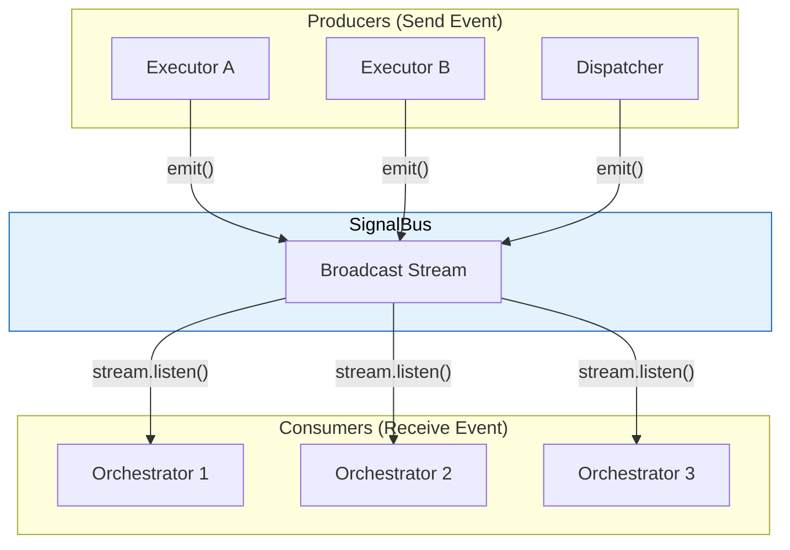
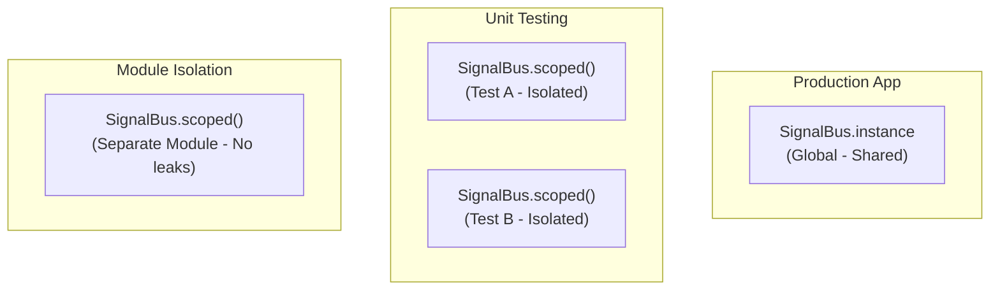
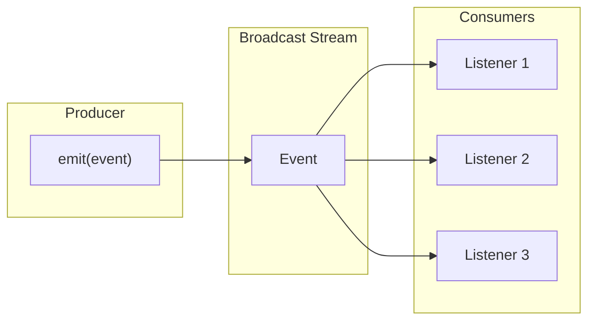
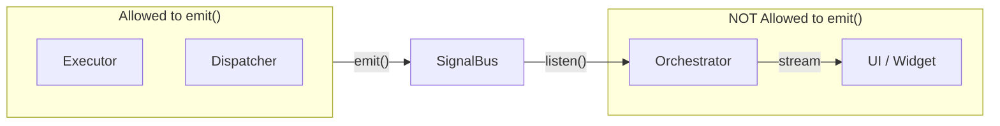

# SignalBus - Event Communication System

SignalBus is the **"Central Nervous System"** of Flutter Orchestrator. It's a simple, high-performance Event Bus that allows system components to communicate without knowing each other directly.

> **Role:** Similar to Message Broker, EventEmitter (Node.js), or RxJS Subject.

### Position in Architecture



---

## 1. SignalBus Structure

```dart
class SignalBus {
  /// Global singleton instance
  static SignalBus get instance;
  
  /// Factory constructor returning global instance
  factory SignalBus();
  
  /// Create isolated bus
  factory SignalBus.scoped();
  
  /// Stream of all events
  Stream<BaseEvent> get stream;
  
  /// Check if bus is disposed
  bool get isDisposed;
  
  /// Send event to bus
  void emit(BaseEvent event);
  
  /// Close bus (cleanup)
  void dispose();
}
```

---

## 2. Singleton Pattern

SignalBus uses **Singleton Pattern** - only one global instance per app.

```dart
// Method 1: Via property (recommended - clearer)
SignalBus.instance.emit(event);
SignalBus.instance.stream.listen(...);

// Method 2: Via factory constructor (backward compatible)
SignalBus().emit(event);
SignalBus().stream.listen(...);

// Both return the SAME instance
print(SignalBus.instance == SignalBus()); // true
```

**Why Singleton?**
- Ensures all components share the same bus
- Events from anywhere can be received by anyone
- Simplifies wiring between components

---

## 3. Scoped Bus (For Testing & Isolation)

Apart from global instance, you can create **isolated buses**:

```dart
// Create isolated bus
final scopedBus = SignalBus.scoped();

// Events on this bus DO NOT affect others
scopedBus.emit(MyEvent()); // Only listeners of scopedBus receive this
```

### 3.1. When to use Scoped Bus?



**Use cases:**

1. **Unit Testing:** Each test has its own bus → no interference
2. **Module Isolation:** Independent modules wanting to contain events
3. **Feature Flags:** Isolate events for experimental features

### 3.2. Testing with Scoped Bus

```dart
void main() {
  late SignalBus testBus;
  late MockExecutor executor;
  late TestOrchestrator orchestrator;
  
  setUp(() {
    testBus = SignalBus.scoped();
    executor = MockExecutor();
    orchestrator = TestOrchestrator(bus: testBus);
  });
  
  tearDown(() {
    testBus.dispose(); // IMPORTANT: Cleanup after each test
  });
  
  test('should receive success event', () async {
    // Emit event to scoped bus
    testBus.emit(JobSuccessEvent('test-id', 'result'));
    
    // Verify orchestrator received it
    expect(orchestrator.lastEvent, isA<JobSuccessEvent>());
  });
}
```

---

## 4. Emit Event

**Only Executor and Dispatcher should emit events** (Security).

```dart
// In Executor
void emitResult<R>(String correlationId, R data) {
  final bus = _activeBus[correlationId] ?? SignalBus.instance;
  bus.emit(JobSuccessEvent<R>(correlationId, data));
}

// Emit failure
void emitFailure(String correlationId, Object error, [StackTrace? stack]) {
  final bus = _activeBus[correlationId] ?? SignalBus.instance;
  bus.emit(JobFailureEvent(correlationId, error, stack));
}

// Emit custom event
void emit(BaseEvent event) {
  final bus = _activeBus[event.correlationId] ?? SignalBus.instance;
  bus.emit(event);
}
```

**Note:** `emit()` is safe even if bus is disposed - it silently ignores instead of crashing.

---

## 5. Listen to Events

### 5.1. Auto-subscription in Orchestrator

When you create an Orchestrator, it **automatically subscribes** to SignalBus:

```dart
class MyOrchestrator extends BaseOrchestrator<MyState> {
  MyOrchestrator() : super(MyState()) {
    // BaseOrchestrator automatically calls:
    // _bus.stream.listen(_routeEvent);
  }
  
  // You just need to override hooks
  @override
  void onActiveSuccess(JobSuccessEvent event) { ... }
}
```

### 5.2. Manual subscription (Advanced)

```dart
// Subscribe directly (rarely needed)
final subscription = SignalBus.instance.stream.listen((event) {
  print('Received: $event');
});

// Cancel when done
subscription.cancel();
```

### 5.3. Filter events

```dart
// Filter by type
SignalBus.instance.stream
  .where((e) => e is JobSuccessEvent)
  .cast<JobSuccessEvent>()
  .listen((e) {
    print('Success with data: ${e.data}');
  });

// Filter by correlation ID
SignalBus.instance.stream
  .where((e) => e.correlationId == myJobId)
  .listen((e) {
    print('Event for my job: $e');
  });

// Filter multiple types
SignalBus.instance.stream
  .where((e) => e is JobSuccessEvent || e is JobFailureEvent)
  .listen((e) {
    print('Terminal event: $e');
  });
```

---

## 6. Broadcast Stream

SignalBus uses **`StreamController.broadcast()`**:



**Characteristics:**
- **Multi-listener:** Many Orchestrators can subscribe simultaneously
- **Fire-and-forget:** Event is sent and done, no waiting for listeners
- **No buffering:** If no listener, event is dropped (no queue)

---

## 7. isDisposed and Error Handling

```dart
// Check before usage
if (!bus.isDisposed) {
  bus.emit(event);
}

// Stream throws StateError if disposed
try {
  final stream = disposedBus.stream; // Throws!
} on StateError catch (e) {
  print('Bus already disposed: $e');
}

// emit() is safe - silent ignore if disposed
disposedBus.emit(event); // No throw, no crash
```

---

## 8. Dispose

### 8.1. Scoped Bus - MUST Dispose

```dart
final scopedBus = SignalBus.scoped();
// ... usage ...
scopedBus.dispose(); // IMPORTANT!
```

### 8.2. Global Instance - DO NOT Dispose

```dart
// ⚠️ WARNING: Never do this in production!
SignalBus.instance.dispose(); // Bus will be PERMANENTLY disabled
```

**Rules:**
- `SignalBus.scoped()` → YOU create → YOU dispose
- `SignalBus.instance` → Framework manages → NO dispose

---

## 9. Security Best Practices

### ✅ Correct Architecture



### ❌ Don't

```dart
// ❌ WRONG: Emit from UI
class MyWidget extends StatelessWidget {
  void onButtonPressed() {
    SignalBus.instance.emit(SomeEvent()); // NO!
  }
}

// ❌ WRONG: Emit from Orchestrator
class MyOrchestrator extends BaseOrchestrator<State> {
  void doSomething() {
    SignalBus.instance.emit(CustomEvent()); // NO!
    // Orchestrator should dispatch(Job) instead of emit(Event)
  }
}
```

### ✅ Do

```dart
// ✅ CORRECT: Emit from Executor
class MyExecutor extends BaseExecutor<MyJob> {
  @override
  Future<void> process(MyJob job) async {
    // ... logic ...
    emit(CustomEvent(job.id)); // OK - Executor is allowed
    return result;
  }
}
```

---

## 10. API Reference

### Properties

| Property | Type | Description |
|----------|------|-------------|
| `instance` | `SignalBus` | Global singleton instance |
| `stream` | `Stream<BaseEvent>` | Stream of all events |
| `isDisposed` | `bool` | true if bus is disposed |

### Factory Constructors

| Constructor | Description |
|-------------|-------------|
| `SignalBus()` | Returns global instance |
| `SignalBus.scoped()` | Creates new isolated bus |

### Methods

| Method | Description |
|--------|-------------|
| `emit(event)` | Send event (silent if disposed) |
| `dispose()` | Close bus (cleanup) |

---

## 11. Best Practices

### ✅ Do

- **Test with Scoped Bus:** Each test uses separate bus
- **Dispose Scoped Bus:** After test completes
- **Only Executor emits:** Keep clean architecture
- **No event storage:** Process immediately upon receipt

### ❌ Don't

- **Emit from UI:** Breaks architecture
- **Dispose global instance:** Breaks entire app
- **Too many subscriptions:** Performance risk
- **Forget cancelling:** Memory leak

---

## See Also

- [Event - Event Types](event.md)
- [Executor - Logic Processing](executor.md)
- [Orchestrator - Event Hooks](orchestrator.md#5-event-hooks)
