# Orchestrator CLI

CLI tool to quickly scaffold Flutter Orchestrator components using Mason templates.

## Overview

```mermaid
graph TB
    subgraph CLI["🖥️ Orchestrator CLI"]
        direction TB
        CREATE["create"]
        INIT["init"]
        DOCTOR["doctor"]
        LIST["list"]
        TEMPLATE["template"]
    end
    
    subgraph CREATE_SUB["Create Commands"]
        JOB["job"]
        EXECUTOR["executor"]
        STATE["state"]
        CUBIT["cubit"]
        NOTIFIER["notifier"]
        RIVERPOD["riverpod"]
        FEATURE["feature"]
    end
    
    subgraph OUTPUT["📁 Generated Files"]
        JOB_FILE["*_job.dart"]
        EXEC_FILE["*_executor.dart"]
        STATE_FILE["*_state.dart"]
        CUBIT_FILE["*_cubit.dart"]
        NOTIFIER_FILE["*_notifier.dart"]
    end
    
    CREATE --> CREATE_SUB
    JOB --> JOB_FILE
    EXECUTOR --> EXEC_FILE
    STATE --> STATE_FILE
    CUBIT --> CUBIT_FILE
    CUBIT --> STATE_FILE
    NOTIFIER --> NOTIFIER_FILE
    NOTIFIER --> STATE_FILE
    RIVERPOD --> NOTIFIER_FILE
    RIVERPOD --> STATE_FILE
    FEATURE --> JOB_FILE
    FEATURE --> EXEC_FILE
    FEATURE --> STATE_FILE
    FEATURE --> CUBIT_FILE
```



## Installation

### From Source (Development)

```bash
# From orchestrator_cli directory
cd packages/orchestrator_cli
dart pub get

# Run directly
dart run bin/orchestrator.dart <command>
```

### Global Activation (After Publish)

```bash
dart pub global activate orchestrator_cli

# Use globally
orchestrator <command>
```

## Commands

### 1. Init - Initialize Project

Creates directory structure and configuration file for an Orchestrator project.

```bash
# Basic initialization
orchestrator init

# With specific state management
orchestrator init -s riverpod

# Overwrite existing config
orchestrator init -f
```

**Generated structure:**

```
lib/
├── features/           # Feature modules
├── core/
│   ├── jobs/          # Shared jobs
│   ├── executors/     # Shared executors
│   └── di/            # Dependency injection
└── shared/            # Shared utilities
orchestrator.yaml      # CLI configuration
```


### 2. Create - Create Components

#### 2.1 Create Job

Create a Job class - representing a work request.

```bash
# Basic
orchestrator create job FetchUser

# Custom output
orchestrator create job FetchUser -o lib/features/user/jobs

# Interactive mode
orchestrator create job -i
```

**Generated file:** `lib/jobs/fetch_user_job.dart`

```dart
import 'package:orchestrator_core/orchestrator_core.dart';

class FetchUserJob extends BaseJob {
  const FetchUserJob();

  @override
  String get name => 'FetchUserJob';
}
```

#### 2.2 Create Executor

Create an Executor class - handling business logic for a Job.

```bash
orchestrator create executor FetchUser
orchestrator create executor FetchUser -o lib/features/user/executors
```

**Generated file:** `lib/executors/fetch_user_executor.dart`

```dart
import 'package:orchestrator_core/orchestrator_core.dart';

class FetchUserExecutor extends BaseExecutor<FetchUserJob> {
  @override
  Future<void> execute(FetchUserJob job) async {
    // TODO: Implement business logic
  }
}
```

#### 2.3 Create State

Create a State class with `copyWith` method.

```bash
orchestrator create state User
orchestrator create state User -o lib/features/user
```

**Generated file:** `lib/states/user_state.dart`

#### 2.4 Create Cubit (Bloc Integration)

Create OrchestratorCubit and State for Bloc.

```bash
orchestrator create cubit User
orchestrator create cubit User -o lib/features/user/cubit
```

**Generated files:**
- `lib/cubits/user_cubit.dart`
- `lib/cubits/user_state.dart`

#### 2.5 Create Notifier (Provider Integration)

```bash
orchestrator create notifier User
orchestrator create notifier User -o lib/features/user/notifier
```

#### 2.6 Create Riverpod Notifier

```bash
orchestrator create riverpod User
orchestrator create riverpod User -o lib/features/user/notifier
```

#### 2.7 Create Feature (Full Scaffold)

Create a full feature with job, executor, and state management.

```bash
# Basic (uses config or default cubit)
orchestrator create feature User

# With specific state management
orchestrator create feature User -s riverpod

# Interactive mode
orchestrator create feature -i

# Skip some components
orchestrator create feature User --no-job
orchestrator create feature User --no-executor

# Custom output
orchestrator create feature User -o lib/modules
```

**Generated structure:**


```
lib/features/user/
├── jobs/
│   └── user_job.dart
├── executors/
│   └── user_executor.dart
├── cubit/                  # or notifier/ for provider/riverpod
│   ├── user_cubit.dart
│   └── user_state.dart
└── user.dart              # Barrel file
```

### 3. Doctor - Project Diagnostics

Analyze and detect problems in project configuration.

```bash
# Run diagnostics
orchestrator doctor

# Verbose
orchestrator doctor -v

# Auto-fix
orchestrator doctor --fix
```

**Performed checks:**

```mermaid
graph LR
    DOCTOR["🩺 doctor"] --> CHECK1["pubspec.yaml"]
    DOCTOR --> CHECK2["orchestrator.yaml"]
    DOCTOR --> CHECK3["Project Structure"]
    DOCTOR --> CHECK4["Dispatcher Setup"]
    DOCTOR --> CHECK5["Executor Registration"]
    DOCTOR --> CHECK6["State Management"]
    DOCTOR --> CHECK7["Import Consistency"]
    
    CHECK1 --> RESULT["📋 Results"]
    CHECK2 --> RESULT
    CHECK3 --> RESULT
    CHECK4 --> RESULT
    CHECK5 --> RESULT
    CHECK6 --> RESULT
    CHECK7 --> RESULT
    
    style DOCTOR fill:#9C27B0,color:#fff
    style RESULT fill:#4CAF50,color:#fff
```



**Sample Output:**

```
🩺 Running Orchestrator Doctor...

━━━━━━━━━━━━━━━━━━━━━━━━━━━━━━━━━━━━━━━━━━━━━━━━━━━━━
📋 Diagnostic Results
━━━━━━━━━━━━━━━━━━━━━━━━━━━━━━━━━━━━━━━━━━━━━━━━━━━━━

✓ Orchestrator dependencies
✓ orchestrator.yaml config
✓ Project structure
✗ Dispatcher setup
  └─ No Dispatcher instance found
  └─ 💡 Create a Dispatcher instance in your DI setup
✓ State management integration

━━━━━━━━━━━━━━━━━━━━━━━━━━━━━━━━━━━━━━━━━━━━━━━━━━━━━
📊 Results: 4 passed, 1 failed
```

### 4. List - List Templates

Show available templates and project components.

```bash
# List all
orchestrator list

# Short alias
orchestrator ls

# Verbose
orchestrator list -v

# Only custom templates
orchestrator list -c
```

### 5. Template - Manage Custom Templates

#### 5.1 Template Init

Generate custom templates from bundled templates.

```bash
# Initialize all custom templates
orchestrator template init

# Initialize specific template
orchestrator template init -t job

# Overwrite existing templates
orchestrator template init -f
```

#### 5.2 Template List

```bash
orchestrator template list
```

**Custom templates location:** `.orchestrator/templates/`

## Configuration

Create `orchestrator.yaml` in project root:

```yaml
# Orchestrator CLI Configuration

# Default State Management
# Options: cubit, provider, riverpod
state_management: cubit

# Output paths
output:
  features: lib/features
  jobs: lib/core/jobs
  executors: lib/core/executors

# Feature structure
feature:
  include_job: true
  include_executor: true
  generate_barrel: true
```

## Template Variables

Available variables for custom templates:

| Variable | Example Input | Output |
|----------|---------------|--------|
| `{{name}}` | FetchUser | FetchUser |
| `{{name.pascalCase()}}` | fetch_user | FetchUser |
| `{{name.camelCase()}}` | FetchUser | fetchUser |
| `{{name.snakeCase()}}` | FetchUser | fetch_user |
| `{{name.constantCase()}}` | FetchUser | FETCH_USER |

## Suggested Workflow


## See Also

- [Getting Started](./getting_started.md)
- [Project Structure](./project_structure.md)
- [Core Concepts](./core_concepts.md)
- [CLI Cheatsheet](./cli_cheatsheet.md)
