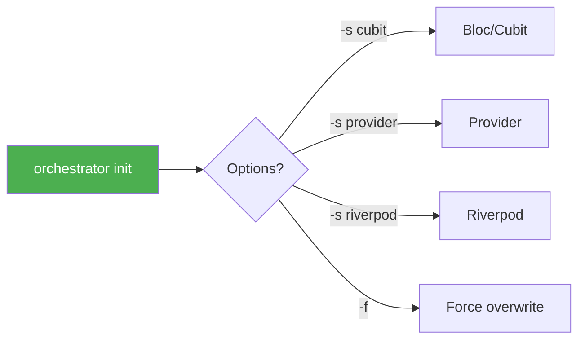
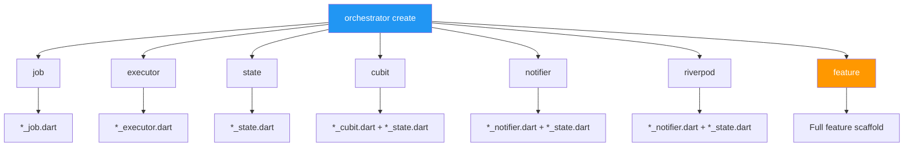
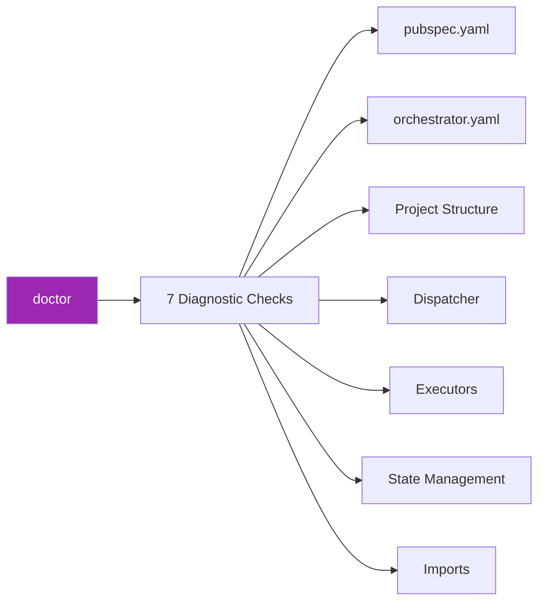
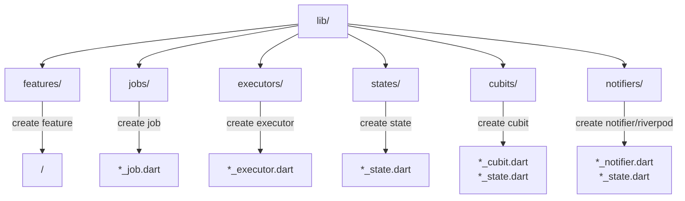

# 📋 Orchestrator CLI Cheatsheet

Quick reference for common CLI commands.

## Quick Reference

```
┌─────────────────────────────────────────────────────────────────────────────┐
│                        ORCHESTRATOR CLI CHEATSHEET                          │
10│ ├─────────────────────────────────────────────────────────────────────────────┤
11│ │                                                                             │
12│ │  🚀 INITIALIZATION                                                          │
13│ │  ────────────────────────────────────────────────────────────────────────   │
14│ │  orchestrator init                    Initialize project                    │
15│ │  orchestrator init -s riverpod        Initialize with Riverpod              │
16│ │  orchestrator init -f                 Overwrite existing config             │
17│ │                                                                             │
18│ │  📦 CREATE COMPONENTS                                                       │
19│ │  ────────────────────────────────────────────────────────────────────────   │
20│ │  orchestrator create job <name>       Create Job class                      │
21│ │  orchestrator create executor <name>  Create Executor class                 │
22│ │  orchestrator create state <name>     Create State class                    │
23│ │  orchestrator create cubit <name>     Create Cubit + State (Bloc)           │
24│ │  orchestrator create notifier <name>  Create Notifier + State (Provider)    │
25│ │  orchestrator create riverpod <name>  Create Notifier + State (Riverpod)    │
26│ │  orchestrator create feature <name>   Create Full Feature                   │
27│ │                                                                             │
28│ │  🩺 DIAGNOSTICS                                                             │
29│ │  ────────────────────────────────────────────────────────────────────────   │
30│ │  orchestrator doctor                  Check project                         │
31│ │  orchestrator doctor -v               Verbose check                         │
32│ │  orchestrator doctor --fix            Auto-fix issues                       │
33│ │                                                                             │
34│ │  📋 LISTING                                                                 │
35│ │  ────────────────────────────────────────────────────────────────────────   │
36│ │  orchestrator list                    List templates                        │
37│ │  orchestrator ls -v                   List verbose details                  │
38│ │  orchestrator ls -c                   Custom templates only                 │
39│ │                                                                             │
40│ │  🎨 CUSTOM TEMPLATES                                                        │
41│ │  ────────────────────────────────────────────────────────────────────────   │
42│ │  orchestrator template init           Create custom templates               │
43│ │  orchestrator template init -t job    Create specific template              │
44│ │  orchestrator template list           List custom templates                 │
45│ │                                                                             │
46│ │  ℹ️  INFO                                                                   │
47│ │  ────────────────────────────────────────────────────────────────────────   │
48│ │  orchestrator --help                  Show help                             │
49│ │  orchestrator --version               Show version                          │
50│ │  orchestrator <cmd> --help            Show specific command help            │
51│ │                                                                             │
52│ └─────────────────────────────────────────────────────────────────────────────┘
```

## Detailed Commands

### 🚀 Init



| Command | Description |
|---------|-------------|
| `orchestrator init` | Init with default config |
| `orchestrator init -s cubit` | Init with Bloc/Cubit |
| `orchestrator init -s provider` | Init with Provider |
| `orchestrator init -s riverpod` | Init with Riverpod |
| `orchestrator init -f` | Overwrite existing config |

### 📦 Create



#### Job

```bash
# Basic
orchestrator create job FetchUser

# Custom path
orchestrator create job FetchUser -o lib/features/user/jobs

# Interactive
orchestrator create job -i
```

#### Executor

```bash
orchestrator create executor FetchUser
orchestrator create executor FetchUser -o lib/features/user/executors
```

#### State

```bash
orchestrator create state User
orchestrator create state User -o lib/features/user
```

#### Cubit (Bloc)

```bash
orchestrator create cubit User
orchestrator create cubit User -o lib/features/user/cubit
```

#### Notifier (Provider)

```bash
orchestrator create notifier User
orchestrator create notifier User -o lib/features/user/notifier
```

#### Riverpod

```bash
orchestrator create riverpod User
orchestrator create riverpod User -o lib/features/user/notifier
```

#### Feature (Full Scaffold)

```bash
# Basic
orchestrator create feature User

# With state management
orchestrator create feature User -s riverpod

# Interactive mode
orchestrator create feature -i

# Skip components
orchestrator create feature User --no-job
orchestrator create feature User --no-executor

# Custom output
orchestrator create feature User -o lib/modules
```

### 🩺 Doctor



| Command | Description |
|---------|-------------|
| `orchestrator doctor` | Run all checks |
| `orchestrator doctor -v` | Verbose details |
| `orchestrator doctor --fix` | Auto-fix issues |

### 📋 List

| Command | Description |
|---------|-------------|
| `orchestrator list` | List all templates |
| `orchestrator ls` | Short command |
| `orchestrator list -v` | List with details |
| `orchestrator list -c` | Custom templates only |

### 🎨 Template

| Command | Description |
|---------|-------------|
| `orchestrator template init` | Create all custom templates |
| `orchestrator template init -t job` | Create specific template |
| `orchestrator template init -f` | Overwrite existing files |
| `orchestrator template list` | List custom templates |

## Common Options

| Option | Short | Description |
|--------|-------|-------------|
| `--help` | `-h` | Show help |
| `--version` | | Show version |
| `--output` | `-o` | Output directory |
| `--state-management` | `-s` | State management type |
| `--interactive` | `-i` | Interactive mode |
| `--verbose` | `-v` | Verbose output |
| `--force` | `-f` | Overwrite existing files |

## Default Output Directories



| Component | Default Path |
|-----------|--------------|
| Feature | `lib/features/<name>/` |
| Job | `lib/jobs/` |
| Executor | `lib/executors/` |
| State | `lib/states/` |
| Cubit | `lib/cubits/` |
| Notifier | `lib/notifiers/` |
| Riverpod | `lib/notifiers/` |

## Workflow Patterns

### 🆕 New Project

```bash
# 1. Init project
orchestrator init -s cubit

# 2. Check setup
orchestrator doctor

# 3. Create first feature
orchestrator create feature User
```

### ➕ Add Feature

```bash
# Create new feature
orchestrator create feature Product -s riverpod

# Or interactive mode
orchestrator create feature -i
```

### 🔧 Add Components

```bash
# Add new job
orchestrator create job FetchProducts -o lib/features/product/jobs

# Add executor
orchestrator create executor FetchProducts -o lib/features/product/executors
```

### 🎨 Customize Templates

```bash
# 1. Export bundled templates
orchestrator template init

# 2. Edit templates in .orchestrator/templates/

# 3. Use custom templates
orchestrator create job MyJob  # Will use custom template if exists
```

### 🔍 Check & Fix

```bash
# Check project
orchestrator doctor -v

# Auto-fix
orchestrator doctor --fix
```

## Configuration File

`orchestrator.yaml`:

```yaml
# Default State Management
state_management: cubit  # cubit | provider | riverpod

# Output paths
output:
  features: lib/features
  jobs: lib/core/jobs
  executors: lib/core/executors

# Feature options
feature:
  include_job: true
  include_executor: true
  generate_barrel: true
```

## Template Variables

| Variable | Input | Output |
|----------|-------|--------|
| `{{name}}` | FetchUser | FetchUser |
| `{{name.pascalCase()}}` | fetch_user | FetchUser |
| `{{name.camelCase()}}` | FetchUser | fetchUser |
| `{{name.snakeCase()}}` | FetchUser | fetch_user |
| `{{name.constantCase()}}` | FetchUser | FETCH_USER |

## Tips & Tricks

### 💡 Use Interactive Mode

```bash
# When unsure about options
orchestrator create feature -i
```

### 💡 Check before committing

```bash
# Check project health
orchestrator doctor
```

### 💡 Customize templates

```bash
# Export and customize
orchestrator template init -t job
# Edit .orchestrator/templates/job/
```

### 💡 Useful Aliases

```bash
# Add to .bashrc or .zshrc
alias oc='orchestrator'
alias occ='orchestrator create'
alias ocf='orchestrator create feature'
alias ocd='orchestrator doctor'
```

## Exit Codes

| Code | Meaning |
|------|---------|
| `0` | Success |
| `1` | General error |
| `64` | Invalid arguments |
| `66` | File not found |
| `73` | Cannot create file |

## See Also

- [CLI Documentation](./cli.md) - Full documentation
- [Getting Started](./getting_started.md) - Quick start
- [Project Structure](./project_structure.md) - Project structure
