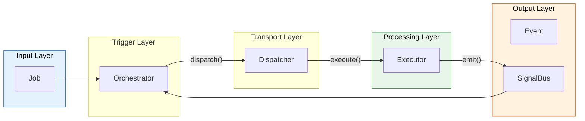

# Cheat Sheet - Core Concepts

> This page provides a **quick overview** of the 6 main components of Flutter Orchestrator. Click "Details" links for full documentation.

---

## 🔄 Data Flow Overview



---

## 🎯 Job (The Work)

**What is it:** Data class describing an action to be performed. Contains data only, **NO** logic.

```dart
class FetchUserJob extends BaseJob {
  final String userId;
  
  FetchUserJob(this.userId) : super(
    id: generateJobId(),
    timeout: Duration(seconds: 30),
    retryPolicy: RetryPolicy(maxRetries: 3),
  );
}
```

| Feature | Description |
|---------|-------------|
| `timeout` | Auto-cancel if exceeded |
| `retryPolicy` | Auto-retry with exponential backoff |
| `cancellationToken` | Allows cancellation mid-flight |
| `strategy` | Cache-First, SWR, Placeholder |

📖 **Details:** [Job - Action Definition](../concepts/job.md)

---

## 🎼 Orchestrator (The Conductor)

**What is it:** Manages UI State. Dispatches Jobs, listens to results via Event Hooks, updates State.

```dart
class UserCubit extends OrchestratorCubit<UserState> {
  void loadUser(String id) {
    emit(state.copyWith(isLoading: true));
    dispatch(FetchUserJob(id));
  }
  
  @override
  void onActiveSuccess(JobSuccessEvent event) {
    emit(state.copyWith(user: event.dataAs<User>(), isLoading: false));
  }
  
  @override
  void onActiveFailure(JobFailureEvent event) {
    emit(state.copyWith(error: event.error.toString(), isLoading: false));
  }
}
```

| Hook | When Called |
|------|-------------|
| `onActiveSuccess` | Job succeeded |
| `onActiveFailure` | Job failed |
| `onProgress` | Progress update |
| `onPassiveEvent` | Event from elsewhere |

📖 **Details:** [Orchestrator - UI State Management](../concepts/orchestrator.md)

---

## 🚦 Dispatcher (The Router)

**What is it:** Singleton router. Receives Job, finds matching Executor, handles Offline Queue.

```dart
// Register in main()
Dispatcher().register<FetchUserJob>(FetchUserExecutor(api));
Dispatcher().register<LoginJob>(LoginExecutor(api));

// Dispatch (usually via Orchestrator)
dispatcher.dispatch(FetchUserJob('123'));
```

| Feature | Description |
|---------|-------------|
| `register<T>()` | Register Executor for Job type |
| `dispatch()` | Send Job, return job ID |
| NetworkAction | Auto-queue when offline |
| Poison Pill | Drop job after 5 failures |

📖 **Details:** [Dispatcher - Coordination Center](../concepts/dispatcher.md)

---

## ⚙️ Executor (The Worker)

**What is it:** Contains Business Logic. Pure Dart, easy to test. Receives Job, returns Result or throws.

```dart
class FetchUserExecutor extends BaseExecutor<FetchUserJob> {
  final ApiService _api;
  FetchUserExecutor(this._api);

  @override
  Future<User> process(FetchUserJob job) async {
    job.cancellationToken?.throwIfCancelled();
    return await _api.getUser(job.userId);
  }
}
```

| Automatic Feature | Description |
|-------------------|-------------|
| Error Boundary | Catches exceptions, emits Failure |
| Retry | Auto-retry via RetryPolicy |
| Cache | Auto read/write cache |
| Progress | `emitProgress()`, `emitStep()` |

📖 **Details:** [Executor - Logic Processing](../concepts/executor.md)

---

## 📨 Event (The Result)

**What is it:** Result from Executor. Broadcast via SignalBus.

| Event | Description | Hook |
|-------|-------------|------|
| `JobSuccessEvent<T>` | Success with data | `onActiveSuccess` |
| `JobFailureEvent` | Failure with error | `onActiveFailure` |
| `JobCancelledEvent` | Cancelled | `onActiveCancelled` |
| `JobTimeoutEvent` | Timed out | `onActiveTimeout` |
| `JobProgressEvent` | Progress 0.0-1.0 | `onProgress` |
| `JobRetryingEvent` | Retrying | `onJobRetrying` |

📖 **Details:** [Event - Event Types](../concepts/event.md)

---

## 📡 SignalBus (The Channel)

**What is it:** Central Event Bus. Executor emits, Orchestrator listens.

```dart
// Singleton instance (Framework managed)
SignalBus.instance

// Scoped bus for testing
final testBus = SignalBus.scoped();
```

| Feature | Description |
|---------|-------------|
| Broadcast Stream | Multiple listeners at once |
| Fire-and-forget | Send and done |
| Scoped Bus | Isolated for testing |

📖 **Details:** [SignalBus - Event Communication](../concepts/signal_bus.md)

---

## 🚀 Next Steps

- [Getting Started](getting_started.md) - Hello World step-by-step
- [Integration](integration.md) - Bloc/Provider/Riverpod
- [Offline Support](../advanced/offline_support.md) - NetworkAction
