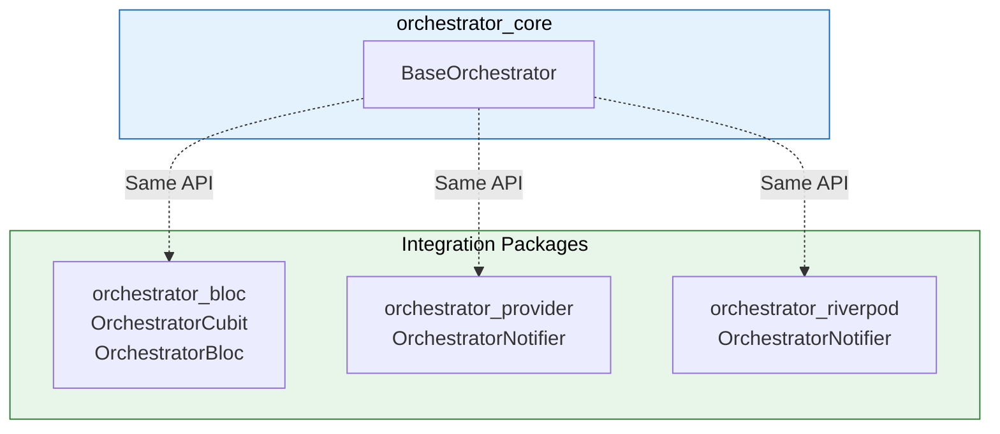
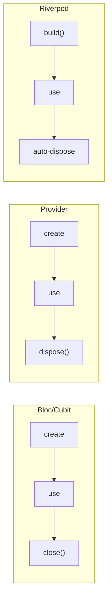

# Integration with State Management Libraries

Flutter Orchestrator provides built-in integration packages for popular state management libraries. You can use **Bloc**, **Provider**, or **Riverpod** while retaining the full power of the Orchestrator architecture.

> **Common Ground:** All integration packages provide **the same API** as `BaseOrchestrator` - only differing in how they integrate with the UI.

### Quick Comparison



---

## 1. Which Package to Choose?

| Package | Library | When to use | Learning Curve |
|---------|---------|-------------|----------------|
| `orchestrator_bloc` | flutter_bloc | Large projects, familiar with Bloc | Medium |
| `orchestrator_provider` | provider | Small-medium projects, lightweight | Low |
| `orchestrator_riverpod` | flutter_riverpod | Strong DI needed, compile-time safety | High |

**Recommendation:**
- **Beginner:** `orchestrator_provider` (Simplest)
- **Large Project:** `orchestrator_bloc` (Mature tooling)
- **Strong DI + Testing:** `orchestrator_riverpod`

---

## 2. Bloc Integration (`orchestrator_bloc`)

### 2.1. Installation

```yaml
dependencies:
  flutter_bloc: ^8.0.0
  orchestrator_bloc: ^1.0.0
  orchestrator_core: ^1.0.0
```

### 2.2. OrchestratorCubit (Recommended)

`OrchestratorCubit` extends `Cubit` and integrates full Orchestrator functionality.

```dart
// 1. Define State
class UserState {
  final User? user;
  final bool isLoading;
  final String? error;
  
  const UserState({this.user, this.isLoading = false, this.error});
  
  UserState copyWith({User? user, bool? isLoading, String? error}) {
    return UserState(
      user: user ?? this.user,
      isLoading: isLoading ?? this.isLoading,
      error: error,
    );
  }
}

// 2. Create Cubit
class UserCubit extends OrchestratorCubit<UserState> {
  UserCubit() : super(const UserState());
  
  void loadUser(String userId) {
    emit(state.copyWith(isLoading: true, error: null));
    dispatch(FetchUserJob(userId));
  }
  
  @override
  void onActiveSuccess(JobSuccessEvent event) {
    final user = event.dataAs<User>();
    emit(state.copyWith(user: user, isLoading: false));
  }
  
  @override
  void onActiveFailure(JobFailureEvent event) {
    emit(state.copyWith(isLoading: false, error: event.error.toString()));
  }
}
```

### 2.3. OrchestratorBloc (Event-Driven)

If you prefer Bloc's event-driven pattern:

```dart
// Custom events
class LoadUserEvent extends OrchestratorBlocEvent {
  final String userId;
  const LoadUserEvent(this.userId);
}

// Bloc
class UserBloc extends OrchestratorBloc<OrchestratorBlocEvent, UserState> {
  UserBloc() : super(const UserState()) {
    on<LoadUserEvent>(_onLoadUser);
  }
  
  void _onLoadUser(LoadUserEvent event, Emitter<UserState> emitter) {
    emitter(state.copyWith(isLoading: true));
    dispatch(FetchUserJob(event.userId));
  }
  
  @override
  void onActiveSuccess(JobSuccessEvent event) {
    emit(state.copyWith(user: event.dataAs<User>(), isLoading: false));
  }
}
```

### 2.4. Widget Integration

```dart
class UserPage extends StatelessWidget {
  @override
  Widget build(BuildContext context) {
    return BlocProvider(
      create: (_) => UserCubit()..loadUser('123'),
      child: BlocBuilder<UserCubit, UserState>(
        builder: (context, state) {
          if (state.isLoading) {
            return CircularProgressIndicator();
          }
          if (state.error != null) {
            return Text('Error: ${state.error}');
          }
          return Text('Hello, ${state.user?.name}');
        },
      ),
    );
  }
}
```

### 2.5. API Reference

| Property/Method | Description |
|-----------------|-------------|
| `dispatch(job)` | Send Job and track it |
| `cancelJob(id)` | Cancel tracking job |
| `hasActiveJobs` | true if jobs are running |
| `getJobProgress(id)` | Get progress 0.0-1.0 |
| `emit(state)` | Update state (from Cubit) |

---

## 3. Provider Integration (`orchestrator_provider`)

### 3.1. Installation

```yaml
dependencies:
  provider: ^6.0.0
  orchestrator_provider: ^1.0.0
  orchestrator_core: ^1.0.0
```

### 3.2. OrchestratorNotifier

`OrchestratorNotifier` extends `ChangeNotifier`:

```dart
// 1. Define State (same as above)
class UserState { ... }

// 2. Create Notifier
class UserNotifier extends OrchestratorNotifier<UserState> {
  UserNotifier() : super(const UserState());
  
  void loadUser(String userId) {
    state = state.copyWith(isLoading: true, error: null);
    dispatch(FetchUserJob(userId));
  }
  
  @override
  void onActiveSuccess(JobSuccessEvent event) {
    state = state.copyWith(user: event.dataAs<User>(), isLoading: false);
  }
  
  @override
  void onActiveFailure(JobFailureEvent event) {
    state = state.copyWith(isLoading: false, error: event.error.toString());
  }
}
```

**Note:** With Provider, you assign `state = newState` instead of calling `emit()`. It automatically calls `notifyListeners()`.

### 3.3. Widget Integration

```dart
class UserPage extends StatelessWidget {
  @override
  Widget build(BuildContext context) {
    return ChangeNotifierProvider(
      create: (_) => UserNotifier()..loadUser('123'),
      child: Consumer<UserNotifier>(
        builder: (context, notifier, _) {
          final state = notifier.state;
          
          if (state.isLoading) {
            return CircularProgressIndicator();
          }
          if (state.error != null) {
            return Text('Error: ${state.error}');
          }
          return Text('Hello, ${state.user?.name}');
        },
      ),
    );
  }
}
```

### 3.4. API Reference

| Property/Method | Description |
|-----------------|-------------|
| `state` | Getter/Setter for current state |
| `dispatch(job)` | Send Job and track it |
| `cancelJob(id)` | Cancel tracking job |
| `hasActiveJobs` | true if jobs are running |
| `getJobProgress(id)` | Get progress 0.0-1.0 |
| `dispose()` | Cleanup (called by Provider) |

---

## 4. Riverpod Integration (`orchestrator_riverpod`)

### 4.1. Installation

```yaml
dependencies:
  flutter_riverpod: ^2.0.0
  orchestrator_riverpod: ^1.0.0
  orchestrator_core: ^1.0.0
```

### 4.2. OrchestratorNotifier

`OrchestratorNotifier` extends Riverpod's `Notifier`:

```dart
// 1. Define State
class UserState { ... }

// 2. Create Notifier
class UserNotifier extends OrchestratorNotifier<UserState> {
  @override
  UserState buildState() => const UserState();
  
  void loadUser(String userId) {
    state = state.copyWith(isLoading: true, error: null);
    dispatch(FetchUserJob(userId));
  }
  
  @override
  void onActiveSuccess(JobSuccessEvent event) {
    state = state.copyWith(user: event.dataAs<User>(), isLoading: false);
  }
  
  @override
  void onActiveFailure(JobFailureEvent event) {
    state = state.copyWith(isLoading: false, error: event.error.toString());
  }
}

// 3. Define Provider
final userProvider = NotifierProvider<UserNotifier, UserState>(
  UserNotifier.new,
);
```

**Note:** 
- Override `buildState()` instead of using constructor
- Bus subscription is setup AUTOMATICALLY in `build()`

### 4.3. Widget Integration

```dart
class UserPage extends ConsumerWidget {
  @override
  Widget build(BuildContext context, WidgetRef ref) {
    final state = ref.watch(userProvider);
    final notifier = ref.read(userProvider.notifier);
    
    // Trigger load on first build
    useEffect(() {
      notifier.loadUser('123');
      return null;
    }, []);
    
    if (state.isLoading) {
      return CircularProgressIndicator();
    }
    if (state.error != null) {
      return Text('Error: ${state.error}');
    }
    return Text('Hello, ${state.user?.name}');
  }
}
```

### 4.4. API Reference

| Property/Method | Description |
|-----------------|-------------|
| `buildState()` | Override to provide initial state |
| `state` | Getter/Setter for state (from Notifier) |
| `dispatch(job)` | Send Job and track it |
| `cancelJob(id)` | Cancel tracking job |
| `hasActiveJobs` | true if jobs are running |
| `getJobProgress(id)` | Get progress 0.0-1.0 |
| `dispose()` | Cleanup (auto by Riverpod) |

---

## 5. Detailed Comparison

### 5.1. State Update Syntax

| Package | Update Syntax |
|---------|---------------|
| Bloc | `emit(newState)` |
| Provider | `state = newState` |
| Riverpod | `state = newState` |

### 5.2. Initial State Provision

| Package | Provision Method |
|---------|------------------|
| Bloc | `super(initialState)` |
| Provider | `super(initialState)` |
| Riverpod | Override `buildState()` |

### 5.3. Lifecycle



---

## 6. Event Hooks (Same for All)

All integration packages provide **identical hooks** to BaseOrchestrator:

| Hook | Description |
|------|-------------|
| `onActiveSuccess` | Job succeeded |
| `onActiveFailure` | Job failed |
| `onActiveCancelled` | Job cancelled |
| `onActiveTimeout` | Job timed out |
| `onProgress` | Progress updated |
| `onJobStarted` | Job started |
| `onJobRetrying` | Job is retrying |
| `onActiveEvent` | All active events |
| `onPassiveEvent` | Events from elsewhere |

---

## 7. Migration Guide

### 7.1. Provider to Bloc

```dart
// Before (Provider)
class UserNotifier extends OrchestratorNotifier<UserState> {
  void loadUser() {
    state = state.copyWith(isLoading: true);
    dispatch(FetchUserJob());
  }
  
  @override
  void onActiveSuccess(JobSuccessEvent event) {
    state = state.copyWith(user: event.dataAs<User>());
  }
}

// After (Bloc)
class UserCubit extends OrchestratorCubit<UserState> {
  void loadUser() {
    emit(state.copyWith(isLoading: true)); // state -> emit
    dispatch(FetchUserJob());
  }
  
  @override
  void onActiveSuccess(JobSuccessEvent event) {
    emit(state.copyWith(user: event.dataAs<User>())); // state -> emit
  }
}
```

### 7.2. Bloc to Riverpod

```dart
// Before (Bloc)
class UserCubit extends OrchestratorCubit<UserState> {
  UserCubit() : super(const UserState());
}

// After (Riverpod)
class UserNotifier extends OrchestratorNotifier<UserState> {
  @override
  UserState buildState() => const UserState(); // super() -> buildState()
}

final userProvider = NotifierProvider<UserNotifier, UserState>(
  UserNotifier.new,
);
```

---

## 8. Best Practices

### ✅ Do

- **Choose one package** and use consistently
- **Register Executors** in `main()` before setting up providers
- **Handle all failure cases** in hooks
- **Dispose correctly** (auto with Bloc/Riverpod, manual with Provider)

### ❌ Don't

```dart
// ❌ WRONG: Mixing state management
class MyWidget extends StatelessWidget {
  void build(BuildContext context) {
    // Using both Bloc AND Provider in same project
    final bloc = context.read<MyBloc>();
    final notifier = context.read<MyNotifier>();
  }
}

// ❌ WRONG: Dispatching from Widget
ElevatedButton(
  onPressed: () {
    Dispatcher().dispatch(MyJob()); // NO! Use Cubit/Notifier
  },
)
```

---

## See Also

- [Getting Started](getting_started.md) - Initial setup
- [Orchestrator](../concepts/orchestrator.md) - BaseOrchestrator details
- [Testing](../advanced/testing.md) - Testing with mocks
