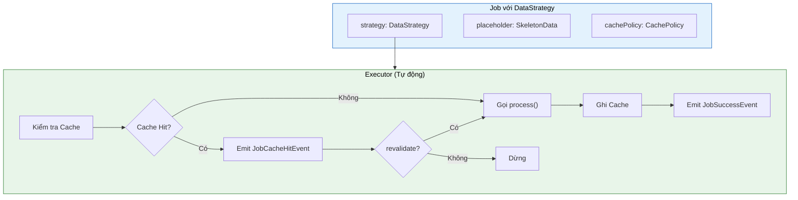
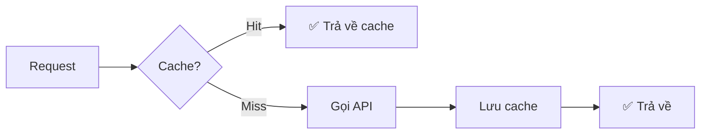
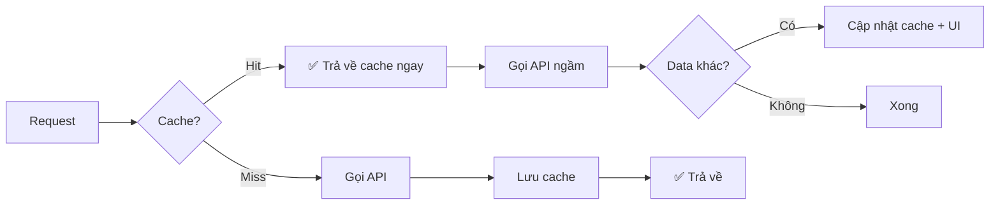
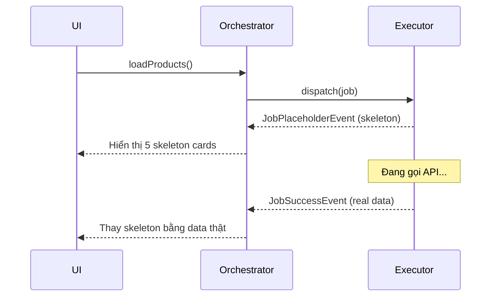
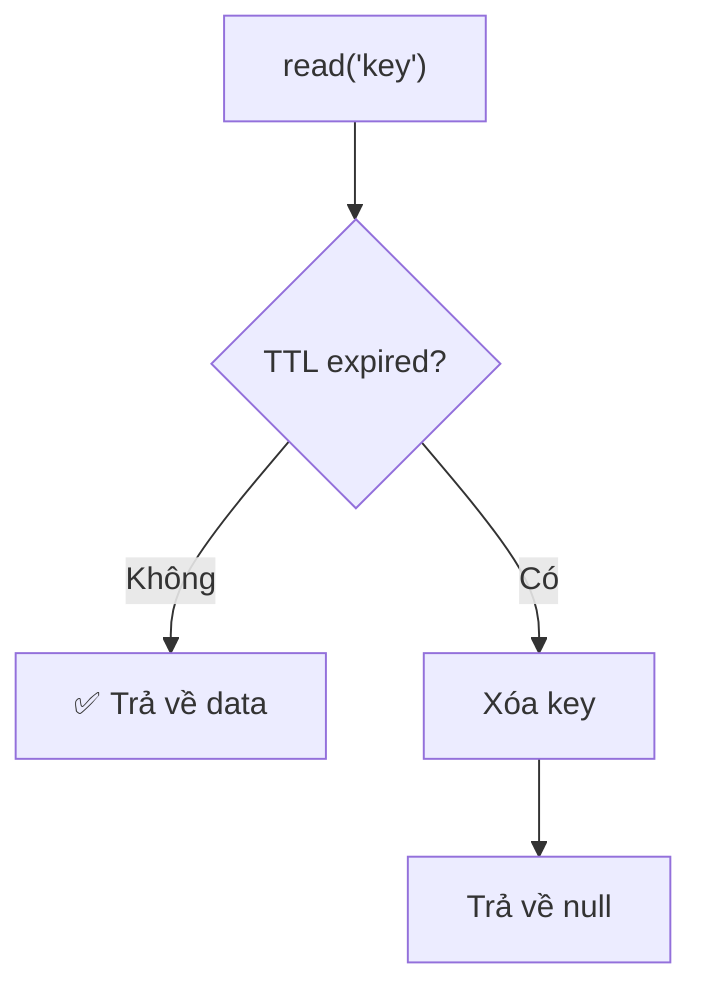

# Cache & Data Strategy

Caching là một trong những tính năng quan trọng nhất để cải thiện trải nghiệm người dùng. Flutter Orchestrator tích hợp sẵn hệ thống cache với nhiều chiến lược linh hoạt.

### Lợi ích của Caching

- **Giảm số lần gọi API** → Tiết kiệm bandwidth, pin, data
- **Hiển thị dữ liệu ngay lập tức** → UX mượt mà hơn
- **Hoạt động offline** → Dữ liệu vẫn có sẵn khi mất mạng
- **Stale-While-Revalidate** → Best of both worlds

---

## 1. Tổng quan kiến trúc



---

## 2. Cấu hình Cache Provider

### 2.1. Trong main()

```dart
import 'package:orchestrator_core/orchestrator_core.dart';

void main() {
  // Sử dụng In-Memory Cache (mặc định)
  OrchestratorConfig.setCacheProvider(InMemoryCacheProvider());
  
  // Hoặc custom provider (Hive, SQLite, SharedPrefs...)
  // OrchestratorConfig.setCacheProvider(HiveCacheProvider());
  
  runApp(MyApp());
}
```

### 2.2. CacheProvider Interface

```dart
abstract class CacheProvider {
  /// Ghi dữ liệu vào cache
  Future<void> write(String key, dynamic value, {Duration? ttl});
  
  /// Đọc dữ liệu từ cache (null nếu không có hoặc hết hạn)
  Future<dynamic> read(String key);
  
  /// Xóa key cụ thể
  Future<void> delete(String key);
  
  /// Xóa theo điều kiện
  Future<void> deleteMatching(bool Function(String key) predicate);
  
  /// Xóa toàn bộ cache
  Future<void> clear();
}
```

### 2.3. Tạo Custom Provider

```dart
class HiveCacheProvider implements CacheProvider {
  final Box _box = Hive.box('cache');
  
  @override
  Future<void> write(String key, value, {Duration? ttl}) async {
    final entry = {
      'value': value,
      'expiry': ttl != null 
        ? DateTime.now().add(ttl).toIso8601String() 
        : null,
    };
    await _box.put(key, entry);
  }
  
  @override
  Future<dynamic> read(String key) async {
    final entry = _box.get(key);
    if (entry == null) return null;
    
    final expiry = entry['expiry'];
    if (expiry != null && DateTime.parse(expiry).isBefore(DateTime.now())) {
      await _box.delete(key);
      return null;
    }
    
    return entry['value'];
  }
  
  // ... implement delete, deleteMatching, clear
}
```

---

## 3. DataStrategy & CachePolicy

### 3.1. Cấu trúc

```dart
class DataStrategy {
  /// Dữ liệu placeholder (Skeleton, loading state...)
  final dynamic placeholder;
  
  /// Cấu hình cache
  final CachePolicy? cachePolicy;
}

class CachePolicy {
  /// Key duy nhất trong cache
  final String key;
  
  /// Thời gian hết hạn (null = vĩnh viễn)
  final Duration? ttl;
  
  /// true = SWR pattern, false = Cache-First
  final bool revalidate;
  
  /// true = Skip cache, force network (Pull-to-Refresh)
  final bool forceRefresh;
}
```

### 3.2. Cấu hình trên Job

```dart
class FetchProductsJob extends BaseJob {
  FetchProductsJob() : super(
    id: generateJobId(),
    strategy: DataStrategy(
      placeholder: List.generate(5, (_) => Product.skeleton()),
      cachePolicy: CachePolicy(
        key: 'products_list',
        ttl: Duration(hours: 1),
        revalidate: true,  // SWR pattern
      ),
    ),
  );
}
```

---

## 4. Các Caching Patterns

### 4.1. Cache-First (Offline-First)

Nếu có cache → Trả về ngay, **KHÔNG** gọi API.



```dart
class FetchUserJob extends BaseJob {
  FetchUserJob(this.userId) : super(
    id: generateJobId(),
    strategy: DataStrategy(
      cachePolicy: CachePolicy(
        key: 'user_$userId',
        ttl: Duration(hours: 24),
        revalidate: false,  // ← Cache-First: Không revalidate
      ),
    ),
  );
  final String userId;
}
```

**Khi nào dùng:**
- Dữ liệu ít thay đổi (User profile, Settings...)
- Ưu tiên tốc độ hơn dữ liệu mới nhất

---

### 4.2. Stale-While-Revalidate (SWR)

Trả về cache ngay → Gọi API ngầm → Cập nhật nếu khác.



```dart
class FetchNewsJob extends BaseJob {
  FetchNewsJob() : super(
    id: generateJobId(),
    strategy: DataStrategy(
      cachePolicy: CachePolicy(
        key: 'news_feed',
        ttl: Duration(minutes: 5),
        revalidate: true,  // ← SWR: Luôn revalidate
      ),
    ),
  );
}
```

**Khi nào dùng:**
- Dữ liệu thay đổi thường xuyên (News feed, Notifications...)
- Muốn hiển thị ngay + cập nhật sau

---

### 4.3. Network-First (Force Refresh)

Bỏ qua cache, **LUÔN** gọi API.

```dart
class FetchProductsJob extends BaseJob {
  final bool isPullToRefresh;
  
  FetchProductsJob({this.isPullToRefresh = false}) : super(
    id: generateJobId(),
    strategy: DataStrategy(
      cachePolicy: CachePolicy(
        key: 'products_list',
        forceRefresh: isPullToRefresh,  // ← Skip cache khi pull-to-refresh
      ),
    ),
  );
}

// Sử dụng
RefreshIndicator(
  onRefresh: () async {
    cubit.loadProducts(isPullToRefresh: true);
  },
  child: ProductList(),
)
```

**Khi nào dùng:**
- Pull-to-refresh (user muốn dữ liệu mới nhất)
- Force sync sau khi mutation

---

### 4.4. Placeholder (Skeleton UI)

Hiển thị UI tạm thời NGAY LẬP TỨC.



```dart
class FetchProductsJob extends BaseJob {
  FetchProductsJob() : super(
    id: generateJobId(),
    strategy: DataStrategy(
      placeholder: List.generate(5, (_) => Product.skeleton()),
    ),
  );
}

// Trong Orchestrator - xử lý placeholder
@override
void onActiveEvent(BaseEvent event) {
  if (event is JobPlaceholderEvent) {
    final skeletons = event.dataAs<List<Product>>();
    emit(state.copyWith(products: skeletons, isShowingSkeleton: true));
  }
}

@override
void onActiveSuccess(JobSuccessEvent event) {
  final products = event.dataAs<List<Product>>();
  emit(state.copyWith(products: products, isShowingSkeleton: false));
}
```

---

## 5. Cache trong Executor

Ngoài caching tự động qua DataStrategy, bạn có thể thao tác cache thủ công:

### 5.1. Đọc/Ghi Cache

```dart
class UpdateUserExecutor extends BaseExecutor<UpdateUserJob> {
  @override
  Future<User> process(UpdateUserJob job) async {
    // 1. Đọc cache hiện tại
    final oldUser = await readCache<User>('user_${job.userId}');
    
    // 2. Gọi API update
    final newUser = await api.updateUser(job.userId, job.data);
    
    // 3. Ghi vào cache với TTL
    await writeCache('user_${job.userId}', newUser, ttl: Duration(hours: 24));
    
    return newUser;
  }
}
```

### 5.2. Invalidate Cache

```dart
class DeleteProductExecutor extends BaseExecutor<DeleteProductJob> {
  @override
  Future<void> process(DeleteProductJob job) async {
    await api.deleteProduct(job.productId);
    
    // Invalidate related caches
    await invalidateKey('product_${job.productId}');
    await invalidateKey('products_list');
    await invalidatePrefix('product_search_');
  }
}
```

### 5.3. Invalidate theo điều kiện

```dart
// Xóa tất cả cache có chứa "temp"
await invalidateMatching((key) => key.contains('temp'));

// Xóa cache của user cụ thể
await invalidateMatching((key) => key.startsWith('user_123_'));
```

---

## 6. InvalidateCacheJob (Built-in)

Framework cung cấp sẵn Job để invalidate cache mà không cần tạo Executor:

```dart
// Xóa key cụ thể
dispatch(InvalidateCacheJob(key: 'user_123'));

// Xóa theo prefix
dispatch(InvalidateCacheJob(prefix: 'products_'));

// Xóa theo điều kiện
dispatch(InvalidateCacheJob(
  predicate: (key) => key.contains('deleted'),
));
```

---

## 7. TTL (Time To Live)

### 7.1. Cấu hình TTL

```dart
CachePolicy(
  key: 'products',
  ttl: Duration(hours: 1),  // Hết hạn sau 1 giờ
)

CachePolicy(
  key: 'user_settings',
  ttl: null,  // Không hết hạn (vĩnh viễn)
)
```

### 7.2. TTL hoạt động như thế nào



---

## 8. Best Practices

### ✅ Nên làm

- **Đặt tên key có ý nghĩa:** `user_{userId}`, `products_page_{page}`
- **Dùng prefix để nhóm:** `product_*`, `user_*`, `search_*`
- **Invalidate sau mutation:** Xóa cache liên quan sau POST/PUT/DELETE
- **Set TTL hợp lý:** Dữ liệu hay thay đổi → TTL ngắn

### ❌ Không nên làm

```dart
// ❌ SAI: Key không rõ ràng
CachePolicy(key: 'data')

// ✅ ĐÚNG: Key mô tả rõ nội dung
CachePolicy(key: 'user_profile_123')

// ❌ SAI: Quên invalidate sau update
class UpdateProductExecutor extends BaseExecutor<UpdateProductJob> {
  Future<Product> process(UpdateProductJob job) async {
    return await api.updateProduct(job.data);
    // Quên invalidate 'products_list' → UI hiển thị data cũ
  }
}

// ✅ ĐÚNG: Invalidate liên quan
class UpdateProductExecutor extends BaseExecutor<UpdateProductJob> {
  Future<Product> process(UpdateProductJob job) async {
    final result = await api.updateProduct(job.data);
    await invalidateKey('products_list');
    await invalidateKey('product_${job.productId}');
    return result;
  }
}
```

---

## 9. Bảng tổng hợp Caching Patterns

| Pattern | `revalidate` | `forceRefresh` | Hành vi |
|---------|--------------|----------------|---------|
| Cache-First | `false` | `false` | Cache hit → Dừng |
| SWR | `true` | `false` | Cache hit → Tiếp tục API |
| Network-First | - | `true` | Bỏ qua cache |
| Placeholder Only | - | - | Không có CachePolicy |

---

## Xem thêm

- [Job - DataStrategy](../concepts/job.md#7-datastrategy---luồng-dữ-liệu-thống-nhất) - Cấu hình trên Job
- [Executor - Cache](../concepts/executor.md#7-tích-hợp-cache) - Thao tác cache trong Executor
