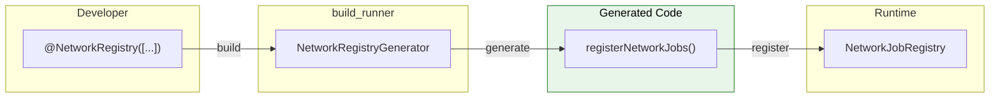
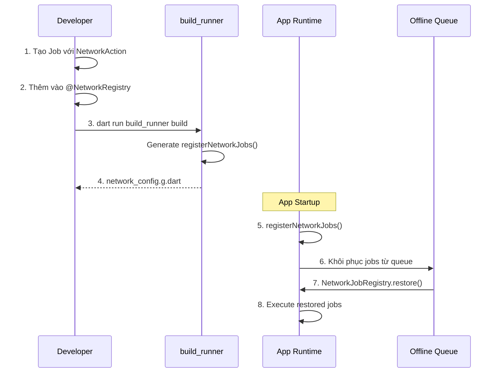

# Code Generation

Flutter Orchestrator sử dụng `build_runner` để tự động sinh code, giúp giảm boilerplate và tránh lỗi khi làm việc với **Network Jobs** (Offline Support).

---

## 1. Tổng quan

### 1.1. Tại sao cần Code Generation?

Khi sử dụng **Offline Support** với `NetworkAction`, mỗi Job cần:
- Được **serialize** (`toJson`) để lưu vào queue khi offline
- Được **deserialize** (`fromJson`) để khôi phục khi online

Code generation giúp **tự động đăng ký** tất cả Jobs vào `NetworkJobRegistry`, đảm bảo:
- ✅ Không sót Job nào
- ✅ Type-safe tại compile time
- ✅ Giảm boilerplate

### 1.2. Flow hoạt động



---

## 2. Cài đặt

### 2.1. pubspec.yaml

```yaml
dependencies:
  orchestrator_core: ^1.0.0

dev_dependencies:
  build_runner: ^2.4.0
  orchestrator_generator: ^1.0.0
```

### 2.2. Chạy Installation

```bash
flutter pub get
```

---

## 3. Sử dụng

### 3.1. Bước 1: Định nghĩa Network Jobs

Mỗi Job cần implement `NetworkAction` và có `fromJson` factory:

```dart
// lib/jobs/send_message_job.dart
import 'package:orchestrator_core/orchestrator_core.dart';

class SendMessageJob extends BaseJob implements NetworkAction<Message> {
  final String content;
  final String recipientId;
  
  SendMessageJob(this.content, this.recipientId)
    : super(id: generateJobId('send_message'));
  
  // BẮT BUỘC: Serialize để lưu queue
  @override
  Map<String, dynamic> toJson() => {
    'content': content,
    'recipientId': recipientId,
  };
  
  // BẮT BUỘC: Deserialize khi khôi phục từ queue
  factory SendMessageJob.fromJson(Map<String, dynamic> json) {
    return SendMessageJob(
      json['content'] as String,
      json['recipientId'] as String,
    );
  }
  
  // Wrapper cho NetworkJobRegistry (trả về BaseJob)
  static BaseJob fromJsonToBase(Map<String, dynamic> json) {
    return SendMessageJob.fromJson(json);
  }
  
  @override
  Message createOptimisticResult() {
    return Message(
      id: id,
      content: content,
      status: MessageStatus.sending,
    );
  }
}
```

### 3.2. Bước 2: Tạo Registry File

Tạo file để khai báo tất cả Network Jobs:

```dart
// lib/network_config.dart
import 'package:orchestrator_core/orchestrator_core.dart';
import 'jobs/send_message_job.dart';
import 'jobs/like_post_job.dart';
import 'jobs/upload_photo_job.dart';

part 'network_config.g.dart';

@NetworkRegistry([
  SendMessageJob,
  LikePostJob,
  UploadPhotoJob,
])
void setupNetworkRegistry() {}
```

### 3.3. Bước 3: Chạy Code Generation

```bash
# Build một lần
dart run build_runner build

# Hoặc watch mode (auto-rebuild khi file thay đổi)
dart run build_runner watch
```

### 3.4. Generated Code

File `network_config.g.dart` sẽ được tạo tự động:

```dart
// GENERATED CODE - DO NOT MODIFY BY HAND

part of 'network_config.dart';

/// Auto-generated function to register all network jobs.
/// Call this during app initialization before processing offline queue.
///
/// Registered jobs:
/// - `SendMessageJob`
/// - `LikePostJob`
/// - `UploadPhotoJob`
void registerNetworkJobs() {
  NetworkJobRegistry.register('SendMessageJob', SendMessageJob.fromJsonToBase);
  NetworkJobRegistry.register('LikePostJob', LikePostJob.fromJsonToBase);
  NetworkJobRegistry.register('UploadPhotoJob', UploadPhotoJob.fromJsonToBase);
}
```

### 3.5. Bước 4: Sử dụng trong main()

```dart
// main.dart
import 'package:flutter/material.dart';
import 'package:orchestrator_core/orchestrator_core.dart';
import 'network_config.dart';

void main() async {
  WidgetsFlutterBinding.ensureInitialized();
  
  // 1. Đăng ký tất cả network jobs
  registerNetworkJobs();
  
  // 2. (Tùy chọn) Cấu hình connectivity provider
  OrchestratorConfig.setConnectivityProvider(ConnectivityPlusProvider());
  
  // 3. (Tùy chọn) Cấu hình network queue manager
  final queueManager = NetworkQueueManager(
    storage: FileNetworkQueueStorage(),
  );
  OrchestratorConfig.setNetworkQueueManager(queueManager);
  
  runApp(MyApp());
}
```

---

## 4. Annotations

### 4.1. @NetworkRegistry

Đánh dấu danh sách các Job types cần đăng ký vào registry:

```dart
@NetworkRegistry([
  JobA,
  JobB,
  JobC,
])
void setupNetworkRegistry() {}
```

**Lưu ý:**
- Mỗi Job trong danh sách phải có `fromJsonToBase` static method
- Function body có thể để trống (chỉ cần annotation)
- Nên đặt tất cả Jobs trong cùng một annotation

### 4.2. @NetworkJob (Tùy chọn)

Đánh dấu một Job class là Network Job (cho documentation):

```dart
@NetworkJob()
class SendMessageJob extends BaseJob implements NetworkAction<Message> {
  // ...
}
```

---

## 5. NetworkJobRegistry

### 5.1. API Reference

```dart
class NetworkJobRegistry {
  /// Đăng ký một Job type với factory function
  static void register(String typeName, BaseJob Function(Map<String, dynamic>) factory);
  
  /// Đăng ký bằng generic type (alternative)
  static void registerType<T>(BaseJob Function(Map<String, dynamic>) factory);
  
  /// Kiểm tra xem Job type đã được đăng ký chưa
  static bool isRegistered(String typeName);
  
  /// Khôi phục Job từ persisted data
  static BaseJob? restore(String typeName, Map<String, dynamic> payload);
  
  /// Xóa tất cả registrations (cho testing)
  static void clear();
}
```

### 5.2. Manual Registration (Alternative)

Nếu không dùng code generation, bạn có thể đăng ký thủ công:

```dart
void main() {
  // Manual registration
  NetworkJobRegistry.register('SendMessageJob', SendMessageJob.fromJsonToBase);
  NetworkJobRegistry.register('LikePostJob', LikePostJob.fromJsonToBase);
  
  runApp(MyApp());
}
```

---

## 6. Troubleshooting

### 6.1. Lỗi thường gặp

| Lỗi | Nguyên nhân | Cách sửa |
|-----|-------------|----------|
| `fromJsonToBase not found` | Job thiếu static method | Thêm `static BaseJob fromJsonToBase(Map<String, dynamic> json)` |
| `Type not found` | Chưa import Job | Thêm import statement |
| `Part directive not found` | Thiếu `part` directive | Thêm `part 'filename.g.dart';` |
| `Conflicting outputs` | File cũ conflict | Chạy với `--delete-conflicting-outputs` |

### 6.2. Clean và Rebuild

```bash
# Xóa tất cả generated files
dart run build_runner clean

# Rebuild với force delete
dart run build_runner build --delete-conflicting-outputs
```

### 6.3. Debug Generated Code

Xem file `.g.dart` để kiểm tra code được generate đúng không:

```bash
cat lib/network_config.g.dart
```

---

## 7. Best Practices

### ✅ Nên làm

- **Một file registry duy nhất:** Quản lý tập trung tất cả Network Jobs
- **Commit file .g.dart:** Để không phải chạy build_runner mỗi lần clone
- **Chạy trong CI/CD:** Verify generated code trong pipeline
- **Naming convention:** `fromJsonToBase` để phân biệt với `fromJson`

### ❌ Không nên làm

```dart
// ❌ SAI: Quên part directive
@NetworkRegistry([SendMessageJob])
void setupRegistry() {}

// ✅ ĐÚNG: Có part directive
part 'network_config.g.dart';

@NetworkRegistry([SendMessageJob])
void setupRegistry() {}

// ❌ SAI: fromJson trả về Type thay vì BaseJob
factory SendMessageJob.fromJson(Map<String, dynamic> json) {
  return SendMessageJob(...);  // NetworkJobRegistry cần BaseJob
}

// ✅ ĐÚNG: fromJsonToBase trả về BaseJob
static BaseJob fromJsonToBase(Map<String, dynamic> json) {
  return SendMessageJob.fromJson(json);
}
```

---

## 8. Workflow đầy đủ



---

## Xem thêm

- [Offline Support](offline_support.md) - Tổng quan về NetworkAction
- [Dispatcher - NetworkAction](../concepts/dispatcher.md#5-xử-lý-networkaction-offline-support) - Cách Dispatcher xử lý
