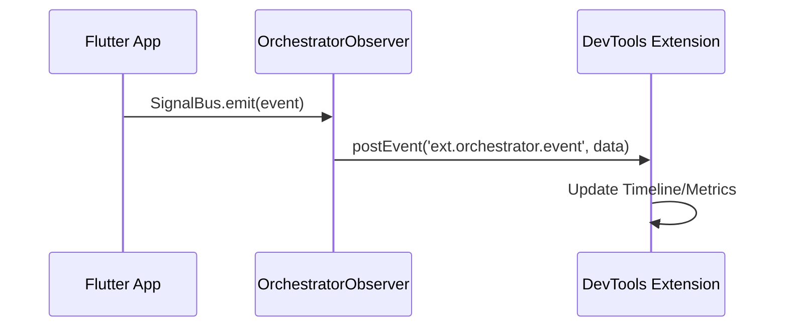

# Hướng Dẫn DevTools Extension

DevTools Extension của Flutter Orchestrator cung cấp khả năng debug real-time cho các ứng dụng sử dụng Orchestrator.

## Tính Năng

### 1. Event Timeline
Theo dõi tất cả jobs và events khi chúng xảy ra:
- Xem loại event (JobStarted, JobSuccess, JobFailure, etc.)
- Lọc theo loại event hoặc tên job
- Xem timestamps và correlation IDs

### 2. Job Inspector
Nhóm các events liên quan theo correlation ID:
- Xem toàn bộ lifecycle của mỗi job
- Kiểm tra dữ liệu success/failure
- Xem retry attempts và chi tiết lỗi

### 3. Metrics Dashboard
Thống kê về việc thực thi jobs trong ứng dụng:
- **Total Events/Jobs**: Tổng số hoạt động
- **Success Rate**: Tỷ lệ jobs thành công
- **Peak Throughput**: Số jobs tối đa xử lý mỗi giây
- **Cache Hit Rate**: Hiệu quả của chiến lược caching
- **Anomaly Detection**: Tự động phát hiện failures và patterns bất thường

### 4. Network Queue
Kiểm tra hàng đợi offline jobs:
- Xem các jobs đang chờ kết nối mạng
- Kiểm tra retry counts và trạng thái poison pill
- Theo dõi tiến trình sync

### 5. Executor Registry
Xem tất cả executors đã đăng ký:
- Xem executors nào khả dụng
- Xác minh registration khi khởi động

## Cài Đặt

DevTools extension tự động khả dụng khi bạn:

1. Thêm `orchestrator_flutter` vào project:
   ```bash
   flutter pub add orchestrator_flutter
   ```

2. Khởi tạo DevTools observer trong `main()`:
   ```dart
   import 'package:orchestrator_flutter/orchestrator_flutter.dart';

   void main() {
     initDevToolsObserver();
     runApp(MyApp());
   }
   ```

3. Chạy app ở chế độ debug hoặc profile và mở Flutter DevTools.

## Mẹo Sử Dụng

- **Filter Events**: Dùng filter bar để tập trung vào loại event hoặc job cụ thể
- **Click Events**: Click vào bất kỳ event nào để xem dữ liệu JSON chi tiết
- **Watch Metrics**: Giữ tab Metrics mở trong khi load testing
- **Debug Offline**: Dùng tab Network Queue để xác minh xử lý offline job

## Khắc Phục Sự Cố

### Extension Không Hiển Thị
- Đảm bảo `orchestrator_flutter` đã được import đúng
- Xác minh `initDevToolsObserver()` được gọi trước `runApp()`
- Kiểm tra đang chạy ở chế độ debug/profile (không phải release)

### Không Có Events Xuất Hiện
- Xác nhận app đang dispatch jobs thông qua Dispatcher
- Kiểm tra executors đã được đăng ký đúng

## Kiến Trúc



Extension hoạt động bằng cách:
1. `OrchestratorObserver` subscribe vào `SignalBus`
2. Events được serialize và gửi qua `dart:developer.postEvent()`
3. DevTools extension nhận và hiển thị events real-time
