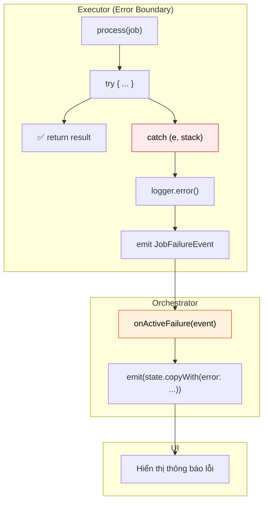
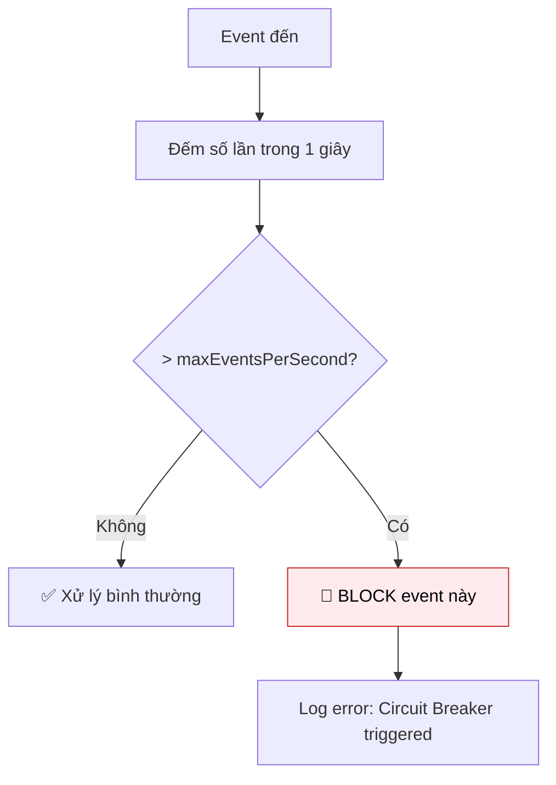

# Error Handling & Logging

Xử lý lỗi tập trung là một trong những điểm mạnh của Flutter Orchestrator. Framework cung cấp **Error Boundary** tự động, **Logging** linh hoạt, và **Circuit Breaker** để bảo vệ ứng dụng.

---

## 1. Tổng quan Error Flow



---

## 2. Error Boundary trong Executor

Framework tự động bọc `process()` trong try-catch. Bạn **không cần** viết code xử lý lỗi trong Executor.

### 2.1. Cách hoạt động

```dart
// Trong Executor - BẠN VIẾT
@override
Future<User> process(FetchUserJob job) async {
  return await api.getUser(job.userId);  // Có thể throw
}

// Framework TỰ ĐỘNG LÀM
Future<void> execute(T job) async {
  try {
    final result = await process(job);
    emitResult(job.id, result);
  } catch (e, stack) {
    OrchestratorConfig.logger.error('Job ${job.id} failed', e, stack);
    emitFailure(job.id, e, stack);  // → JobFailureEvent
  }
}
```

### 2.2. Lợi ích

- ✅ **Không crash app:** Exception được bắt và xử lý gracefully
- ✅ **Stack trace đầy đủ:** Debug dễ dàng
- ✅ **Tự động log:** Lỗi được ghi lại
- ✅ **UI nhận thông báo:** Qua `JobFailureEvent`

---

## 3. Xử lý lỗi trong Orchestrator

### 3.1. Hook cơ bản

```dart
class UserCubit extends OrchestratorCubit<UserState> {
  @override
  void onActiveFailure(JobFailureEvent event) {
    emit(state.copyWith(
      isLoading: false,
      error: _mapError(event.error),
    ));
  }
  
  String _mapError(Object error) {
    if (error is SocketException) {
      return 'Không có kết nối mạng. Vui lòng kiểm tra internet.';
    }
    if (error is TimeoutException) {
      return 'Kết nối quá chậm. Vui lòng thử lại.';
    }
    if (error is UnauthorizedException) {
      return 'Phiên đăng nhập hết hạn. Vui lòng đăng nhập lại.';
    }
    return 'Đã xảy ra lỗi. Vui lòng thử lại sau.';
  }
}
```

### 3.2. Xử lý theo loại Job

```dart
@override
void onActiveFailure(JobFailureEvent event) {
  if (event.correlationId.startsWith('login_')) {
    emit(state.copyWith(loginError: event.error.toString()));
  } else if (event.correlationId.startsWith('fetch_')) {
    emit(state.copyWith(fetchError: event.error.toString()));
  }
}
```

### 3.3. Xử lý tất cả failure types

```dart
@override
void onActiveFailure(JobFailureEvent event) {
  _handleError(event.error, event.stackTrace);
}

@override
void onActiveTimeout(JobTimeoutEvent event) {
  _handleError(TimeoutException('Operation timed out'), null);
}

@override
void onActiveCancelled(JobCancelledEvent event) {
  // Thường không cần hiển thị lỗi vì user chủ động hủy
  emit(state.copyWith(isLoading: false));
}

void _handleError(Object error, StackTrace? stack) {
  emit(state.copyWith(isLoading: false, error: _mapError(error)));
  
  // Log cho debug
  if (kDebugMode) {
    print('Error: $error');
    if (stack != null) print(stack);
  }
}
```

---

## 4. Logging

### 4.1. Cấu hình Logger

```dart
void main() {
  // Development: Log chi tiết
  if (kDebugMode) {
    OrchestratorConfig.enableDebugLogging();
  }
  
  // Production: Log errors only + gửi lên server
  if (kReleaseMode) {
    OrchestratorConfig.setLogger(ProductionLogger());
  }
  
  runApp(MyApp());
}
```

### 4.2. OrchestratorLogger Interface

```dart
abstract class OrchestratorLogger {
  void log(LogLevel level, String message, [Object? error, StackTrace? stackTrace]);
  
  // Convenience methods
  void debug(String message);
  void info(String message);
  void warning(String message, [Object? error]);
  void error(String message, Object error, [StackTrace? stackTrace]);
}
```

### 4.3. Log Levels

| Level | Mô tả | Khi nào dùng |
|-------|-------|--------------|
| `debug` | Chi tiết nhất | Development only |
| `info` | Thông tin chung | Events quan trọng |
| `warning` | Cảnh báo | Vấn đề tiềm ẩn |
| `error` | Lỗi nghiêm trọng | Exceptions, failures |

### 4.4. Built-in Loggers

```dart
// Console Logger (Development)
OrchestratorConfig.setLogger(ConsoleLogger(minLevel: LogLevel.debug));

// Silent Logger (Production default)
OrchestratorConfig.setLogger(NoOpLogger());

// Custom Logger
class ProductionLogger extends OrchestratorLogger {
  @override
  void log(LogLevel level, String message, [Object? error, StackTrace? stack]) {
    if (level == LogLevel.error && error != null) {
      // Gửi lên Sentry/Crashlytics
      Sentry.captureException(error, stackTrace: stack);
    }
  }
}
```

---

## 5. Circuit Breaker

Bảo vệ ứng dụng khỏi **vòng lặp vô hạn** hoặc **event spam**.

### 5.1. Cách hoạt động



### 5.2. Cấu hình

```dart
void main() {
  // Mặc định: 50 events/giây cho mỗi type
  OrchestratorConfig.maxEventsPerSecond = 100;  // Tăng nếu app high-frequency
  
  // Set limit riêng cho event type cụ thể
  OrchestratorConfig.setTypeLimit<JobProgressEvent>(500);  // Progress có thể nhiều
  OrchestratorConfig.setTypeLimit<MyHighFreqEvent>(1000);
  
  runApp(MyApp());
}
```

### 5.3. Khi nào Circuit Breaker kích hoạt?

```
[ERROR] Circuit Breaker: Event JobSuccessEvent exceeded limit (51/s > 50).
        Blocking this specific event type to prevent infinite loop.
        Other events are unaffected.
```

**Nguyên nhân phổ biến:**
- Orchestrator emit state trong `onActiveSuccess` → trigger dispatch mới → lặp vô hạn
- API trả về lỗi → retry ngay lập tức → spam events

---

## 6. Retry vs Fail

### 6.1. Khi nào nên Retry

```dart
class FetchDataJob extends BaseJob {
  FetchDataJob() : super(
    id: generateJobId(),
    retryPolicy: RetryPolicy(
      maxRetries: 3,
      baseDelay: Duration(seconds: 1),
      shouldRetry: (error, attempt) {
        // Retry cho lỗi tạm thời
        if (error is SocketException) return true;
        if (error is TimeoutException) return true;
        if (error is HttpException && error.statusCode >= 500) return true;
        return false;
      },
    ),
  );
}
```

### 6.2. Khi nào KHÔNG nên Retry

```dart
shouldRetry: (error, attempt) {
  // KHÔNG retry cho lỗi vĩnh viễn
  if (error is UnauthorizedException) return false;  // Token hết hạn
  if (error is NotFoundException) return false;       // Resource không tồn tại
  if (error is ValidationException) return false;     // Input sai
  if (error is HttpException && error.statusCode == 400) return false;
  return true;
}
```

### 6.3. Bảng phân loại lỗi

| Loại lỗi | Nên Retry? | Lý do |
|----------|------------|-------|
| Network timeout | ✅ Có | Mạng có thể ổn định lại |
| Server 5xx | ✅ Có | Server có thể phục hồi |
| Server 4xx | ❌ Không | Request không hợp lệ |
| Auth expired | ❌ Không | Cần refresh token |
| Validation error | ❌ Không | Input sai |

---

## 7. User-facing Error Messages

### 7.1. Error Mapper

```dart
class ErrorMapper {
  static String toUserMessage(Object error) {
    return switch (error) {
      SocketException() => 'Không có kết nối mạng',
      TimeoutException() => 'Kết nối quá chậm',
      HttpException(statusCode: 401) => 'Phiên đăng nhập hết hạn',
      HttpException(statusCode: 403) => 'Bạn không có quyền truy cập',
      HttpException(statusCode: 404) => 'Không tìm thấy dữ liệu',
      HttpException(statusCode: >= 500) => 'Lỗi máy chủ, vui lòng thử lại',
      ValidationException(:final message) => message,
      _ => 'Đã xảy ra lỗi, vui lòng thử lại',
    };
  }
}

// Sử dụng
@override
void onActiveFailure(JobFailureEvent event) {
  final message = ErrorMapper.toUserMessage(event.error);
  emit(state.copyWith(error: message));
}
```

### 7.2. Hiển thị trong UI

```dart
BlocBuilder<UserCubit, UserState>(
  builder: (context, state) {
    if (state.error != null) {
      return Column(
        children: [
          Icon(Icons.error_outline, color: Colors.red, size: 48),
          Text(state.error!, style: TextStyle(color: Colors.red)),
          ElevatedButton(
            onPressed: () => context.read<UserCubit>().retry(),
            child: Text('Thử lại'),
          ),
        ],
      );
    }
    // ... normal UI
  },
)
```

---

## 8. Error Tracking Integration

### 8.1. Sentry

```dart
class SentryLogger extends OrchestratorLogger {
  @override
  void log(LogLevel level, String message, [Object? error, StackTrace? stack]) {
    if (level == LogLevel.error && error != null) {
      Sentry.captureException(
        error,
        stackTrace: stack,
        hint: Hint.withMap({'message': message}),
      );
    }
  }
}

// Setup
void main() async {
  await SentryFlutter.init((options) {
    options.dsn = 'your-dsn';
  });
  
  OrchestratorConfig.setLogger(SentryLogger());
  runApp(MyApp());
}
```

### 8.2. Firebase Crashlytics

```dart
class CrashlyticsLogger extends OrchestratorLogger {
  @override
  void log(LogLevel level, String message, [Object? error, StackTrace? stack]) {
    if (level == LogLevel.error && error != null) {
      FirebaseCrashlytics.instance.recordError(
        error,
        stack,
        reason: message,
        fatal: false,
      );
    }
    
    if (level == LogLevel.warning || level == LogLevel.info) {
      FirebaseCrashlytics.instance.log('[$level] $message');
    }
  }
}
```

---

## 9. Best Practices

### ✅ Nên làm

- **Luôn xử lý `onActiveFailure`:** Hiển thị thông báo lỗi cho user
- **Map lỗi kỹ thuật → user-friendly:** Không hiển thị stack trace cho user
- **Log đầy đủ trong development:** Debug dễ dàng
- **Gửi lỗi lên server trong production:** Theo dõi health của app
- **Cấu hình retry hợp lý:** Retry cho lỗi tạm thời, fail fast cho lỗi vĩnh viễn

### ❌ Không nên làm

```dart
// ❌ SAI: Bỏ qua failure
@override
void onActiveFailure(JobFailureEvent event) {
  // Để trống → User không biết có lỗi
}

// ❌ SAI: Hiển thị lỗi kỹ thuật cho user
emit(state.copyWith(error: event.error.toString()));
// → "SocketException: Connection refused"

// ❌ SAI: Log thông tin nhạy cảm
logger.debug('Login with password: ${user.password}');

// ❌ SAI: Retry vô hạn
RetryPolicy(maxRetries: 999, shouldRetry: (_,_) => true);
```

---

## Xem thêm

- [Job - RetryPolicy](../concepts/job.md#5-retrypolicy---tự-động-thử-lại) - Cấu hình retry
- [Orchestrator - Event Hooks](../concepts/orchestrator.md#5-event-hooks) - Xử lý failure
- [Event - JobFailureEvent](../concepts/event.md#22-jobfailureevent) - Chi tiết failure event
