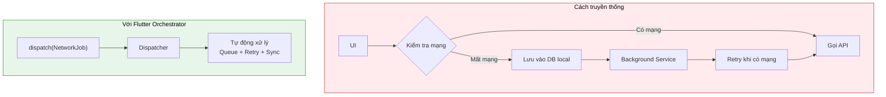
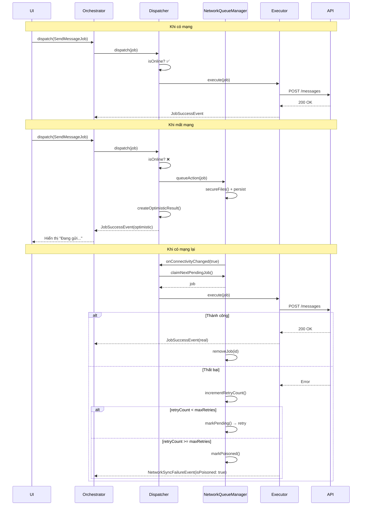
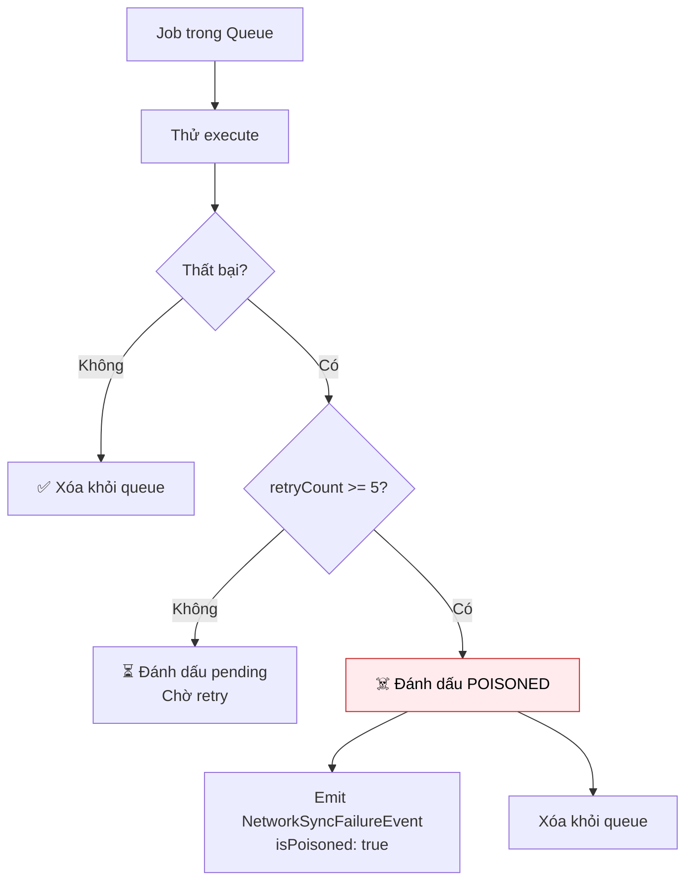

# Hỗ trợ Offline (Offline Support)

Một trong những tính năng mạnh mẽ nhất của Flutter Orchestrator là khả năng hỗ trợ **Offline** tự động thông qua cơ chế **NetworkAction**. 

> **Nguyên tắc:** Bạn chỉ cần đánh dấu Job là `NetworkAction`, Framework sẽ lo toàn bộ: **Queue → Persist → Retry → Sync**.

---

## 1. Vấn đề với cách tiếp cận truyền thống



**Vấn đề của cách truyền thống:**
- ❌ Code logic offline phân tán khắp nơi
- ❌ Phải viết Background Service thủ công
- ❌ Khó bảo trì và debug
- ❌ Dễ quên edge cases

---

## 2. Giải pháp: NetworkAction Interface

### 2.1. Tổng quan

```dart
abstract class NetworkAction<T> {
  /// Serialize job để lưu vào queue khi offline
  Map<String, dynamic> toJson();
  
  /// Kết quả giả định trả về ngay lập tức (Optimistic UI)
  T createOptimisticResult();
  
  /// (Tùy chọn) Key để chống duplicate
  String? get deduplicationKey => null;
}
```

### 2.2. Ví dụ đầy đủ (v0.6.0+)

```dart
import 'package:orchestrator_core/orchestrator_core.dart';

// Domain Event với DataSource
class MessageSentEvent extends BaseEvent {
  final Message message;
  final DataSource source;

  MessageSentEvent(super.correlationId, this.message, this.source);
}

// Job với NetworkAction support
class SendMessageJob extends EventJob<Message, MessageSentEvent>
    implements NetworkAction<Message> {
  final String content;
  final String recipientId;

  SendMessageJob({
    required this.content,
    required this.recipientId,
  }) : super(id: generateJobId('msg'));

  // ========== EventJob: Tạo Domain Event ==========

  @override
  MessageSentEvent createEventTyped(Message result) {
    // Dùng dataSource getter để include source trong event
    return MessageSentEvent(id, result, dataSource);
  }

  // ========== NetworkAction: Serialization ==========

  @override
  Map<String, dynamic> toJson() => {
    'id': id,
    'content': content,
    'recipientId': recipientId,
  };

  factory SendMessageJob.fromJson(Map<String, dynamic> json) {
    return SendMessageJob._withId(
      id: json['id'] as String,
      content: json['content'] as String,
      recipientId: json['recipientId'] as String,
    );
  }

  SendMessageJob._withId({
    required String id,
    required this.content,
    required this.recipientId,
  }) : super(id: id);

  // ========== NetworkAction: Optimistic Result ==========

  @override
  Message createOptimisticResult() {
    return Message(
      id: id,
      content: content,
      recipientId: recipientId,
      status: MessageStatus.sending,
      createdAt: DateTime.now(),
    );
  }

  // ========== Tùy chọn: Xử lý Failure ==========

  @override
  MessageSentEvent? createFailureEvent(Object error, Message? lastOptimistic) {
    // Trả về event để rollback trạng thái optimistic
    return MessageSentEvent(
      id,
      Message(id: id, content: content, status: MessageStatus.failed),
      DataSource.failed,
    );
  }

  @override
  String? get deduplicationKey => id;
}
```

> **💡 Điểm quan trọng (v0.6.0+):**
> - Dùng `dataSource` getter trong `createEventTyped()` để include source info
> - Override `createFailureEvent()` để xử lý sync failure vĩnh viễn
> - `DataSource` có thể là: `fresh`, `cached`, `optimistic`, hoặc `failed`

---

## 3. Luồng hoạt động chi tiết



---

## 4. Cấu hình

### 4.1. Setup trong main()

```dart
void main() async {
  WidgetsFlutterBinding.ensureInitialized();

  // 1. Đăng ký Network Jobs
  NetworkJobRegistry.registerType<SendMessageJob>(SendMessageJob.fromJson);

  // 2. Đăng ký Executors
  Dispatcher().register<SendMessageJob>(SendMessageExecutor(api));

  // 3. Cấu hình Connectivity Provider
  OrchestratorConfig.setConnectivityProvider(
    ConnectivityPlusProvider(),
  );
  
  // 4. Cấu hình Network Queue Manager
  OrchestratorConfig.setNetworkQueueManager(
    NetworkQueueManager(
      storage: FileNetworkQueueStorage(),
      fileDelegate: FlutterFileSafety(),
    ),
  );

  // 5. Xử lý queued jobs từ session trước (MỚI trong v0.6.0)
  await Dispatcher().processQueuedJobs();

  runApp(MyApp());
}
```

### 4.2. ConnectivityProvider Interface

```dart
abstract class ConnectivityProvider {
  /// Kiểm tra có mạng không
  Future<bool> get isConnected;
  
  /// Stream thay đổi kết nối
  Stream<bool> get onConnectivityChanged;
}

// Implementation với connectivity_plus
class ConnectivityPlusProvider implements ConnectivityProvider {
  final Connectivity _connectivity = Connectivity();
  
  @override
  Future<bool> get isConnected async {
    final result = await _connectivity.checkConnectivity();
    return result != ConnectivityResult.none;
  }
  
  @override
  Stream<bool> get onConnectivityChanged {
    return _connectivity.onConnectivityChanged
      .map((result) => result != ConnectivityResult.none);
  }
}
```

### 4.3. NetworkQueueStorage Interface

```dart
abstract class NetworkQueueStorage {
  /// Lưu job vào persistence
  Future<void> saveJob(String id, Map<String, dynamic> data);
  
  /// Xóa job khỏi persistence
  Future<void> removeJob(String id);
  
  /// Lấy job theo ID
  Future<Map<String, dynamic>?> getJob(String id);
  
  /// Lấy tất cả jobs (FIFO order)
  Future<List<Map<String, dynamic>>> getAllJobs();
  
  /// Cập nhật job
  Future<void> updateJob(String id, Map<String, dynamic> updates);
  
  /// Xóa tất cả
  Future<void> clearAll();
}
```

---

## 5. File Safety (Bảo vệ file tạm)

### 5.1. Vấn đề

Khi user upload ảnh/video, file thường nằm trong thư mục **tạm** (`/tmp`, `/cache`). OS có thể xóa file này **BẤT CỨ LÚC NÀO**. Nếu mất mạng và file bị xóa trước khi sync → **Lỗi**.

### 5.2. Giải pháp: FileSafetyDelegate

```dart
abstract class FileSafetyDelegate {
  /// Copy file tạm sang vị trí an toàn
  Future<Map<String, dynamic>> secureFiles(Map<String, dynamic> jobData);
  
  /// Xóa file an toàn sau khi sync xong
  Future<void> cleanupFiles(Map<String, dynamic> jobData);
}

// Implementation
class FlutterFileSafety implements FileSafetyDelegate {
  @override
  Future<Map<String, dynamic>> secureFiles(Map<String, dynamic> data) async {
    final appDir = await getApplicationSupportDirectory();
    final safeDir = Directory('${appDir.path}/network_queue_files');
    await safeDir.create(recursive: true);
    
    // Copy file nếu là path tạm
    if (data['filePath'] != null) {
      final tmpPath = data['filePath'] as String;
      if (tmpPath.contains('/tmp') || tmpPath.contains('/cache')) {
        final fileName = path.basename(tmpPath);
        final safePath = '${safeDir.path}/$fileName';
        await File(tmpPath).copy(safePath);
        data['filePath'] = safePath;  // Thay bằng path an toàn
      }
    }
    
    return data;
  }
  
  @override
  Future<void> cleanupFiles(Map<String, dynamic> data) async {
    final safePath = data['filePath'] as String?;
    if (safePath != null && safePath.contains('network_queue_files')) {
      await File(safePath).delete();
    }
  }
}
```

---

## 6. Poison Pill (Xử lý Job thất bại vĩnh viễn)

### 6.1. Cơ chế

Nếu một Job fail liên tục sau **5 lần retry** (mặc định), nó sẽ bị đánh dấu là **Poisoned** và bị loại khỏi queue để không block các jobs khác.



### 6.2. Xử lý trong Orchestrator (v0.6.0+)

Với `createFailureEvent()`, framework tự động emit domain event khi failure:

```dart
@override
void onEvent(BaseEvent event) {
  switch (event) {
    case MessageSentEvent e when isJobRunning(e.correlationId):
      if (e.source == DataSource.failed) {
        // Sync thất bại vĩnh viễn → Rollback optimistic UI
        final messages = state.messages.map((m) {
          if (m.id == e.message.id) {
            return m.copyWith(status: MessageStatus.failed);
          }
          return m;
        }).toList();
        emit(state.copyWith(messages: messages));

        // Hiển thị dialog retry
        showRetryDialog('Không thể gửi tin nhắn. Thử lại?');
      } else {
        // Thành công (optimistic hoặc fresh)
        final messages = [...state.messages];
        final index = messages.indexWhere((m) => m.id == e.message.id);
        if (index >= 0) {
          messages[index] = e.message;
        } else {
          messages.add(e.message);
        }
        emit(state.copyWith(messages: messages));
      }
  }
}
```

> **💡 Các giá trị DataSource:**
> - `DataSource.optimistic` - Trả về ngay lập tức khi offline
> - `DataSource.fresh` - Trả về sau khi sync thành công
> - `DataSource.failed` - Trả về khi sync thất bại vĩnh viễn (poison pill)

---

## 7. NetworkJobRegistry

### 7.1. Tại sao cần Registry?

Khi khôi phục Job từ queue (JSON), Framework cần biết:
- **Type của Job** (String) → để tìm factory
- **Factory function** → để deserialize JSON thành Job

### 7.2. API Reference

```dart
class NetworkJobRegistry {
  /// Đăng ký với string type name
  static void register(String type, EventJob Function(Map<String, dynamic>) factory);

  /// Đăng ký với generic type (type-safe, khuyến nghị)
  static void registerType<T extends EventJob>(EventJob Function(Map<String, dynamic>) factory);

  /// Khôi phục Job từ JSON
  static EventJob? restore(String type, Map<String, dynamic> json);

  /// Kiểm tra đã đăng ký chưa
  static bool isRegistered(String type);

  /// Xóa tất cả (testing)
  static void clear();
}
```

### 7.3. Ví dụ đăng ký

```dart
void main() {
  // Đăng ký type-safe (khuyến nghị)
  NetworkJobRegistry.registerType<SendMessageJob>(SendMessageJob.fromJson);
  NetworkJobRegistry.registerType<LikePostJob>(LikePostJob.fromJson);
}
```

---

## 8. NetworkJobStatus

```dart
enum NetworkJobStatus {
  pending,     // Chờ xử lý
  processing,  // Đang xử lý (claimed)
  poisoned,    // Thất bại vĩnh viễn
}
```

---

## 9. Best Practices

### ✅ Nên làm

- **Include `DataSource` trong events:** Để UI phân biệt optimistic vs synced data
- **Implement `createFailureEvent()`:** Để auto rollback khi sync failure
- **Implement `deduplicationKey`:** Tránh duplicate khi user tap nhiều lần
- **Gọi `processQueuedJobs()` khi startup:** Sync pending jobs từ session trước
- **Dùng File Safety:** Cho jobs có file attachment

### ❌ Không nên làm

```dart
// ❌ SAI: Không include DataSource trong event
class MessageSentEvent extends BaseEvent {
  final Message message;
  // Thiếu: final DataSource source;
}

// ❌ SAI: Không dùng dataSource getter
@override
MessageSentEvent createEventTyped(Message result) {
  return MessageSentEvent(id, result);  // Thiếu dataSource
}

// ❌ SAI: Optimistic result thiếu status
@override
Message createOptimisticResult() {
  return Message(content: content);  // Thiếu status: sending
}

// ❌ SAI: Không xử lý DataSource.failed
case MessageSentEvent e when isJobRunning(e.correlationId):
  emit(state.copyWith(message: e.message));  // Nên check e.source
```

---

## 10. Bảng tổng hợp Components

| Component | Mô tả |
|-----------|-------|
| `NetworkAction<T>` | Interface cho Job cần offline support |
| `NetworkQueueManager` | Quản lý queue (persist, retry) |
| `NetworkQueueStorage` | Interface lưu trữ queue |
| `ConnectivityProvider` | Kiểm tra/stream trạng thái mạng |
| `FileSafetyDelegate` | Bảo vệ file tạm |
| `NetworkJobRegistry` | Registry cho deserialization |
| `NetworkSyncFailureEvent` | Framework event khi sync thất bại |
| `DataSource` | Enum: `fresh`, `cached`, `optimistic`, `failed` |
| `createFailureEvent()` | Optional method cho domain failure events |
| `processQueuedJobs()` | Trigger queue processing khi app startup |

---

## 11. DataSource Enum

```dart
enum DataSource {
  /// Data lấy trực tiếp từ source (API, database)
  fresh,

  /// Data lấy từ cache
  cached,

  /// Data tạo optimistic khi offline
  optimistic,

  /// Data từ sync thất bại vĩnh viễn (poison pill)
  failed,
}
```

---

## Xem thêm

- [Code Generation](code_generation.md) - Tự động đăng ký Network Jobs
- [Dispatcher - NetworkAction](../concepts/dispatcher.md#5-xử-lý-networkaction-offline-support) - Chi tiết trong Dispatcher
- [Event - NetworkSyncFailureEvent](../concepts/event.md#61-networksyncfailureevent) - Xử lý failure
