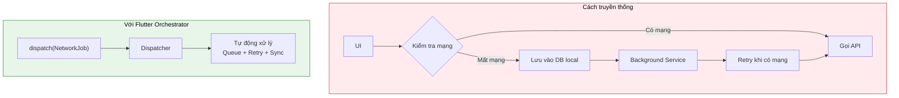
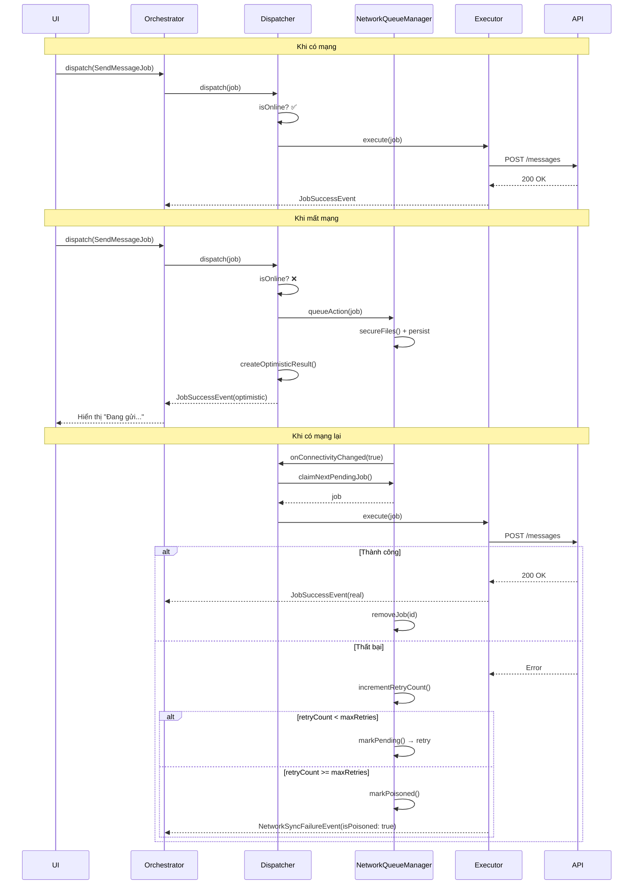
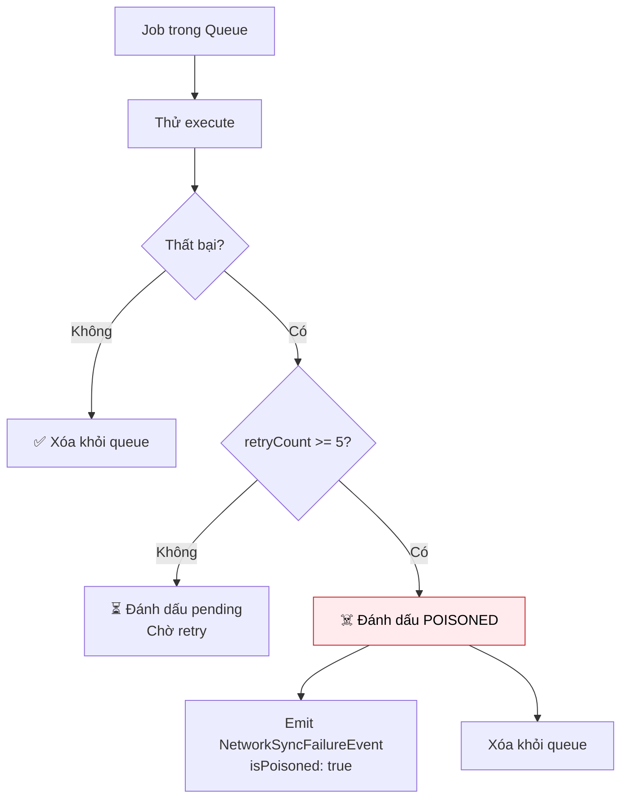

# Hỗ trợ Offline (Offline Support)

Một trong những tính năng mạnh mẽ nhất của Flutter Orchestrator là khả năng hỗ trợ **Offline** tự động thông qua cơ chế **NetworkAction**. 

> **Nguyên tắc:** Bạn chỉ cần đánh dấu Job là `NetworkAction`, Framework sẽ lo toàn bộ: **Queue → Persist → Retry → Sync**.

---

## 1. Vấn đề với cách tiếp cận truyền thống



**Vấn đề của cách truyền thống:**
- ❌ Code logic offline phân tán khắp nơi
- ❌ Phải viết Background Service thủ công
- ❌ Khó bảo trì và debug
- ❌ Dễ quên edge cases

---

## 2. Giải pháp: NetworkAction Interface

### 2.1. Tổng quan

```dart
abstract class NetworkAction<T> {
  /// Serialize job để lưu vào queue khi offline
  Map<String, dynamic> toJson();
  
  /// Kết quả giả định trả về ngay lập tức (Optimistic UI)
  T createOptimisticResult();
  
  /// (Tùy chọn) Key để chống duplicate
  String? get deduplicationKey => null;
}
```

### 2.2. Ví dụ đầy đủ

```dart
import 'package:orchestrator_core/orchestrator_core.dart';

@NetworkJob()
class SendMessageJob extends BaseJob implements NetworkAction<Message> {
  final String content;
  final String recipientId;
  
  SendMessageJob({
    required this.content,
    required this.recipientId,
  }) : super(id: generateJobId('msg'));  // Framework tự sinh ID unique
  
  // ========== BẮT BUỘC: Serialization ==========
  
  @override
  Map<String, dynamic> toJson() => {
    'id': id,  // Quan trọng: Serialize cả ID để tracking
    'content': content,
    'recipientId': recipientId,
  };
  
  factory SendMessageJob.fromJson(Map<String, dynamic> json) {
    return SendMessageJob._withId(
      id: json['id'] as String,
      content: json['content'] as String,
      recipientId: json['recipientId'] as String,
    );
  }
  
  // Private constructor để restore với ID cũ
  SendMessageJob._withId({
    required String id,
    required this.content,
    required this.recipientId,
  }) : super(id: id);
  
  // Wrapper cho NetworkJobRegistry (trả về BaseJob)
  static BaseJob fromJsonToBase(Map<String, dynamic> json) {
    return SendMessageJob.fromJson(json);
  }
  
  // ========== BẮT BUỘC: Optimistic Result ==========
  
  @override
  Message createOptimisticResult() {
    return Message(
      id: id,  // Dùng job.id làm tempId (Framework đã sinh sẵn)
      content: content,
      recipientId: recipientId,
      status: MessageStatus.sending,
      createdAt: DateTime.now(),
    );
  }
  
  // ========== TÙY CHỌN: Deduplication ==========
  
  @override
  String? get deduplicationKey => id;  // Dùng job.id để chống duplicate
}
```

> **💡 Lưu ý về ID:**
> - `generateJobId()` là helper của Framework, sinh ID unique với format: `prefix-timestamp-random`
> - Ví dụ: `msg-1703579123456789-a1b2c3`
> - Bạn dùng `id` này để tracking optimistic UI, **không cần** tạo `tempId` riêng
```

---

## 3. Luồng hoạt động chi tiết



---

## 4. Cấu hình

### 4.1. Setup trong main()

```dart
void main() async {
  WidgetsFlutterBinding.ensureInitialized();
  
  // 1. Đăng ký Network Jobs (từ code generation)
  registerNetworkJobs();
  
  // 2. Đăng ký Executors
  Dispatcher().register<SendMessageJob>(SendMessageExecutor(api));
  
  // 3. Cấu hình Connectivity Provider
  OrchestratorConfig.setConnectivityProvider(
    ConnectivityPlusProvider(),  // Implement từ connectivity_plus
  );
  
  // 4. Cấu hình Network Queue Manager
  OrchestratorConfig.setNetworkQueueManager(
    NetworkQueueManager(
      storage: FileNetworkQueueStorage(),
      fileDelegate: FlutterFileSafety(),  // Tùy chọn: bảo vệ file
    ),
  );
  
  runApp(MyApp());
}
```

### 4.2. ConnectivityProvider Interface

```dart
abstract class ConnectivityProvider {
  /// Kiểm tra có mạng không
  Future<bool> get isConnected;
  
  /// Stream thay đổi kết nối
  Stream<bool> get onConnectivityChanged;
}

// Implementation với connectivity_plus
class ConnectivityPlusProvider implements ConnectivityProvider {
  final Connectivity _connectivity = Connectivity();
  
  @override
  Future<bool> get isConnected async {
    final result = await _connectivity.checkConnectivity();
    return result != ConnectivityResult.none;
  }
  
  @override
  Stream<bool> get onConnectivityChanged {
    return _connectivity.onConnectivityChanged
      .map((result) => result != ConnectivityResult.none);
  }
}
```

### 4.3. NetworkQueueStorage Interface

```dart
abstract class NetworkQueueStorage {
  /// Lưu job vào persistence
  Future<void> saveJob(String id, Map<String, dynamic> data);
  
  /// Xóa job khỏi persistence
  Future<void> removeJob(String id);
  
  /// Lấy job theo ID
  Future<Map<String, dynamic>?> getJob(String id);
  
  /// Lấy tất cả jobs (FIFO order)
  Future<List<Map<String, dynamic>>> getAllJobs();
  
  /// Cập nhật job
  Future<void> updateJob(String id, Map<String, dynamic> updates);
  
  /// Xóa tất cả
  Future<void> clearAll();
}
```

---

## 5. File Safety (Bảo vệ file tạm)

### 5.1. Vấn đề

Khi user upload ảnh/video, file thường nằm trong thư mục **tạm** (`/tmp`, `/cache`). OS có thể xóa file này **BẤT CỨ LÚC NÀO**. Nếu mất mạng và file bị xóa trước khi sync → **Lỗi**.

### 5.2. Giải pháp: FileSafetyDelegate

```dart
abstract class FileSafetyDelegate {
  /// Copy file tạm sang vị trí an toàn
  Future<Map<String, dynamic>> secureFiles(Map<String, dynamic> jobData);
  
  /// Xóa file an toàn sau khi sync xong
  Future<void> cleanupFiles(Map<String, dynamic> jobData);
}

// Implementation
class FlutterFileSafety implements FileSafetyDelegate {
  @override
  Future<Map<String, dynamic>> secureFiles(Map<String, dynamic> data) async {
    final appDir = await getApplicationSupportDirectory();
    final safeDir = Directory('${appDir.path}/network_queue_files');
    await safeDir.create(recursive: true);
    
    // Copy file nếu là path tạm
    if (data['filePath'] != null) {
      final tmpPath = data['filePath'] as String;
      if (tmpPath.contains('/tmp') || tmpPath.contains('/cache')) {
        final fileName = path.basename(tmpPath);
        final safePath = '${safeDir.path}/$fileName';
        await File(tmpPath).copy(safePath);
        data['filePath'] = safePath;  // Thay bằng path an toàn
      }
    }
    
    return data;
  }
  
  @override
  Future<void> cleanupFiles(Map<String, dynamic> data) async {
    final safePath = data['filePath'] as String?;
    if (safePath != null && safePath.contains('network_queue_files')) {
      await File(safePath).delete();
    }
  }
}
```

---

## 6. Poison Pill (Xử lý Job thất bại vĩnh viễn)

### 6.1. Cơ chế

Nếu một Job fail liên tục sau **5 lần retry** (mặc định), nó sẽ bị đánh dấu là **Poisoned** và bị loại khỏi queue để không block các jobs khác.



### 6.2. Xử lý trong Orchestrator

```dart
@override
void onPassiveEvent(BaseEvent event) {
  if (event is NetworkSyncFailureEvent && event.isPoisoned) {
    // Job đã fail vĩnh viễn → Rollback optimistic UI
    final failedId = event.correlationId;
    
    // Ví dụ: Đánh dấu tin nhắn là "gửi thất bại"
    final messages = state.messages.map((m) {
      if (m.tempId == failedId) {
        return m.copyWith(status: MessageStatus.failed);
      }
      return m;
    }).toList();
    
    emit(state.copyWith(messages: messages));
    
    // Hiển thị dialog cho user
    showRetryDialog('Không thể gửi tin nhắn. Bạn muốn thử lại?');
  }
}
```

---

## 7. NetworkJobRegistry

### 7.1. Tại sao cần Registry?

Khi khôi phục Job từ queue (JSON), Framework cần biết:
- **Type của Job** (String) → để tìm factory
- **Factory function** → để deserialize JSON thành Job

### 7.2. API Reference

```dart
class NetworkJobRegistry {
  /// Đăng ký với string type name
  static void register(String type, BaseJob Function(Map<String, dynamic>) factory);
  
  /// Đăng ký với generic type (type-safe)
  static void registerType<T extends BaseJob>(BaseJob Function(Map<String, dynamic>) factory);
  
  /// Khôi phục Job từ JSON
  static BaseJob? restore(String type, Map<String, dynamic> json);
  
  /// Kiểm tra đã đăng ký chưa
  static bool isRegistered(String type);
  
  /// Xóa tất cả (testing)
  static void clear();
}
```

### 7.3. Đăng ký thủ công vs Code Generation

```dart
// Thủ công
void main() {
  NetworkJobRegistry.register('SendMessageJob', SendMessageJob.fromJsonToBase);
  NetworkJobRegistry.register('LikePostJob', LikePostJob.fromJsonToBase);
}

// Với Code Generation (khuyến nghị)
@NetworkRegistry([SendMessageJob, LikePostJob])
void setupNetworkRegistry() {}
// → Tự động generate registerNetworkJobs()
```

---

## 8. NetworkJobStatus

```dart
enum NetworkJobStatus {
  pending,     // Chờ xử lý
  processing,  // Đang xử lý (claimed)
  poisoned,    // Thất bại vĩnh viễn
}
```

---

## 9. Best Practices

### ✅ Nên làm

- **Đặt `tempId` unique:** Để tracking và rollback optimistic UI
- **Implement `deduplicationKey`:** Tránh duplicate khi user tap nhiều lần
- **Xử lý `NetworkSyncFailureEvent`:** Rollback UI khi poison
- **Dùng File Safety:** Cho jobs có file attachment

### ❌ Không nên làm

```dart
// ❌ SAI: Quên fromJsonToBase
class MyJob extends BaseJob implements NetworkAction<Result> {
  factory MyJob.fromJson(Map<String, dynamic> json) => ...;
  // Thiếu: static BaseJob fromJsonToBase(...)
}

// ❌ SAI: Optimistic result không đủ thông tin
@override
Message createOptimisticResult() {
  return Message(content: content);  // Thiếu status, tempId
}

// ❌ SAI: Không listen NetworkSyncFailureEvent
// → User thấy tin nhắn "đã gửi" nhưng thực tế đã fail
```

---

## 10. Bảng tổng hợp Components

| Component | Mô tả |
|-----------|-------|
| `NetworkAction<T>` | Interface cho Job cần offline support |
| `NetworkQueueManager` | Quản lý queue (persist, retry) |
| `NetworkQueueStorage` | Interface lưu trữ queue |
| `ConnectivityProvider` | Kiểm tra/stream trạng thái mạng |
| `FileSafetyDelegate` | Bảo vệ file tạm |
| `NetworkJobRegistry` | Registry cho deserialization |
| `NetworkSyncFailureEvent` | Event khi sync thất bại |

---

## Xem thêm

- [Code Generation](code_generation.md) - Tự động đăng ký Network Jobs
- [Dispatcher - NetworkAction](../concepts/dispatcher.md#5-xử-lý-networkaction-offline-support) - Chi tiết trong Dispatcher
- [Event - NetworkSyncFailureEvent](../concepts/event.md#61-networksyncfailureevent) - Xử lý failure
