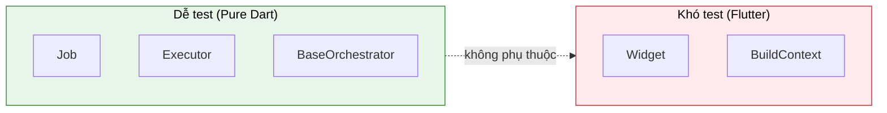

# Testing

Kiến trúc Flutter Orchestrator được thiết kế để **dễ test**. Logic nghiệp vụ nằm trong Executor thuần Dart, không phụ thuộc Flutter → Test đơn giản và nhanh.

---

## 1. Lợi ích của kiến trúc



**Lợi ích:**
- ✅ Executor thuần Dart → Test không cần Flutter
- ✅ Không cần mock `BuildContext`, `Widget`
- ✅ Fast tests → Chạy trong milliseconds
- ✅ Scoped Bus → Isolated tests

---

## 2. Unit Test Executor

### 2.1. Test cơ bản

```dart
import 'package:test/test.dart';
import 'package:mocktail/mocktail.dart';

// Mock dependencies
class MockApiService extends Mock implements ApiService {}

void main() {
  group('FetchUserExecutor', () {
    late MockApiService mockApi;
    late FetchUserExecutor executor;
    
    setUp(() {
      mockApi = MockApiService();
      executor = FetchUserExecutor(mockApi);
    });
    
    test('should return user on success', () async {
      // Arrange
      final expectedUser = User(id: '123', name: 'John');
      when(() => mockApi.getUser('123'))
        .thenAnswer((_) async => expectedUser);
      
      // Act
      final result = await executor.process(FetchUserJob(userId: '123'));
      
      // Assert
      expect(result, equals(expectedUser));
      verify(() => mockApi.getUser('123')).called(1);
    });
    
    test('should throw on API error', () async {
      // Arrange
      when(() => mockApi.getUser(any()))
        .thenThrow(Exception('Network error'));
      
      // Act & Assert
      expect(
        () => executor.process(FetchUserJob(userId: '123')),
        throwsException,
      );
    });
  });
}
```

### 2.2. Test với Cancellation

```dart
test('should throw CancelledException when cancelled', () async {
  final token = CancellationToken();
  final job = FetchUserJob(userId: '123', cancellationToken: token);
  
  // Cancel before execution
  token.cancel();
  
  expect(
    () => executor.process(job),
    throwsA(isA<CancelledException>()),
  );
});

test('CancellationToken.throwIfCancelled works correctly', () {
  final token = CancellationToken();
  
  // Not cancelled yet
  expect(() => token.throwIfCancelled(), returnsNormally);
  
  // After cancel
  token.cancel();
  expect(
    () => token.throwIfCancelled(),
    throwsA(isA<CancelledException>()),
  );
});
```

### 2.3. Test Progress Emission

```dart
class ProgressExecutor extends BaseExecutor<DownloadJob> {
  @override
  Future<File> process(DownloadJob job) async {
    for (int i = 1; i <= 10; i++) {
      await Future.delayed(Duration(milliseconds: 10));
      emitProgress(job.id, progress: i / 10.0, message: 'Downloading $i/10');
    }
    return File('downloaded.zip');
  }
}

test('should emit progress events', () async {
  final executor = ProgressExecutor();
  final bus = SignalBus.scoped();
  final progressEvents = <JobProgressEvent>[];
  
  bus.stream
    .where((e) => e is JobProgressEvent)
    .cast<JobProgressEvent>()
    .listen(progressEvents.add);
  
  // Execute with scoped bus
  final job = DownloadJob()..bus = bus;
  await executor.process(job);
  
  expect(progressEvents.length, equals(10));
  expect(progressEvents.last.progress, equals(1.0));
  
  bus.dispose();
});
```

---

## 3. Unit Test Orchestrator

### 3.1. Setup với Scoped Bus

**Quan trọng:** Luôn dùng `SignalBus.scoped()` để test isolation.

```dart
class TestOrchestrator extends BaseOrchestrator<String> {
  final List<String> eventLog = [];
  
  TestOrchestrator({SignalBus? bus}) : super('Init', bus: bus);
  
  @override
  void onActiveSuccess(JobSuccessEvent event) {
    eventLog.add('Success:${event.data}');
    emit('Success: ${event.data}');
  }
  
  @override
  void onActiveFailure(JobFailureEvent event) {
    eventLog.add('Failure:${event.error}');
    emit('Failure: ${event.error}');
  }
  
  String fetchUser(String id) => dispatch(FetchUserJob(userId: id));
}
```

### 3.2. Test State Changes

```dart
void main() {
  late SignalBus scopedBus;
  late TestOrchestrator orchestrator;
  late Dispatcher dispatcher;
  
  setUp(() {
    scopedBus = SignalBus.scoped();
    orchestrator = TestOrchestrator(bus: scopedBus);
    dispatcher = Dispatcher();
    dispatcher.register(FetchUserExecutor(MockApiService()));
  });
  
  tearDown(() {
    orchestrator.dispose();
    scopedBus.dispose();
  });
  
  test('should update state on success', () async {
    orchestrator.fetchUser('123');
    
    await expectLater(
      orchestrator.stream,
      emitsThrough('Success: User(123)'),
    );
    
    expect(orchestrator.eventLog, contains('Success:User(123)'));
  });
  
  test('should update state on failure', () async {
    // Setup failure
    dispatcher.register(FailingExecutor());
    
    orchestrator.fetchUser('invalid');
    
    await expectLater(
      orchestrator.stream,
      emitsThrough(contains('Failure')),
    );
  });
}
```

### 3.3. Test Scoped Bus Isolation

```dart
test('events are isolated between scoped buses', () async {
  // Scope 1
  final bus1 = SignalBus.scoped();
  final orc1 = TestOrchestrator(bus: bus1);
  
  // Scope 2
  final bus2 = SignalBus.scoped();
  final orc2 = TestOrchestrator(bus: bus2);
  
  // Global bus spy
  final globalEvents = <BaseEvent>[];
  SignalBus.instance.stream.listen(globalEvents.add);
  
  // Run job in Scope 1
  orc1.fetchUser('123');
  await Future.delayed(Duration(milliseconds: 50));
  
  // Scope 1 got event
  expect(orc1.eventLog, contains('Success:User(123)'));
  
  // Scope 2 saw NOTHING
  expect(orc2.eventLog, isEmpty);
  
  // Global bus saw NOTHING
  expect(globalEvents, isEmpty);
  
  orc1.dispose();
  orc2.dispose();
  bus1.dispose();
  bus2.dispose();
});
```

---

## 4. Test Timeout & Retry

### 4.1. Test Timeout

```dart
class SlowExecutor extends BaseExecutor<TestJob> {
  @override
  Future<dynamic> process(TestJob job) async {
    await Future.delayed(Duration(seconds: 10));  // Very slow
    return 'done';
  }
}

test('should timeout correctly', () async {
  dispatcher.register(SlowExecutor());
  
  final job = TestJob(timeout: Duration(milliseconds: 100));
  orchestrator.dispatch(job);
  
  await Future.delayed(Duration(milliseconds: 200));
  
  expect(orchestrator.eventLog.any((e) => e.contains('Timeout')), isTrue);
});
```

### 4.2. Test Retry

```dart
class FailingExecutor extends BaseExecutor<FailingJob> {
  int attempts = 0;
  
  @override
  Future<dynamic> process(FailingJob job) async {
    attempts++;
    if (attempts <= job.failCount) {
      throw Exception('Simulated failure #$attempts');
    }
    return 'success after retries';
  }
}

test('should retry on failure', () async {
  final executor = FailingExecutor();
  dispatcher.register(executor);
  
  // Fail 2 times, retry 3 times → should succeed
  final job = FailingJob(
    failCount: 2,
    retryPolicy: RetryPolicy(maxRetries: 3),
  );
  
  orchestrator.dispatch(job);
  await Future.delayed(Duration(milliseconds: 500));
  
  // Verified retry attempts
  expect(executor.attempts, equals(3));  // 2 fails + 1 success
  expect(orchestrator.eventLog, contains('Success:success after retries'));
});
```

---

## 5. Integration Test

Test luồng hoàn chỉnh từ Orchestrator → Dispatcher → Executor → Events.

```dart
void main() {
  late SignalBus bus;
  late Dispatcher dispatcher;
  late UserCubit cubit;
  late MockApiService mockApi;
  
  setUp(() {
    bus = SignalBus.scoped();
    dispatcher = Dispatcher();
    mockApi = MockApiService();
    
    // Register executors
    dispatcher.register(FetchUserExecutor(mockApi));
    dispatcher.register(UpdateUserExecutor(mockApi));
    
    // Create cubit with scoped bus
    cubit = UserCubit(bus: bus);
  });
  
  tearDown(() {
    cubit.close();
    bus.dispose();
  });
  
  test('full flow: load → update → refresh', () async {
    // Arrange
    when(() => mockApi.getUser('123'))
      .thenAnswer((_) async => User(id: '123', name: 'John'));
    when(() => mockApi.updateUser(any()))
      .thenAnswer((_) async => User(id: '123', name: 'Jane'));
    
    // Act 1: Load
    cubit.loadUser('123');
    await Future.delayed(Duration(milliseconds: 50));
    
    // Assert 1
    expect(cubit.state.user?.name, equals('John'));
    
    // Act 2: Update
    cubit.updateName('Jane');
    await Future.delayed(Duration(milliseconds: 50));
    
    // Assert 2
    expect(cubit.state.user?.name, equals('Jane'));
  });
}
```

---

## 6. Mocking Dependencies

### 6.1. Với Mocktail

```dart
import 'package:mocktail/mocktail.dart';

class MockApiService extends Mock implements ApiService {}
class MockDatabaseService extends Mock implements DatabaseService {}

void main() {
  setUpAll(() {
    // Register fallback values for custom types
    registerFallbackValue(User(id: '', name: ''));
    registerFallbackValue(FetchUserJob(userId: ''));
  });
}
```

### 6.2. Với get_it

```dart
import 'package:get_it/get_it.dart';

final getIt = GetIt.instance;

void setupTestDI() {
  getIt.reset();
  
  // Register mocks
  getIt.registerSingleton<ApiService>(MockApiService());
  getIt.registerSingleton<SignalBus>(SignalBus.scoped());
  
  // Register executors with mock
  final dispatcher = Dispatcher();
  dispatcher.register(FetchUserExecutor(getIt<ApiService>()));
  getIt.registerSingleton(dispatcher);
}

void main() {
  setUp(setupTestDI);
  tearDown(() => getIt.reset());
}
```

---

## 7. Test Utilities

### 7.1. Helper cho event waiting

```dart
extension TestBusExtension on SignalBus {
  /// Wait for specific event type
  Future<T> waitFor<T extends BaseEvent>({
    Duration timeout = const Duration(seconds: 5),
  }) {
    return stream
      .where((e) => e is T)
      .cast<T>()
      .first
      .timeout(timeout);
  }
  
  /// Collect events during action
  Future<List<BaseEvent>> collectEvents(
    Future<void> Function() action,
  ) async {
    final events = <BaseEvent>[];
    final sub = stream.listen(events.add);
    
    await action();
    await Future.delayed(Duration(milliseconds: 50));
    
    await sub.cancel();
    return events;
  }
}

// Usage
test('collect events', () async {
  final bus = SignalBus.scoped();
  
  final events = await bus.collectEvents(() async {
    dispatcher.dispatch(FetchUserJob(userId: '123'));
  });
  
  expect(events, contains(isA<JobSuccessEvent>()));
});
```

### 7.2. Test Dispatcher Helper

```dart
class TestDispatcher extends Dispatcher {
  final List<BaseJob> dispatchedJobs = [];
  
  @override
  String dispatch(BaseJob job) {
    dispatchedJobs.add(job);
    return super.dispatch(job);
  }
  
  void expectDispatched<T extends BaseJob>() {
    expect(dispatchedJobs.whereType<T>().isNotEmpty, isTrue);
  }
}
```

---

## 8. Coverage

### 8.1. Chạy với coverage

```bash
# Generate coverage
dart test --coverage=coverage

# Convert to lcov
dart pub global activate coverage
dart pub global run coverage:format_coverage \
  --lcov \
  --in=coverage \
  --out=coverage/lcov.info \
  --report-on=lib

# Generate HTML report
genhtml coverage/lcov.info -o coverage/html

# Open report
open coverage/html/index.html
```

### 8.2. CI/CD (GitHub Actions)

```yaml
# .github/workflows/test.yml
name: Test

on: [push, pull_request]

jobs:
  test:
    runs-on: ubuntu-latest
    steps:
      - uses: actions/checkout@v3
      - uses: dart-lang/setup-dart@v1
      
      - name: Install dependencies
        run: dart pub get
        
      - name: Run tests
        run: dart test --coverage=coverage
        
      - name: Upload coverage
        uses: codecov/codecov-action@v3
        with:
          files: coverage/lcov.info
```

---

## 9. Best Practices

### ✅ Nên làm

- **Dùng Scoped Bus:** Luôn dùng `SignalBus.scoped()` trong tests
- **Dispose sau test:** Gọi `dispose()` trong `tearDown`
- **Test happy path & error cases:** Đầy đủ scenarios
- **Mock external dependencies:** API, Database, etc.
- **Verify interactions:** Dùng `verify()` của Mocktail

### ❌ Không nên làm

```dart
// ❌ SAI: Dùng Global Bus trong test → Pollution
test('bad test', () async {
  final orc = TestOrchestrator();  // Dùng global bus!
  // → Tests khác sẽ bị ảnh hưởng
});

// ✅ ĐÚNG: Dùng Scoped Bus
test('good test', () async {
  final bus = SignalBus.scoped();
  final orc = TestOrchestrator(bus: bus);
  // → Isolated
  
  orc.dispose();
  bus.dispose();
});

// ❌ SAI: Quên dispose
test('leaky test', () async {
  final bus = SignalBus.scoped();
  // ... test ...
  // Quên bus.dispose() → Memory leak
});
```

---

## Xem thêm

- [Orchestrator - Scoped Bus](../concepts/orchestrator.md#9-scoped-bus-cho-testing) - Chi tiết Scoped Bus
- [SignalBus - Testing](../concepts/signal_bus.md#4-scoped-bus---testing--module-isolation) - SignalBus.scoped()
