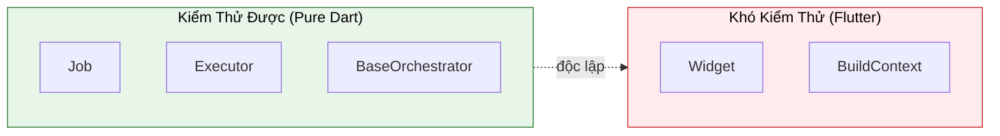

# Testing (Kiểm Thử)

Kiến trúc Flutter Orchestrator được thiết kế để **Dễ Kiểm Thử**. Business logic nằm trong các Executor và Orchestrator viết bằng Dart thuần, không phụ thuộc vào Flutter, giúp kiểm thử đơn giản và nhanh chóng.

Chúng tôi cung cấp package **`orchestrator_test`** để đơn giản hóa việc kiểm thử với mocks, fakes, và BDD-style helpers.

---

## 1. Lợi Ích Kiến Trúc



**Lợi ích:**
- ✅ Pure Dart Executors → Test không cần Flutter
- ✅ Không cần mock `BuildContext`, `Widget`
- ✅ Test nhanh → Chạy trong mili-giây
- ✅ Scoped Bus → Test cô lập

---

## 2. Cài Đặt

Thêm `orchestrator_test` vào `dev_dependencies`:

```yaml
dev_dependencies:
  flutter_test:
    sdk: flutter
  orchestrator_test: ^0.1.0
  bloc_test: ^9.0.0 # Khuyến nghị cho Cubits/Blocs
```

---

## 3. Unit Test Executor

Executors chứa logic nghiệp vụ thuần. Bạn có thể unit test chúng bằng cách mock các dependencies (như API services).

`orchestrator_test` export `mocktail`, nên bạn có thể dễ dàng tạo mocks.

```dart
import 'package:test/test.dart';
import 'package:orchestrator_test/orchestrator_test.dart';

// Mock API dependency
class MockApiService extends Mock implements ApiService {}

void main() {
  group('FetchUserExecutor', () {
    late MockApiService mockApi;
    late FetchUserExecutor executor;
    
    setUp(() {
      mockApi = MockApiService();
      executor = FetchUserExecutor(mockApi);
    });
    
    test('should return user on success', () async {
      // Arrange
      final expectedUser = User(id: '123', name: 'John');
      when(() => mockApi.getUser('123')).thenAnswer((_) async => expectedUser);
      
      // Act
      final result = await executor.process(FetchUserJob(userId: '123'));
      
      // Assert
      expect(result, equals(expectedUser));
      verify(() => mockApi.getUser('123')).called(1);
    });
  });
}
```

---

## 4. Test Orchestrator (BDD Style)

Orchestrators (Cubits) quản lý state. Bạn có thể test chúng với helper `testOrchestrator`, cung cấp cách khai báo để test chuyển đổi state, tương tự `blocTest`.

```dart
import 'package:orchestrator_test/orchestrator_test.dart';

testOrchestrator<CounterOrchestrator, int>(
  'emits 1 when increment is called',
  build: () => CounterOrchestrator(),
  act: (orchestrator) => orchestrator.increment(),
  expect: () => [1],
);

testOrchestrator<CounterOrchestrator, int>(
  'emits specific state sequence',
  build: () => CounterOrchestrator(),
  act: (orchestrator) async {
    orchestrator.increment();
    orchestrator.increment();
  },
  expect: () => [1, 2],
);
```

### 4.1. Test với Mocks

Bạn có thể truyền `MockDispatcher` vào orchestrator nếu hỗ trợ dependency injection, hoặc dùng `FakeExecutor` đăng ký vào global dispatcher.

```dart
testOrchestrator<UserOrchestrator, UserState>(
  'emits [loading, success] on fetch',
  setUp: () {
    // Đăng ký fake executor để xử lý job ngay lập tức
    final dispatcher = Dispatcher();
    dispatcher.register(FakeExecutor<FetchUserJob>(
      (job) async => User(name: 'Fake User')
    ));
  },
  build: () => UserOrchestrator(),
  act: (orc) => orc.fetchUser('123'),
  expect: () => [
    UserState.loading(),
    UserState.success(User(name: 'Fake User')),
  ],
);
```

---

## 5. Integration Test với Fakes

`orchestrator_test` cung cấp các **Fakes** mạnh mẽ để mô phỏng hành vi phức tạp mà không cần mock thủ công.

### 5.1. FakeExecutor

Mô phỏng response từ backend hoặc logic mà không cần network calls.

```dart
final executor = FakeExecutor<MyJob>((job) async {
  if (job.id == 'error') throw Exception('Failed');
  return 'Success';
});

dispatcher.register(executor);
```

### 5.2. FakeConnectivityProvider

Test tính năng "Offline Support" bằng cách điều khiển trạng thái mạng.

```dart
test('queues job when offline', () async {
  final connectivity = FakeConnectivityProvider(isConnected: false);
  OrchestratorConfig.setConnectivityProvider(connectivity);

  dispatcher.dispatch(NetworkJob());

  // Xác nhận job được queue, không xử lý
  expect(queueManager.hasPendingJobs, isTrue);

  // Online lại -> Job sẽ được xử lý
  connectivity.goOnline();
  await Future.delayed(Duration(milliseconds: 100)); // Đợi sync
  expect(queueManager.hasPendingJobs, isFalse);
});
```

### 5.3. FakeCacheProvider

Test logic caching trong memory.

```dart
final cache = FakeCacheProvider(trackTtl: true);
await cache.write('key', 'value', ttl: Duration(seconds: 1));
```

---

## 6. Event Testing

### 6.1. EventCapture

Capture các events được emit bởi `SignalBus` để verify interactions.

```dart
test('should emit failure event', () async {
  final capture = EventCapture(); // Lắng nghe global bus mặc định
  
  // Dispatch job sẽ fail
  dispatcher.dispatch(FailingJob());
  
  // Đợi event cụ thể
  final event = await capture.waitFor<JobFailureEvent>();
  
  expect(event.error, isA<Exception>());
  expect(capture.events, hasLength(1));
});
```

### 6.2. Event Matchers

Custom matchers giúp assertions dễ đọc hơn.

```dart
expect(event, isJobSuccess(data: 'result'));
expect(event, isJobFailure(wasRetried: true));
expect(event, isJobProgress(minProgress: 0.5));
expect(event, isJobCancelled());
expect(event, isJobTimeout());
```

Và cho sequences:

```dart
expect(
  events,
  emitsEventsInOrder([
    isJobProgress(),
    isJobSuccess(),
  ]),
);
```

---

## 7. Test Timeout & Retry

### 7.1. Test Timeout

```dart
class SlowExecutor extends BaseExecutor<TestJob> {
  @override
  Future<dynamic> process(TestJob job) async {
    await Future.delayed(Duration(seconds: 10));  // Rất chậm
    return 'done';
  }
}

test('should timeout correctly', () async {
  dispatcher.register(SlowExecutor());
  
  final job = TestJob(timeout: Duration(milliseconds: 100));
  orchestrator.dispatch(job);
  
  await Future.delayed(Duration(milliseconds: 200));
  
  expect(orchestrator.eventLog.any((e) => e.contains('Timeout')), isTrue);
});
```

### 7.2. Test Retry

```dart
class FailingExecutor extends BaseExecutor<FailingJob> {
  int attempts = 0;
  
  @override
  Future<dynamic> process(FailingJob job) async {
    attempts++;
    if (attempts <= job.failCount) {
      throw Exception('Simulated failure #$attempts');
    }
    return 'success after retries';
  }
}

test('should retry on failure', () async {
  final executor = FailingExecutor();
  dispatcher.register(executor);
  
  // Fail 2 lần, retry 3 lần → nên thành công
  final job = FailingJob(
    failCount: 2,
    retryPolicy: RetryPolicy(maxRetries: 3),
  );
  
  orchestrator.dispatch(job);
  await Future.delayed(Duration(milliseconds: 500));
  
  // Xác nhận số lần retry
  expect(executor.attempts, equals(3));  // 2 fails + 1 success
  expect(orchestrator.eventLog, contains('Success:success after retries'));
});
```

---

## 8. Job Matchers

`orchestrator_test` cung cấp các matchers để verify properties của Job:

```dart
// Match job ID
expect(job, hasJobId('my-job-id'));

// Match job type
expect(job, isJobOfType<MyJob>());

// Match timeout
expect(job, hasTimeout(Duration(seconds: 30)));

// Match cancellation token presence
expect(job, hasCancellationToken());

// Match retry policy
expect(job, hasRetryPolicy(maxRetries: 3));

// Kiểm tra job list
expect(dispatcher.dispatchedJobs, containsJobOfType<MyJob>());
expect(dispatcher.dispatchedJobs, hasJobCount<MyJob>(2));
```

---

## 9. Ví Dụ Đầy Đủ (Integration)

Đây là ví dụ integration test sử dụng `bloc_test` và `FakeExecutor`:

```dart
import 'package:bloc_test/bloc_test.dart';
import 'package:orchestrator_test/orchestrator_test.dart';

void main() {
  late Dispatcher dispatcher;

  setUp(() {
    dispatcher = Dispatcher();
    dispatcher.resetForTesting();
  });

  blocTest<CounterCubit, CounterState>(
    'emits [loading, success] when increment is called',
    setUp: () {
      // Đăng ký FakeExecutor
      dispatcher.register<IncrementJob>(
        FakeExecutor<IncrementJob>((job) async => 10),
      );
    },
    build: () => CounterCubit(),
    act: (cubit) => cubit.increment(),
    expect: () => [
      // Sử dụng matchers hoặc giá trị cụ thể
      isA<CounterState>().having((s) => s.isLoading, 'isLoading', true),
      isA<CounterState>().having((s) => s.count, 'count', 10),
    ],
  );
}
```

---

## 10. Coverage

### 10.1. Chạy với coverage

```bash
# Generate coverage
dart test --coverage=coverage

# Convert to lcov
dart pub global activate coverage
dart pub global run coverage:format_coverage \
  --lcov \
  --in=coverage \
  --out=coverage/lcov.info \
  --report-on=lib

# Generate HTML report
genhtml coverage/lcov.info -o coverage/html

# Mở report
open coverage/html/index.html
```

### 10.2. CI/CD (GitHub Actions)

```yaml
# .github/workflows/test.yml
name: Test

on: [push, pull_request]

jobs:
  test:
    runs-on: ubuntu-latest
    steps:
      - uses: actions/checkout@v3
      - uses: dart-lang/setup-dart@v1
      
      - name: Install dependencies
        run: dart pub get
        
      - name: Run tests
        run: dart test --coverage=coverage
        
      - name: Upload coverage
        uses: codecov/codecov-action@v3
        with:
          files: coverage/lcov.info
```

---

## 11. Best Practices

### ✅ Nên làm

- **Dùng Fakes thay vì Mocks**: Ưu tiên `FakeExecutor` hơn mock `process()`. Thực tế hơn và ít setup hơn.
- **Isolate Tests**: Đảm bảo `Dispatcher` và `SignalBus` được reset hoặc scoped giữa các tests. `Dispatcher` là singleton, dùng `setUp(() => dispatcher.resetForTesting())`.
- **Test Matchers**: Dùng `isJobSuccess`, `hasJobId` để giữ tests dễ đọc.
- **Offline Tests**: Luôn dùng `FakeConnectivityProvider` để test offline/online transitions rõ ràng.
- **Dùng Scoped Bus**: Luôn `SignalBus.scoped()` trong tests để isolation
- **Dispose sau test**: Gọi `dispose()` trong `tearDown`

### ❌ Không nên làm

```dart
// ❌ SAI: Dùng Global Bus trong test → Gây ô nhiễm
test('bad test', () async {
  final orc = TestOrchestrator();  // Dùng global bus!
  // → Ảnh hưởng các tests khác
});

// ✅ ĐÚNG: Dùng Scoped Bus
test('good test', () async {
  final bus = SignalBus.scoped();
  final orc = TestOrchestrator(bus: bus);
  // → Cô lập
  
  orc.dispose();
  bus.dispose();
});

// ❌ SAI: Quên dispose
test('leaky test', () async {
  final bus = SignalBus.scoped();
  // ... test ...
  // Quên bus.dispose() → Memory leak
});
```

---

## Xem Thêm

- [Orchestrator - Scoped Bus](../concepts/orchestrator.md#11-scoped-bus-advanced)
- [SignalBus - Testing](../concepts/signal_bus.md#3-scoped-bus-for-testing--isolation)
