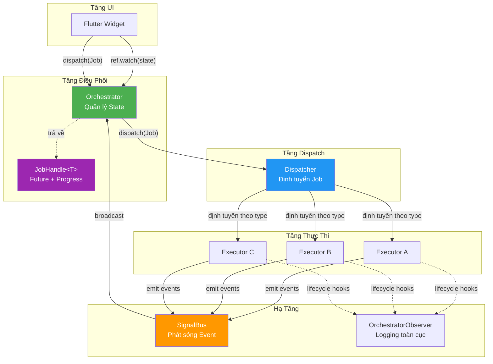
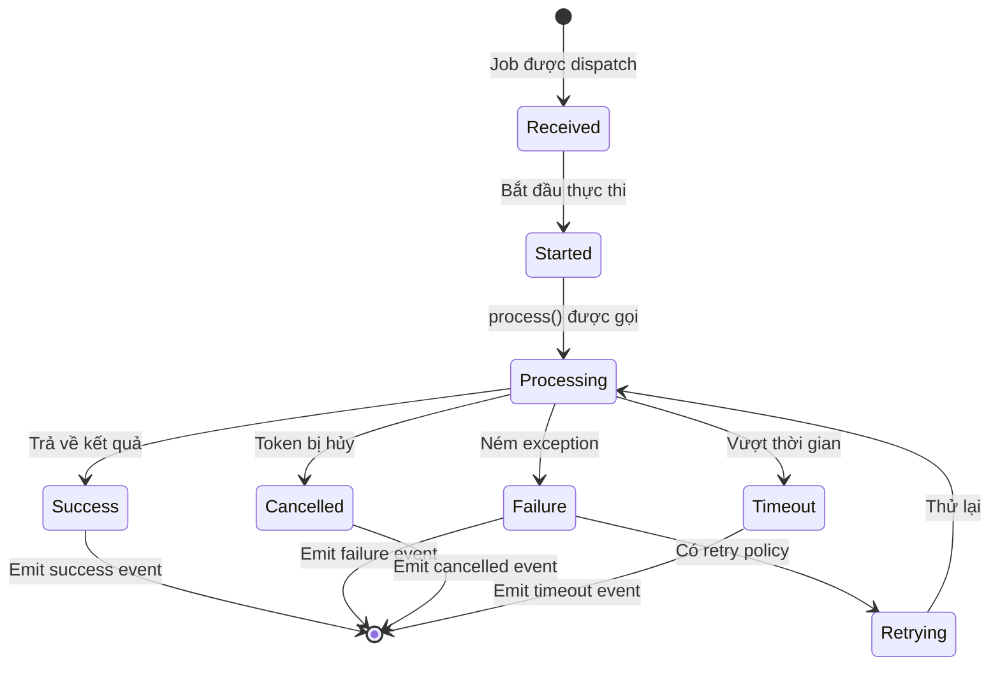
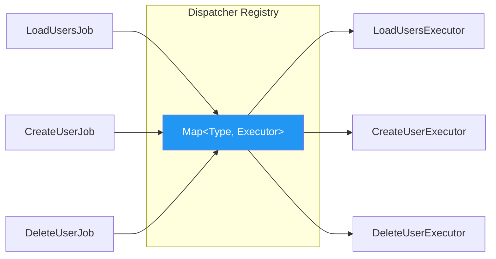
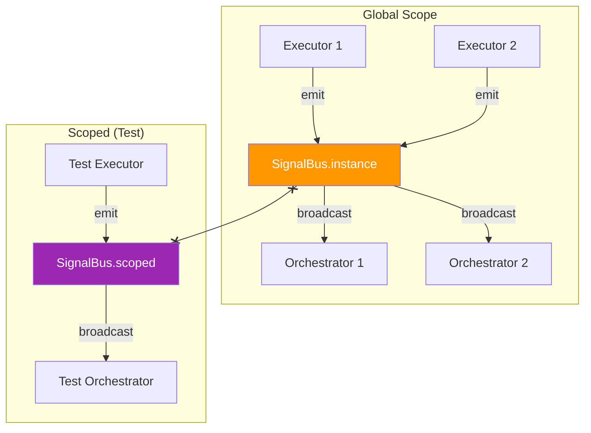
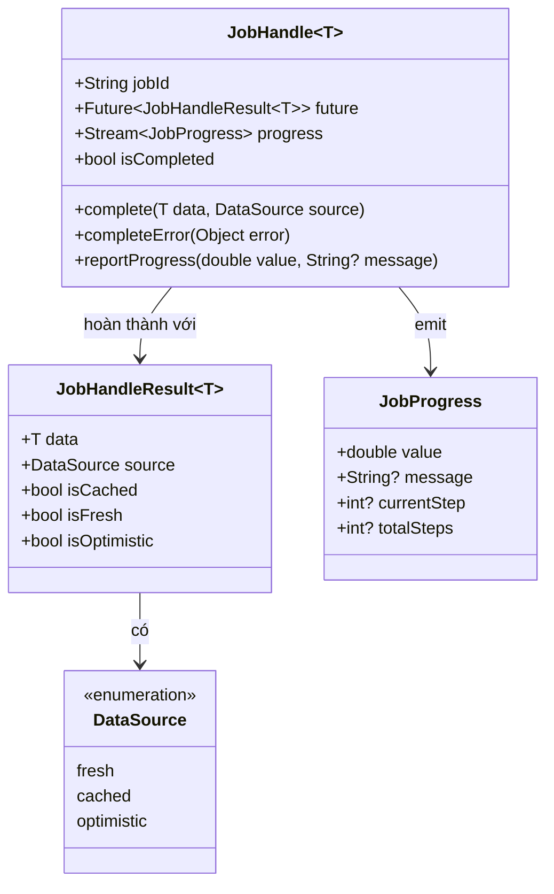
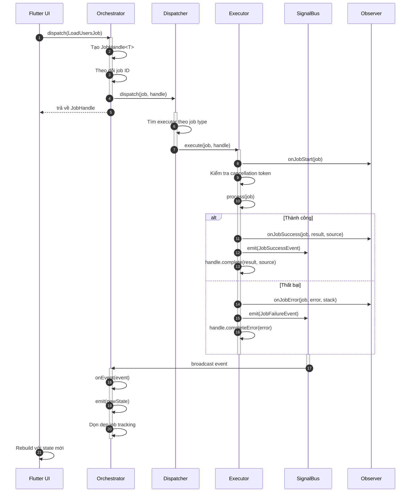
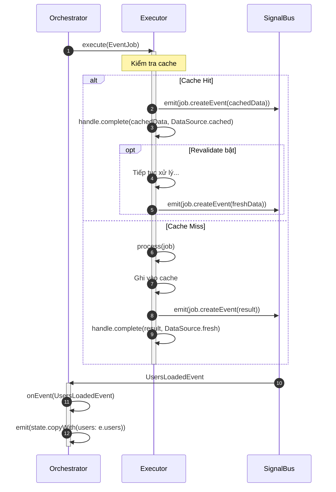
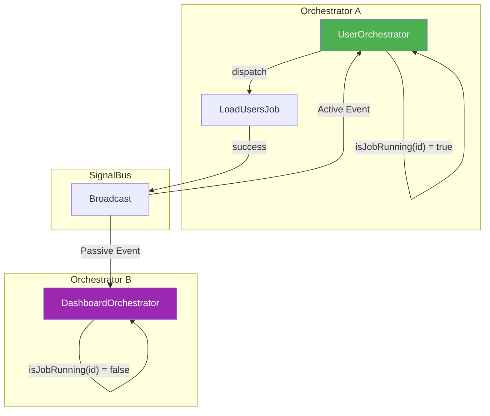

# Kiến Trúc Orchestrator Core

> Tài liệu kỹ thuật chi tiết của orchestrator_core v1.0.0 với Domain Event Architecture v3

## Mục Lục

1. [Tổng Quan](#tổng-quan)
2. [Các Thành Phần Chính](#các-thành-phần-chính)
3. [Luồng Dữ Liệu](#luồng-dữ-liệu)
4. [Vòng Đời Job](#vòng-đời-job)
5. [Hệ Thống Event](#hệ-thống-event)
6. [Tính Năng Nâng Cao](#tính-năng-nâng-cao)

---

## Tổng Quan

Orchestrator Pattern tách biệt **làm gì** (Jobs) khỏi **làm như thế nào** (Executors), với **Dispatcher** trung tâm định tuyến jobs và **SignalBus** cho giao tiếp dựa trên sự kiện.





---

## Các Thành Phần Chính

### 1. BaseJob

Đối tượng command bất biến mô tả **cần làm gì**.

```dart
// Job đơn giản
class LoadUsersJob extends BaseJob {
  LoadUsersJob() : super(id: generateJobId('load_users'));
}

// Job có tham số
class CreateUserJob extends BaseJob {
  final String name;
  final String email;
  
  CreateUserJob({required this.name, required this.email})
    : super(id: generateJobId('create_user'));
}
```

#### EventJob (v1.0.0+)

Jobs tự động emit domain events khi hoàn thành:

```dart
class LoadUsersJob extends EventJob<List<User>, UsersLoadedEvent> {
  @override
  UsersLoadedEvent createEventTyped(List<User> result) {
    return UsersLoadedEvent(correlationId: id, users: result);
  }
  
  @override
  String? get cacheKey => 'users_list';
  
  @override
  Duration? get cacheTtl => Duration(minutes: 5);
}
```


### 2. BaseExecutor

Xử lý thực thi job với hỗ trợ sẵn cho timeout, retry, cancellation và progress.

```dart
class LoadUsersExecutor extends BaseExecutor<LoadUsersJob> {
  final UserRepository _repo;
  
  LoadUsersExecutor(this._repo);
  
  @override
  Future<List<User>> process(LoadUsersJob job) async {
    // Báo cáo tiến độ
    emitProgress(job.id, progress: 0.3, message: 'Đang tải...');
    
    final users = await _repo.getAll();
    
    emitProgress(job.id, progress: 1.0, message: 'Hoàn tất');
    return users;
  }
}
```

#### Vòng Đời Executor




### 3. Dispatcher

Định tuyến jobs đến executors đã đăng ký. Sử dụng Singleton pattern.

```dart
// Đăng ký (thường trong khởi tạo app)
final dispatcher = Dispatcher();
dispatcher.register<LoadUsersJob>(LoadUsersExecutor(repo));
dispatcher.register<CreateUserJob>(CreateUserExecutor(repo));

// Dispatch (nội bộ - được gọi bởi Orchestrator)
dispatcher.dispatch(job, handle: jobHandle);
```




### 4. BaseOrchestrator

"Bộ Não Phản Ứng" - quản lý state và phản ứng với domain events.

```dart
class UserOrchestrator extends BaseOrchestrator<UserState> {
  UserOrchestrator() : super(UserState.initial());
  
  // Dispatch jobs
  JobHandle<List<User>> loadUsers() {
    return dispatch<List<User>>(LoadUsersJob());
  }
  
  // Phản ứng với TẤT CẢ events qua một handler duy nhất
  @override
  void onEvent(BaseEvent event) {
    switch (event) {
      case UsersLoadedEvent e:
        emit(state.copyWith(users: e.users));
      case UserCreatedEvent e:
        emit(state.copyWith(users: [...state.users, e.user]));
      case UserDeletedEvent e:
        emit(state.copyWith(
          users: state.users.where((u) => u.id != e.userId).toList()
        ));
    }
  }
}
```


### 5. SignalBus

Event bus phát sóng cho giao tiếp tách rời. Hỗ trợ cả global và scoped instances.

```dart
// Global bus (mặc định)
final globalBus = SignalBus.instance;

// Scoped bus (cho testing hoặc cách ly)
final scopedBus = SignalBus.scoped();

// Lắng nghe events
bus.listen((event) {
  print('Nhận được: $event');
});

// Emit events
bus.emit(UserCreatedEvent(correlationId: jobId, user: newUser));
```




### 6. JobHandle

Đại diện cho một job đang chạy với kết quả future và theo dõi tiến độ.

```dart
// Fire and forget (chạy rồi quên)
orchestrator.loadUsers();

// Chờ kết quả
final handle = orchestrator.loadUsers();
final result = await handle.future;
print(result.data);        // List<User>
print(result.source);      // DataSource.fresh | cached | optimistic

// Theo dõi tiến độ
handle.progress.listen((p) {
  print('${p.value * 100}% - ${p.message}');
});
```




---

## Luồng Dữ Liệu

### Luồng Thực Thi Job Hoàn Chỉnh




### Luồng EventJob (Domain Events)




---

## Hệ Thống Event

### Active vs Passive Events



**Active Event**: Orchestrator đã dispatch job nhận được completion event.
- `isJobRunning(event.correlationId)` trả về `true`

**Passive Event**: Các orchestrators khác nhận cùng event như observers.
- `isJobRunning(event.correlationId)` trả về `false`
- Hữu ích cho đồng bộ state giữa các features


---

## Tính Năng Nâng Cao

### 1. Timeout & Cancellation

```dart
// Với timeout
final job = LoadUsersJob()..timeout = Duration(seconds: 30);

// Với cancellation
final token = CancellationToken();
final job = LoadUsersJob()..cancellationToken = token;

// Hủy sau
token.cancel();
```

### 2. Retry Policy

```dart
final job = LoadUsersJob()
  ..retryPolicy = RetryPolicy(
    maxRetries: 3,
    delay: Duration(seconds: 1),
    backoffMultiplier: 2.0,  // 1s, 2s, 4s
  );
```

### 3. Circuit Breaker (Bảo Vệ Loop)

Orchestrator có bảo vệ sẵn chống infinite event loops.

```dart
// Cấu hình giới hạn theo event type
OrchestratorConfig.setLimit(JobProgressEvent, 100);  // Cho phép 100/giây
OrchestratorConfig.setLimit(JobSuccessEvent, 50);    // Cho phép 50/giây
```


### 4. OrchestratorObserver (Logging Toàn Cục)

```dart
class MyObserver extends OrchestratorObserver {
  @override
  void onJobStart(BaseJob job) {
    analytics.track('job_started', {'type': job.runtimeType.toString()});
  }
  
  @override
  void onJobError(BaseJob job, Object error, StackTrace stack) {
    crashlytics.recordError(error, stack);
  }
}

// Đặt toàn cục
OrchestratorObserver.instance = MyObserver();
```

---

## Tham Khảo Nhanh

### Các Pattern Sử Dụng

| Pattern | Code | Trường Hợp Dùng |
|---------|------|-----------------|
| Fire & Forget | `orchestrator.loadUsers()` | Cập nhật state qua events |
| Chờ Kết Quả | `await handle.future` | Cần kết quả ngay |
| Theo Dõi Tiến Độ | `handle.progress.listen(...)` | Hiển thị UI tiến độ |
| Kiểm Tra Active | `isJobRunning(id)` | Phân biệt job của mình vs của người khác |

### Giá Trị DataSource

| Giá Trị | Ý Nghĩa |
|---------|---------|
| `DataSource.fresh` | Vừa lấy từ nguồn |
| `DataSource.cached` | Trả về từ cache |
| `DataSource.optimistic` | Cập nhật lạc quan (chờ xác nhận) |

---

*Tạo cho orchestrator_core v1.0.0 - Domain Event Architecture v3*
