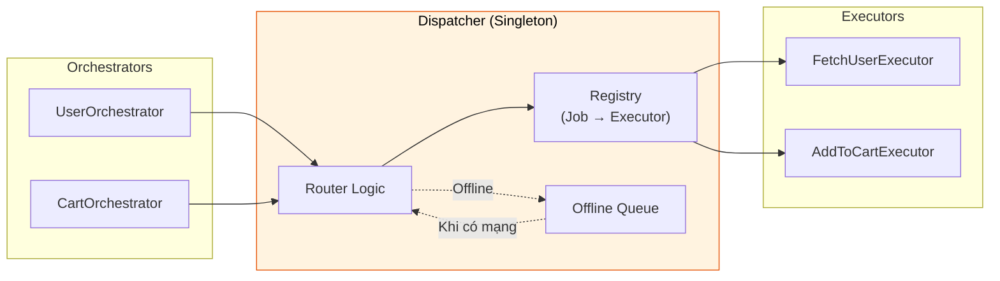
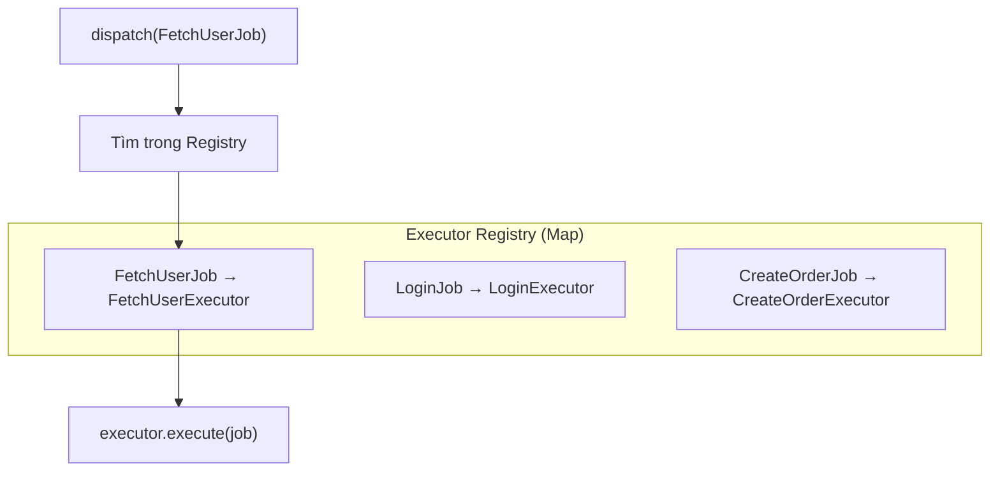
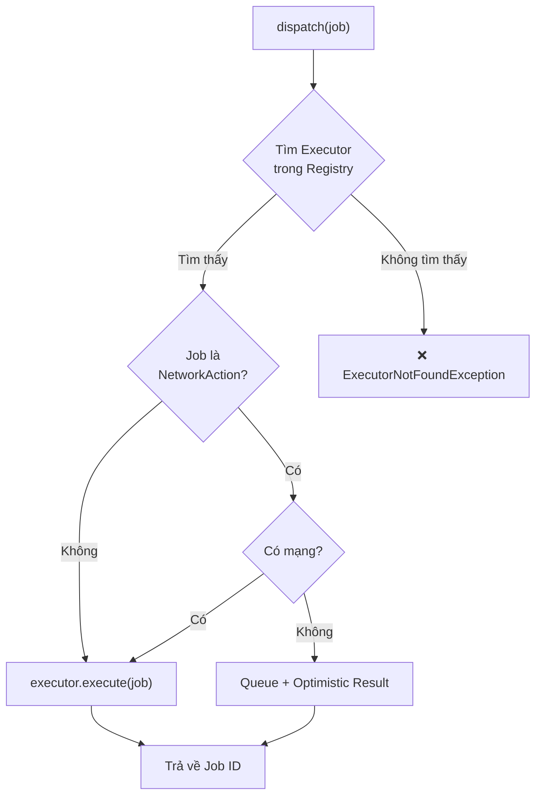
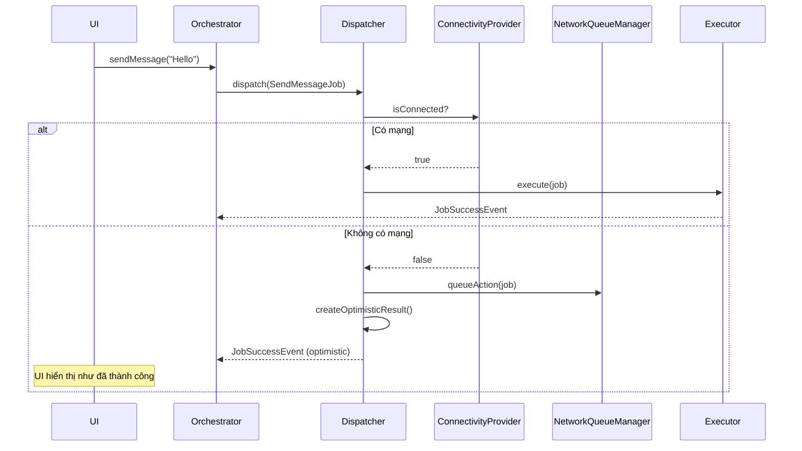
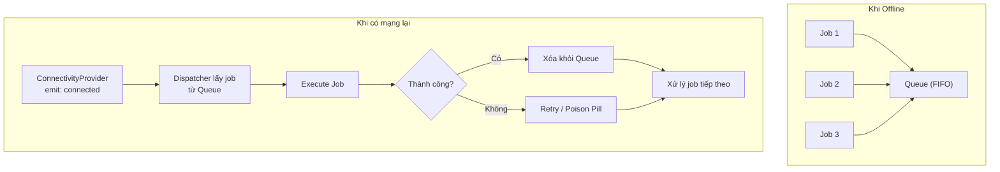
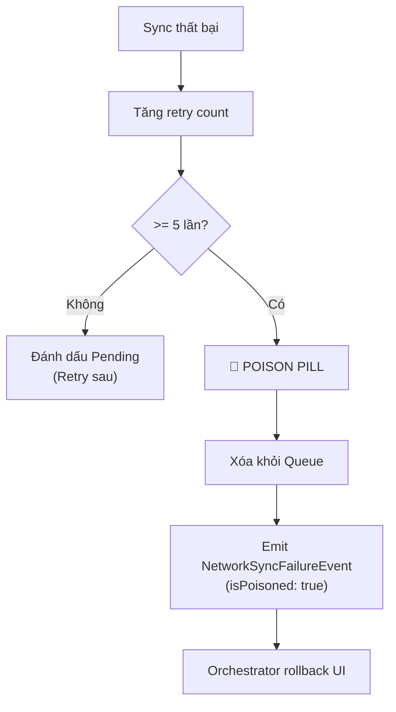

# Dispatcher - Trung tâm điều phối

Dispatcher là **"Bộ định tuyến" (Router)** của hệ thống. Nó nhận Job từ Orchestrator, tìm Executor phù hợp và chuyển tiếp để xử lý. Ngoài ra, Dispatcher còn xử lý các vấn đề ngầm như **Offline Queue** và **Auto-Sync**.

> **Vai trò:** Tương tự như API Gateway hoặc Message Broker trong các kiến trúc backend.

### Vị trí của Dispatcher trong kiến trúc



---

## 1. Singleton Pattern

Dispatcher là **Global Singleton** - chỉ có một instance duy nhất trong toàn bộ ứng dụng.

```dart
// Tất cả các lần gọi Dispatcher() đều trả về CÙNG MỘT instance
final dispatcher1 = Dispatcher();
final dispatcher2 = Dispatcher();
print(dispatcher1 == dispatcher2); // true
```

**Tại sao Singleton?**
- Đảm bảo tất cả Orchestrators dùng chung một registry
- Tập trung quản lý Offline Queue
- Dễ dàng theo dõi và debug

---

## 2. Đăng ký Executor

Trước khi dispatch Job, bạn phải đăng ký Executor tương ứng.

### 2.1. Đăng ký theo Generic Type (Khuyến nghị)

```dart
// Trong main.dart
void main() {
  // 1. Đăng ký tất cả Executors TRƯỚC KHI runApp
  Dispatcher().register<FetchUserJob>(FetchUserExecutor());
  Dispatcher().register<LoginJob>(LoginExecutor());
  Dispatcher().register<CreateOrderJob>(CreateOrderExecutor());
  
  // 2. Cấu hình khác...
  
  // 3. Chạy app
  runApp(MyApp());
}
```

### 2.2. Đăng ký theo Runtime Type

Sử dụng khi không có access đến generic type (ví dụ: dynamic registration):

```dart
// Đăng ký bằng Type object
Dispatcher().registerByType(FetchUserJob, FetchUserExecutor());

// Use case: Plugin system, dynamic loading
for (final module in loadedModules) {
  Dispatcher().registerByType(module.jobType, module.executor);
}
```

### 2.3. Registry nội bộ



---

## 3. Dispatch Job

### 3.1. Luồng cơ bản



### 3.2. Cách sử dụng

```dart
// Trong Orchestrator
void loadUser(String userId) {
  // dispatch() trả về job ID ngay lập tức (Fire-and-Forget)
  final jobId = dispatch(FetchUserJob(userId));
  
  // Kết quả sẽ đến qua event hooks (onActiveSuccess, onActiveFailure...)
}
```

### 3.3. Dispatch từ Orchestrator vs Trực tiếp

```dart
// ✅ ĐÚNG: Dispatch qua Orchestrator
class UserOrchestrator extends BaseOrchestrator<UserState> {
  void loadUser() {
    dispatch(FetchUserJob()); // Orchestrator tracking tự động
  }
}

// ❌ SAI: Dispatch trực tiếp từ UI
class MyWidget extends StatelessWidget {
  void onTap() {
    Dispatcher().dispatch(FetchUserJob()); // Không có tracking!
  }
}
```

---

## 4. Xử lý NetworkAction (Offline Support)

Khi Job implement `NetworkAction`, Dispatcher sẽ tự động xử lý offline.

### 4.1. Luồng xử lý chi tiết



### 4.2. Optimistic Result

Khi offline, Dispatcher sẽ:
1. Lưu Job vào Queue
2. Gọi `job.createOptimisticResult()` để lấy kết quả giả định
3. Emit `JobSuccessEvent` với kết quả giả định
4. UI hiển thị như thể đã thành công

```dart
// Trong Job
class SendMessageJob extends BaseJob implements NetworkAction<Message> {
  final String text;
  
  @override
  Message createOptimisticResult() {
    return Message(
      id: 'temp_${DateTime.now().millisecondsSinceEpoch}',
      text: text,
      status: MessageStatus.sending, // Đánh dấu đang gửi
    );
  }
}
```

---

## 5. Auto-Sync khi có mạng

### 5.1. Cơ chế hoạt động



### 5.2. FIFO Order

Jobs được xử lý theo thứ tự **First In First Out** để đảm bảo tính nhất quán:

```
Queue: [Job1, Job2, Job3]
       ↑
       Xử lý trước
```

---

## 6. Poison Pill (Max Retries)

Để tránh một Job lỗi vĩnh viễn block toàn bộ Queue, Dispatcher implement cơ chế **Poison Pill**.

### 6.1. Luồng xử lý



### 6.2. Xử lý Poison Pill trong Orchestrator

```dart
@override
void onPassiveEvent(BaseEvent event) {
  if (event is NetworkSyncFailureEvent && event.isPoisoned) {
    // Job đã bị bỏ sau 5 lần thất bại
    // Rollback optimistic UI
    final failedMessageId = event.correlationId;
    emit(state.markMessageFailed(failedMessageId));
    
    // Hiển thị thông báo lỗi
    showError('Không thể gửi tin nhắn. Vui lòng thử lại.');
  }
}
```

### 6.3. Cấu hình Max Retries

```dart
// Mặc định: 5 lần
// Hiện tại không thể thay đổi qua config, 
// nhưng có thể override trong subclass nếu cần
```

---

## 7. ExecutorNotFoundException

Nếu dispatch Job mà không có Executor đăng ký, Dispatcher sẽ throw exception:

```dart
// Chưa đăng ký Executor cho UnknownJob
Dispatcher().dispatch(UnknownJob());
// → Exception: ExecutorNotFoundException: 
//   No executor registered for job type UnknownJob
```

### 7.1. Cách tránh lỗi này

```dart
void main() {
  // Đăng ký TẤT CẢ Executors trước khi app chạy
  _registerExecutors();
  runApp(MyApp());
}

void _registerExecutors() {
  final d = Dispatcher();
  d.register<FetchUserJob>(FetchUserExecutor());
  d.register<LoginJob>(LoginExecutor());
  // ... tất cả các jobs khác
}
```

### 7.2. Debug khi gặp lỗi

```
ExecutorNotFoundException: No executor registered for job type FetchProductJob
```

**Checklist:**
- [ ] Đã đăng ký `FetchProductJob` với Executor trong `main()`?
- [ ] Tên Job có đúng không? (FetchProductJob vs FetchProductsJob)
- [ ] Có typo trong generic type không?

---

## 8. Testing

### 8.1. Reset cho Test Isolation

```dart
setUp(() {
  // Reset hoàn toàn Dispatcher trước mỗi test
  Dispatcher().resetForTesting();
  
  // Đăng ký executors cần thiết cho test
  Dispatcher().register<TestJob>(mockExecutor);
});
```

### 8.2. Clear Registry

```dart
tearDown(() {
  // Chỉ xóa registry, giữ listeners
  Dispatcher().clear();
});
```

### 8.3. Dispose

```dart
// Chỉ dùng khi kết thúc test suite hoàn toàn
Dispatcher().dispose();
```

---

## 9. Cấu hình Offline Support

Để Dispatcher xử lý offline, cần cấu hình trong `main()`:

```dart
void main() async {
  WidgetsFlutterBinding.ensureInitialized();
  
  // 1. Đăng ký Executors
  _registerExecutors();
  
  // 2. Cấu hình Connectivity Provider
  OrchestratorConfig.setConnectivityProvider(
    FlutterConnectivityProvider(),
  );
  
  // 3. Cấu hình Network Queue Manager
  OrchestratorConfig.setNetworkQueueManager(
    NetworkQueueManager(
      storage: FileNetworkQueueStorage(),
      fileDelegate: FlutterFileSafety(),
    ),
  );
  
  // 4. Đăng ký Network Jobs (từ code generation)
  registerNetworkJobs();
  
  runApp(MyApp());
}
```

---

## 10. API Reference

### 10.1. Public Methods

| Method | Mô tả |
|--------|-------|
| `register<J>(executor)` | Đăng ký Executor cho Job type J |
| `registerByType(type, executor)` | Đăng ký Executor bằng runtime Type |
| `dispatch(job)` | Gửi Job đến Executor, trả về job ID |
| `clear()` | Xóa tất cả registrations |
| `dispose()` | Hủy listeners (cleanup) |
| `resetForTesting()` | Reset hoàn toàn cho testing |

### 10.2. Properties

| Property | Type | Mô tả |
|----------|------|-------|
| `maxRetries` | `int` | Số lần retry tối đa (mặc định: 5) |

---

## 11. Best Practices

### ✅ Nên làm

- **Đăng ký tất cả Executors trong `main()`** trước `runApp()`
- **Mỗi Job type → Một Executor duy nhất**
- **Luôn dispatch qua Orchestrator**, không gọi trực tiếp
- **Xử lý `NetworkSyncFailureEvent`** để rollback UI khi cần

### ❌ Không nên làm

```dart
// ❌ SAI: Đăng ký executor sau khi app chạy
class MyWidget extends StatefulWidget {
  @override
  void initState() {
    // KHÔNG! Đăng ký trước trong main()
    Dispatcher().register<MyJob>(MyExecutor());
  }
}

// ❌ SAI: Dispatch trực tiếp từ Widget
ElevatedButton(
  onPressed: () {
    Dispatcher().dispatch(MyJob()); // KHÔNG! Dùng Orchestrator
  },
)

// ❌ SAI: Quên đăng ký Job
// → ExecutorNotFoundException khi dispatch
```

---

## Xem thêm

- [Job - Định nghĩa hành động](job.md) - Input cho Dispatcher
- [Executor - Xử lý Logic](executor.md) - Nơi Dispatcher chuyển Job đến
- [Offline Support](../advanced/offline_support.md) - Chi tiết về NetworkAction
- [SignalBus - Giao tiếp sự kiện](signal_bus.md) - Cách events trả về
