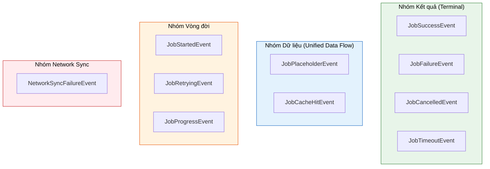
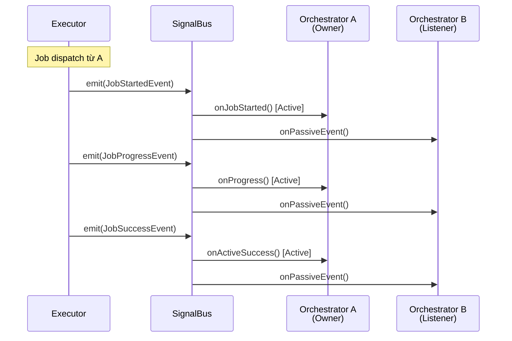

# Event - Các loại sự kiện

Event là **"Tín hiệu phản hồi" (Signal)** từ Executor. Sau khi xử lý Job, Executor sẽ emit các Event thông qua SignalBus để thông báo kết quả, tiến trình hoặc các trạng thái khác cho Orchestrator.

> **Đặc điểm:** Fire-and-Forget - Executor chỉ gửi đi, không chờ phản hồi. Orchestrator tự lắng nghe và xử lý.

### Phân loại Event



---

## 1. BaseEvent (Lớp cơ sở)

Tất cả Event đều kế thừa từ `BaseEvent`:

```dart
@immutable
abstract class BaseEvent {
  /// ID của Job tạo ra event này (Correlation ID)
  /// Dùng để link event với job gốc
  final String correlationId;
  
  /// Thời điểm event được emit
  final DateTime timestamp;
  
  BaseEvent(this.correlationId) : timestamp = DateTime.now();
}
```

**Correlation ID:**
- Mỗi Job có một ID duy nhất
- Tất cả events từ Job đó đều mang cùng `correlationId`
- Orchestrator dùng ID này để phân biệt Active vs Passive events

---

## 2. Result Events (Kết quả cuối cùng)

Đây là các **Terminal Events** - đánh dấu kết thúc vòng đời của Job.

### 2.1. JobSuccessEvent

Emit khi Job hoàn thành **thành công**.

```dart
class JobSuccessEvent<T> extends BaseEvent {
  /// Dữ liệu kết quả
  final T data;
  
  /// Helper method để cast an toàn
  /// Trả về null nếu type không khớp (thay vì throw)
  R? dataAs<R>() {
    if (data is R) return data as R;
    return null;
  }
}
```

**Xử lý trong Orchestrator:**

```dart
@override
void onActiveSuccess(JobSuccessEvent event) {
  // Cách 1: Cast an toàn với dataAs()
  final user = event.dataAs<User>();
  if (user != null) {
    emit(state.copyWith(user: user, isLoading: false));
  }
  
  // Cách 2: Kiểm tra theo Job type (nếu có nhiều Job types)
  // Sử dụng khi cần xử lý khác nhau cho từng loại job
}
```

### 2.2. JobFailureEvent

Emit khi Job **thất bại** (throw exception).

```dart
class JobFailureEvent extends BaseEvent {
  /// Lỗi gốc (có thể là Exception, Error, hoặc bất kỳ Object nào)
  final Object error;
  
  /// Stack trace để debug
  final StackTrace? stackTrace;
  
  /// true nếu đây là failure SAU KHI đã retry hết
  final bool wasRetried;
}
```

**Xử lý trong Orchestrator:**

```dart
@override
void onActiveFailure(JobFailureEvent event) {
  String message;
  
  if (event.error is NetworkException) {
    message = 'Lỗi kết nối mạng. Vui lòng kiểm tra internet.';
  } else if (event.error is AuthException) {
    message = 'Phiên đăng nhập hết hạn. Vui lòng đăng nhập lại.';
  } else {
    message = 'Đã xảy ra lỗi: ${event.error}';
  }
  
  emit(state.copyWith(isLoading: false, error: message));
  
  // Log chi tiết để debug
  if (event.stackTrace != null) {
    logger.error('Job failed', event.error, event.stackTrace);
  }
}
```

### 2.3. JobCancelledEvent

Emit khi Job bị **hủy** (qua CancellationToken).

```dart
class JobCancelledEvent extends BaseEvent {
  /// Lý do hủy (tùy chọn)
  final String? reason;
}
```

**Xử lý trong Orchestrator:**

```dart
@override
void onActiveCancelled(JobCancelledEvent event) {
  emit(state.copyWith(isLoading: false));
  // Thường không cần hiển thị lỗi vì user chủ động hủy
}
```

### 2.4. JobTimeoutEvent

Emit khi Job **vượt quá thời gian** cho phép.

```dart
class JobTimeoutEvent extends BaseEvent {
  /// Duration đã cấu hình trên Job
  final Duration timeout;
}
```

**Xử lý trong Orchestrator:**

```dart
@override
void onActiveTimeout(JobTimeoutEvent event) {
  emit(state.copyWith(
    isLoading: false,
    error: 'Kết nối quá chậm (>${event.timeout.inSeconds}s). Vui lòng thử lại.',
  ));
}
```

---

## 3. Data Events (Unified Data Flow)

Events này emit **TRƯỚC** khi có kết quả thực sự từ `process()`.

### 3.1. JobPlaceholderEvent

Emit ngay lập tức khi Job có `strategy.placeholder`.

```dart
class JobPlaceholderEvent<T> extends BaseEvent {
  /// Dữ liệu placeholder (skeleton, loading state...)
  final T data;
}
```

**Use case: Skeleton UI**

```dart
// Trong Job
class FetchProductsJob extends BaseJob {
  FetchProductsJob() : super(
    id: generateJobId(),
    strategy: DataStrategy(
      placeholder: List.generate(5, (_) => Product.skeleton()),
    ),
  );
}

// Trong Orchestrator - Lắng nghe qua onActiveEvent hoặc onPassiveEvent
@override
void onActiveEvent(BaseEvent event) {
  if (event is JobPlaceholderEvent) {
    final skeletons = event.dataAs<List<Product>>();
    emit(state.copyWith(products: skeletons, isLoadingSkeletons: true));
  }
}
```

### 3.2. JobCacheHitEvent

Emit khi tìm thấy data trong cache.

```dart
class JobCacheHitEvent<T> extends BaseEvent {
  /// Dữ liệu từ cache
  final T data;
}
```

**Timeline:**

```
dispatch(job)
  → JobPlaceholderEvent (nếu có)    ← UI hiển thị skeleton
  → JobCacheHitEvent (nếu cache hit) ← UI hiển thị data cũ
  → JobSuccessEvent (nếu revalidate) ← UI hiển thị data mới
```

---

## 4. Progress Events (Tiến trình)

### 4.1. JobProgressEvent

Emit để báo cáo tiến trình cho UI.

```dart
class JobProgressEvent extends BaseEvent {
  /// Tiến trình từ 0.0 đến 1.0 (tự động clamp)
  final double progress;
  
  /// Message tùy chọn
  final String? message;
  
  /// Bước hiện tại (tùy chọn)
  final int? currentStep;
  
  /// Tổng số bước (tùy chọn)
  final int? totalSteps;
}
```

**Xử lý trong Orchestrator:**

```dart
@override
void onProgress(JobProgressEvent event) {
  emit(state.copyWith(
    uploadProgress: event.progress,
    uploadMessage: event.message,
    currentStep: event.currentStep,
    totalSteps: event.totalSteps,
  ));
}

// Trong UI
LinearProgressIndicator(value: state.uploadProgress)
Text('${(state.uploadProgress * 100).toInt()}%')
Text(state.uploadMessage ?? '')
```

---

## 5. Lifecycle Events (Vòng đời)

### 5.1. JobStartedEvent

Emit khi Job **bắt đầu** execute.

```dart
class JobStartedEvent extends BaseEvent {
  // Không có field bổ sung
  // Chỉ thông báo rằng job đã bắt đầu
}
```

**Use case:** Tracking, analytics, logging

```dart
@override
void onJobStarted(JobStartedEvent event) {
  analytics.trackEvent('job_started', {'id': event.correlationId});
}
```

### 5.2. JobRetryingEvent

Emit khi Job đang **retry** sau lỗi.

```dart
class JobRetryingEvent extends BaseEvent {
  /// Lần retry thứ mấy (1-indexed)
  final int attempt;
  
  /// Số lần retry tối đa
  final int maxRetries;
  
  /// Lỗi của lần thử trước
  final Object lastError;
  
  /// Thời gian chờ trước khi retry
  final Duration delayBeforeRetry;
}
```

**Xử lý trong Orchestrator:**

```dart
@override
void onJobRetrying(JobRetryingEvent event) {
  emit(state.copyWith(
    statusMessage: 'Đang thử lại... (${event.attempt}/${event.maxRetries})',
  ));
}
```

---

## 6. Network Sync Events

### 6.1. NetworkSyncFailureEvent

Emit khi một **NetworkAction job** fail trong quá trình đồng bộ ngầm.

```dart
class NetworkSyncFailureEvent extends BaseEvent {
  /// Lỗi gây ra failure
  final Object error;
  
  /// Stack trace
  final StackTrace? stackTrace;
  
  /// Số lần đã retry
  final int retryCount;
  
  /// true = Job đã bị bỏ (vượt max retries)
  /// false = Job sẽ được retry tiếp
  final bool isPoisoned;
}
```

**QUAN TRỌNG - Xử lý Poison Pill:**

```dart
@override
void onPassiveEvent(BaseEvent event) {
  if (event is NetworkSyncFailureEvent && event.isPoisoned) {
    // Job đã fail vĩnh viễn sau nhiều lần retry
    // PHẢI rollback optimistic UI
    final failedId = event.correlationId;
    
    // Ví dụ: Đánh dấu tin nhắn là "gửi thất bại"
    emit(state.markMessageFailed(failedId));
    
    // Hiện thông báo cho user
    showSnackbar('Không thể gửi tin nhắn. Vui lòng thử lại.');
  }
}
```

---

## 7. Custom Events

Bạn có thể tạo Event tùy chỉnh cho các trường hợp đặc biệt:

```dart
// Định nghĩa custom event
class UserLoggedOutEvent extends BaseEvent {
  final String reason;
  
  UserLoggedOutEvent({required this.reason}) 
    : super('system-logout-${DateTime.now().millisecondsSinceEpoch}');
}

class NewNotificationEvent extends BaseEvent {
  final int count;
  final String preview;
  
  NewNotificationEvent(String jobId, {required this.count, required this.preview})
    : super(jobId);
}

// Emit từ Executor
@override
Future<void> process(CheckNotificationsJob job) async {
  final notifications = await _api.getNotifications();
  
  if (notifications.isNotEmpty) {
    emit(NewNotificationEvent(
      job.id,
      count: notifications.length,
      preview: notifications.first.title,
    ));
  }
  
  return notifications;
}

// Lắng nghe trong Orchestrator
@override
void onPassiveEvent(BaseEvent event) {
  if (event is NewNotificationEvent) {
    emit(state.copyWith(badgeCount: event.count));
  }
}
```

---

## 8. Event Flow Diagram



**Giải thích:**
- **Active Events:** Orchestrator A dispatch job → nhận events qua các hooks cụ thể (`onActiveSuccess`, `onActiveFailure`...)
- **Passive Events:** Tất cả Orchestrators khác nhận events qua `onPassiveEvent()`

---

## 9. Bảng tổng hợp Events

| Event | Khi nào emit | Hook trong Orchestrator |
|-------|--------------|-------------------------|
| `JobStartedEvent` | Job bắt đầu | `onJobStarted()` |
| `JobPlaceholderEvent` | Có placeholder | `onActiveEvent()` |
| `JobCacheHitEvent` | Cache hit | `onActiveEvent()` |
| `JobProgressEvent` | Báo tiến trình | `onProgress()` |
| `JobRetryingEvent` | Đang retry | `onJobRetrying()` |
| `JobSuccessEvent` | Thành công | `onActiveSuccess()` |
| `JobFailureEvent` | Thất bại | `onActiveFailure()` |
| `JobCancelledEvent` | Bị hủy | `onActiveCancelled()` |
| `JobTimeoutEvent` | Timeout | `onActiveTimeout()` |
| `NetworkSyncFailureEvent` | Sync thất bại | `onPassiveEvent()` |

---

## 10. Best Practices

### ✅ Nên làm

- **Dùng `dataAs<T>()`** thay vì cast trực tiếp → tránh crash
- **Xử lý tất cả terminal events** (Success, Failure, Cancelled, Timeout)
- **Log failure events** với stack trace để debug
- **Rollback UI** khi nhận `NetworkSyncFailureEvent` với `isPoisoned = true`

### ❌ Không nên làm

```dart
// ❌ SAI: Cast trực tiếp có thể crash
final user = event.data as User; // Nguy hiểm!

// ✅ ĐÚNG: Dùng dataAs()
final user = event.dataAs<User>();
if (user != null) { ... }

// ❌ SAI: Bỏ qua failure events
@override
void onActiveFailure(JobFailureEvent event) {
  // Để trống → User không biết có lỗi
}

// ✅ ĐÚNG: Luôn xử lý và thông báo
@override
void onActiveFailure(JobFailureEvent event) {
  emit(state.copyWith(error: event.error.toString()));
}
```

---

## Xem thêm

- [Orchestrator - Event Hooks](orchestrator.md#5-event-hooks) - Các hooks để xử lý events
- [Executor - Emit Events](executor.md#8-emit-custom-events) - Cách emit events
- [SignalBus - Giao tiếp sự kiện](signal_bus.md) - Cách events truyền đi
