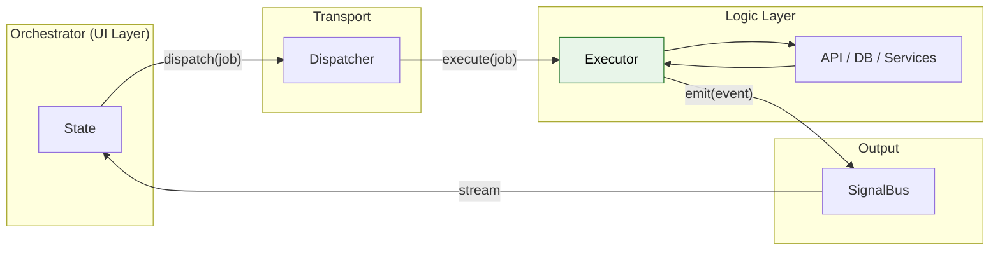
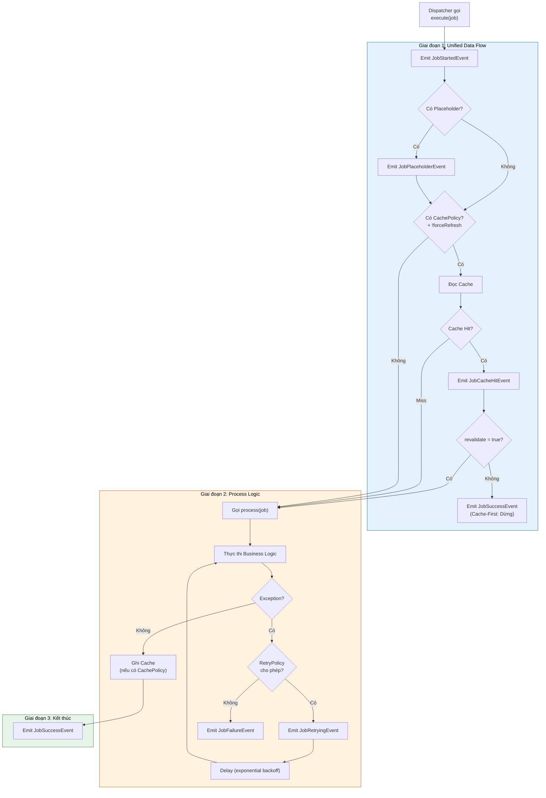

# Executor - Xử lý Logic nghiệp vụ

Executor là **"Công nhân" (The Worker)** của hệ thống. Nó nhận Job từ Dispatcher, thực thi Business Logic thuần túy và gửi kết quả trở lại qua SignalBus.

> **Vai trò:** Tương đương với Use Case (Clean Architecture), Service Layer, hoặc Command Handler.

### Đặc điểm chính

- **Thuần Dart (Flutter-free):** Không import bất kỳ package UI nào
- **Tự động hóa:** Tích hợp sẵn Error Boundary, Retry, Timeout, Cancellation
- **Unified Data Flow:** Tự động xử lý Placeholder → Cache → Process → Cache Write

### Vị trí của Executor trong kiến trúc



---

## 1. Cấu trúc BaseExecutor

```dart
abstract class BaseExecutor<T extends BaseJob> {
  /// Entry point chính - Nơi bạn viết logic thực tế
  /// Chỉ cần return kết quả hoặc throw exception
  Future<dynamic> process(T job);
  
  /// Gửi kết quả thành công (tự động gọi khi process return)
  void emitResult<R>(String correlationId, R data);
  
  /// Gửi thông báo lỗi (tự động gọi khi process throw)
  void emitFailure(String correlationId, Object error, [StackTrace? stack]);
  
  /// Gửi cập nhật tiến trình
  void emitProgress(String correlationId, {required double progress, ...});
  
  /// Gửi tiến trình theo bước (tự tính %)
  void emitStep(String correlationId, {required int current, required int total, ...});
  
  /// Gửi sự kiện tùy chỉnh
  void emit(BaseEvent event);
  
  /// Cache operations
  CacheProvider get cacheProvider;
  Future<R?> readCache<R>(String key);
  Future<void> writeCache(String key, dynamic value, {Duration? ttl});
  Future<void> invalidateKey(String key);
  Future<void> invalidatePrefix(String prefix);
  Future<void> invalidateMatching(bool Function(String) predicate);
}
```

---

## 2. Luồng thực thi (Execution Flow)

Khi Dispatcher gọi `executor.execute(job)`, quy trình sau tự động diễn ra:



---

## 3. Tạo Executor đơn giản

```dart
class FetchUserExecutor extends BaseExecutor<FetchUserJob> {
  final ApiService _api;
  
  FetchUserExecutor(this._api);
  
  @override
  Future<User> process(FetchUserJob job) async {
    // Chỉ cần thực thi logic và return kết quả
    // Error Boundary tự động bắt exception
    return await _api.getUser(job.userId);
  }
}
```

**Lưu ý:** Bạn chỉ cần `return` kết quả, Framework tự động:
- Bọc vào `JobSuccessEvent` nếu thành công
- Bọc vào `JobFailureEvent` nếu throw exception
- Xử lý Timeout, Retry, Cancellation

---

## 4. Đăng ký Executor

```dart
void main() {
  final api = ApiService();
  
  // Đăng ký trong main() TRƯỚC runApp()
  Dispatcher().register<FetchUserJob>(FetchUserExecutor(api));
  Dispatcher().register<CreateOrderJob>(CreateOrderExecutor(api));
  Dispatcher().register<DeleteTaskJob>(DeleteTaskExecutor(api));
  
  runApp(MyApp());
}
```

---

## 5. Các tính năng tích hợp sẵn

### 5.1. Error Boundary (Hàng rào chặn lỗi)

Framework tự động bọc `process()` trong try-catch:

```dart
@override
Future<User> process(FetchUserJob job) async {
  // Nếu api.getUser() throw exception:
  // → Framework tự động emit JobFailureEvent
  // → Kèm đầy đủ error và stack trace
  // → App KHÔNG crash
  return await _api.getUser(job.userId);
}
```

### 5.2. Timeout

Cấu hình trên Job, Executor tự động xử lý:

```dart
// Trong Job
class SlowApiJob extends BaseJob {
  SlowApiJob() : super(id: generateJobId(), timeout: Duration(seconds: 30));
}

// Trong Executor - không cần làm gì thêm
// Framework tự động emit JobTimeoutEvent nếu quá 30 giây
```

### 5.3. Retry với Exponential Backoff

```dart
// Trong Job
class UnstableApiJob extends BaseJob {
  UnstableApiJob() : super(
    id: generateJobId(),
    retryPolicy: RetryPolicy(
      maxRetries: 3,
      baseDelay: Duration(seconds: 1),
      exponentialBackoff: true,
    ),
  );
}

// Trong Executor - KHÔNG CẦN VIẾT LOGIC RETRY
// Framework tự động xử lý hoàn toàn dựa trên RetryPolicy của Job
@override
Future<Data> process(UnstableApiJob job) async {
  // Dev chỉ cần viết logic chính, không quan tâm retry
  // Khi _api.fetchData() throw exception:
  // → Framework TỰ ĐỘNG emit JobRetryingEvent
  // → Framework TỰ ĐỘNG delay theo exponential backoff
  // → Framework TỰ ĐỘNG gọi lại process() 
  // → Sau maxRetries lần fail → Framework emit JobFailureEvent
  return await _api.fetchData();
}
```

### 5.4. Cancellation

```dart
@override
Future<void> process(LongRunningJob job) async {
  for (var item in items) {
    // Kiểm tra trước mỗi bước nặng
    job.cancellationToken?.throwIfCancelled();
    
    await processItem(item);
  }
}
```

---

## 6. Báo cáo tiến trình (Progress Reporting)

### 6.1. Theo phần trăm (0.0 → 1.0)

```dart
@override
Future<void> process(UploadJob job) async {
  emitProgress(job.id, progress: 0.0, message: 'Bắt đầu upload...');
  
  for (int i = 0; i < chunks.length; i++) {
    await uploadChunk(chunks[i]);
    emitProgress(
      job.id, 
      progress: (i + 1) / chunks.length,
      message: 'Đang upload ${i + 1}/${chunks.length}',
    );
  }
}
```

### 6.2. Theo bước (tự tính %)

```dart
@override
Future<void> process(SyncJob job) async {
  final items = await fetchItems();
  
  for (int i = 0; i < items.length; i++) {
    await syncItem(items[i]);
    emitStep(job.id, current: i + 1, total: items.length);
  }
}
```

---

## 7. Tích hợp Cache

### 7.1. Tự động qua DataStrategy (trên Job)

```dart
// Job với cache policy
class FetchProductsJob extends BaseJob {
  FetchProductsJob() : super(
    id: generateJobId(),
    strategy: DataStrategy(
      cachePolicy: CachePolicy(
        key: 'products_list',
        ttl: Duration(hours: 1),
        revalidate: true, // SWR pattern
      ),
    ),
  );
}

// Executor - không cần code gì thêm về cache
// Framework tự động: đọc cache → emit → process → ghi cache
```

### 7.2. Thao tác thủ công trong Executor

```dart
@override
Future<void> process(UpdateUserJob job) async {
  // 1. Đọc cache thủ công
  final oldUser = await readCache<User>('user_${job.userId}');
  
  // 2. Thực hiện update
  final newUser = await _api.updateUser(job.userId, job.data);
  
  // 3. Ghi cache thủ công
  await writeCache('user_${job.userId}', newUser, ttl: Duration(hours: 1));
  
  // 4. Invalidate các cache liên quan
  await invalidateKey('user_list');
  await invalidatePrefix('user_search_');
  
  return newUser;
}
```

### 7.3. InvalidateCacheJob (Built-in)

Framework cung cấp sẵn CacheJobExecutor để invalidate cache:

```dart
// Xóa key cụ thể
dispatch(InvalidateCacheJob(key: 'user_123'));

// Xóa theo prefix
dispatch(InvalidateCacheJob(prefix: 'products_'));

// Xóa theo điều kiện
dispatch(InvalidateCacheJob(predicate: (k) => k.contains('temp')));
```

---

## 8. Emit Custom Events

```dart
@override
Future<User> process(LoginJob job) async {
  final user = await _api.login(job.username, job.password);
  
  // Emit event tùy chỉnh cho các Orchestrator khác
  if (user.isFirstLogin) {
    emit(FirstLoginEvent(job.id, user));
  }
  
  if (user.hasUnreadNotifications) {
    emit(NewNotificationsEvent(job.id, count: user.unreadCount));
  }
  
  return user;
}
```

---

## 9. Dependency Injection

Executor là thuần Dart → DI đơn giản qua Constructor:

```dart
// Trong main.dart
void main() {
  final api = ApiService(baseUrl: 'https://api.example.com');
  final db = DatabaseService();
  final logger = LogService();
  
  Dispatcher().register<FetchTasksJob>(FetchTasksExecutor(api));
  Dispatcher().register<SaveLocalJob>(SaveLocalExecutor(db, logger));
  
  runApp(MyApp());
}
```

**Với get_it:**

```dart
void main() {
  // Setup DI
  GetIt.I.registerSingleton(ApiService());
  GetIt.I.registerSingleton(DatabaseService());
  
  // Inject từ container
  Dispatcher().register<FetchJob>(FetchExecutor(GetIt.I<ApiService>()));
}
```

---

## 10. Unit Testing

Executor thuần Dart → Test rất đơn giản:

```dart
void main() {
  late MockApiService mockApi;
  late FetchUserExecutor executor;
  
  setUp(() {
    mockApi = MockApiService();
    executor = FetchUserExecutor(mockApi);
  });
  
  test('should return user when API succeeds', () async {
    // Arrange
    when(mockApi.getUser('123')).thenAnswer(
      (_) async => User(id: '123', name: 'Ant'),
    );
    
    // Act
    final result = await executor.process(FetchUserJob('123'));
    
    // Assert
    expect(result.name, 'Ant');
    verify(mockApi.getUser('123')).called(1);
  });
  
  test('should throw when API fails', () async {
    when(mockApi.getUser(any)).thenThrow(Exception('Network error'));
    
    expect(
      () => executor.process(FetchUserJob('123')),
      throwsException,
    );
  });
}
```

---

## 11. Ví dụ thực tế từ Examples

### 11.1. Executor cơ bản

```dart
/// Executor for fetching all tasks
class FetchTasksExecutor extends BaseExecutor<FetchTasksJob> {
  final MockApiService _api;
  FetchTasksExecutor(this._api);

  @override
  Future<List<Task>> process(FetchTasksJob job) async {
    job.cancellationToken?.throwIfCancelled();
    final tasks = await _api.fetchTasks();
    job.cancellationToken?.throwIfCancelled();
    return tasks;
  }
}
```

### 11.2. Executor với Retry

```dart
/// Executor with auto-retry for failures
class FetchTasksWithRetryExecutor extends BaseExecutor<FetchTasksWithRetryJob> {
  final EnhancedMockApi _api;
  
  @override
  Future<List<Task>> process(FetchTasksWithRetryJob job) async {
    // RetryPolicy được xử lý tự động bởi BaseExecutor
    final tasks = await _api.fetchTasksWithFailures(failTimes: 2);
    return tasks;
  }
}
```

### 11.3. Executor cho Offline

```dart
/// Executor for creating tasks (offline support)
class CreateTaskExecutor extends BaseExecutor<CreateTaskJob> {
  final EnhancedMockApi _api;

  @override
  Future<Task> process(CreateTaskJob job) async {
    if (_api.isOffline) {
      // Trả về optimistic result nếu offline
      return job.createOptimisticResult();
    }
    
    return await _api.createTask(job.task);
  }
}
```

---

## 12. Best Practices

### ✅ Nên làm

- **Single Responsibility:** Một Executor = Một loại công việc
- **Inject Dependencies:** Qua constructor, không dùng global/static
- **Check Cancellation:** Trong các vòng lặp hoặc trước các bước nặng
- **Invalidate Cache:** Sau các mutation (POST/PUT/DELETE)
- **Return trực tiếp:** Không cần gọi `emitResult` thủ công

### ❌ Không nên làm

```dart
// ❌ SAI: Import Flutter packages
import 'package:flutter/material.dart';
import 'package:flutter/widgets.dart';

// ❌ SAI: Dùng BuildContext
class BadExecutor extends BaseExecutor<BadJob> {
  final BuildContext context; // KHÔNG!
}

// ❌ SAI: Gọi emitResult thủ công khi có thể return
@override
Future<void> process(MyJob job) async {
  final result = await _api.fetch();
  emitResult(job.id, result); // Không cần, chỉ cần return result
}

// ❌ SAI: Quên check cancellation trong vòng lặp lớn
for (var item in largeList) {
  // Thiếu: job.cancellationToken?.throwIfCancelled();
  await process(item);
}
```

---

## Xem thêm

- [Job - Định nghĩa hành động](job.md) - Input của Executor
- [Dispatcher - Trung tâm điều phối](dispatcher.md) - Nơi gọi Executor
- [Event - Kết quả trả về](event.md) - Output của Executor
- [Cache & Data Strategy](../advanced/cache.md) - Chi tiết về cơ chế cache
