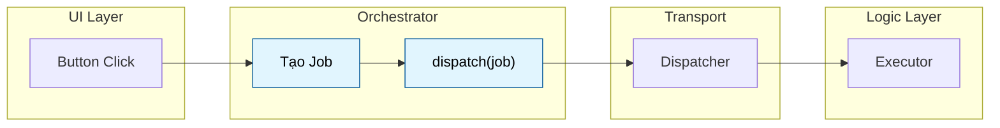
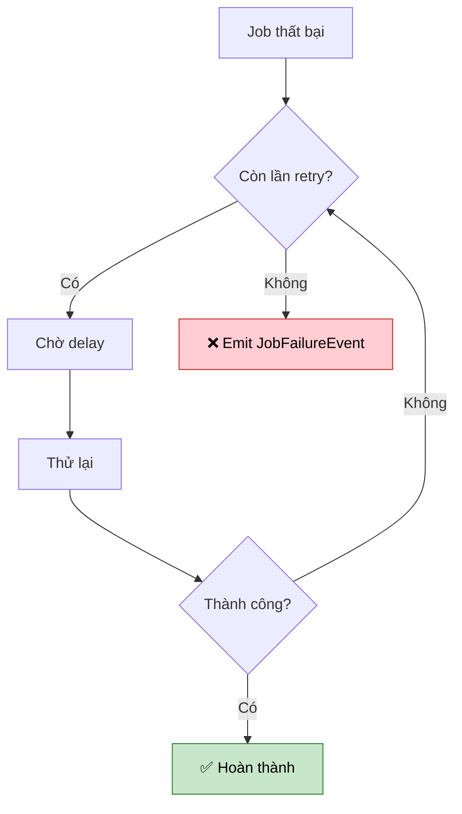
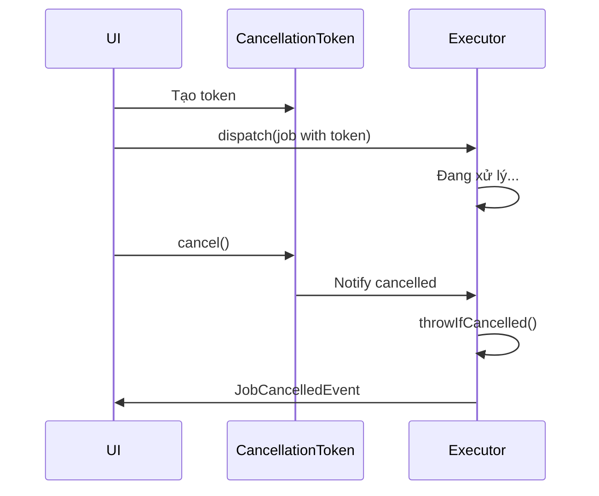
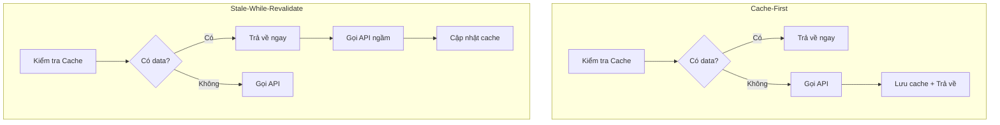

# Job - Định nghĩa hành động

Job là **đơn vị công việc cơ bản** trong Flutter Orchestrator. Nó đại diện cho một "gói dữ liệu" (Packet of Work) được gửi từ Orchestrator đến Executor.

> **Nguyên tắc vàng:** Job chỉ chứa dữ liệu (Data Class), **KHÔNG** chứa logic. Mọi logic xử lý đều nằm trong Executor.

### Vị trí của Job trong kiến trúc



---

## 1. Cấu trúc BaseJob

Tất cả các Job phải kế thừa từ `BaseJob`:

```dart
abstract class BaseJob {
  /// Unique ID để tracking (Correlation ID)
  final String id;
  
  /// Timeout cho job (optional)
  final Duration? timeout;
  
  /// Token để hủy job giữa chừng (optional)
  final CancellationToken? cancellationToken;
  
  /// Chính sách retry khi thất bại (optional)
  final RetryPolicy? retryPolicy;
  
  /// Metadata tùy chỉnh (optional)
  final Map<String, dynamic>? metadata;
  
  /// Chiến lược lấy dữ liệu: cache, placeholder... (optional)
  final DataStrategy? strategy;
  
  /// Bus context - được set tự động bởi Orchestrator
  SignalBus? bus;
}
```

---

## 2. Tạo Job đơn giản

Một Job cơ bản chỉ cần kế thừa `BaseJob` và gọi `generateJobId()`:

```dart
class FetchUserJob extends BaseJob {
  final String userId;
  
  FetchUserJob(this.userId) : super(id: generateJobId('fetch_user'));
}

class CreateOrderJob extends BaseJob {
  final List<String> productIds;
  final double totalAmount;
  
  CreateOrderJob({
    required this.productIds,
    required this.totalAmount,
  }) : super(id: generateJobId('create_order'));
}
```

### Quy tắc đặt tên Job
- Sử dụng **Động từ + Danh từ**: `FetchUser`, `CreateOrder`, `DeleteItem`, `UpdateProfile`
- Thêm suffix `Job`: `FetchUserJob`, `CreateOrderJob`

---

## 3. generateJobId() - Tạo ID duy nhất

Hàm helper tạo ID unique cho mỗi job instance:

```dart
// Cú pháp
String generateJobId([String? prefix])

// Ví dụ
generateJobId()              // → "job-1703579123456789-a1b2c3"
generateJobId('user')        // → "user-1703579123456789-d4e5f6"
generateJobId('fetch_order') // → "fetch_order-1703579123456789-789abc"
```

**Cơ chế hoạt động:**
- Kết hợp `microsecondsSinceEpoch` + random hex 6 ký tự
- Đảm bảo unique ngay cả khi tạo nhiều Job trong cùng millisecond

---

## 4. Timeout - Giới hạn thời gian thực thi

Cấu hình thời gian tối đa cho job chạy. Nếu quá thời gian, Executor sẽ emit `JobTimeoutEvent`.

```dart
class SlowApiJob extends BaseJob {
  SlowApiJob() : super(
    id: generateJobId(),
    timeout: Duration(seconds: 30), // Tối đa 30 giây
  );
}

class QuickValidationJob extends BaseJob {
  QuickValidationJob() : super(
    id: generateJobId(),
    timeout: Duration(milliseconds: 500), // Tối đa 500ms
  );
}
```

**Khi nào dùng:**
- API calls có thể bị treo (server không phản hồi)
- Các task phải hoàn thành trong thời gian nhất định
- Tránh block UI quá lâu

---

## 5. RetryPolicy - Chính sách thử lại

Cấu hình cách xử lý khi job thất bại.

### 5.1. Các thuộc tính của RetryPolicy

```dart
class RetryPolicy {
  /// Số lần retry tối đa (mặc định: 3)
  final int maxRetries;
  
  /// Thời gian chờ cơ bản giữa các lần retry (mặc định: 1 giây)
  final Duration baseDelay;
  
  /// Dùng exponential backoff? (mặc định: true)
  final bool exponentialBackoff;
  
  /// Giới hạn delay tối đa (mặc định: 30 giây)
  final Duration maxDelay;
  
  /// Hàm kiểm tra có nên retry cho lỗi này không (optional)
  final bool Function(Object error)? shouldRetry;
}
```

### 5.2. Exponential Backoff

Khi `exponentialBackoff = true`, thời gian chờ tăng theo cấp số nhân:

| Lần thử | Delay (baseDelay = 1s) |
|---------|------------------------|
| 1       | 1 giây                 |
| 2       | 2 giây                 |
| 3       | 4 giây                 |
| 4       | 8 giây                 |
| 5       | 16 giây                |

Delay sẽ không vượt quá `maxDelay`.



### 5.3. Ví dụ sử dụng

```dart
// Retry 5 lần với exponential backoff
class UnstableApiJob extends BaseJob {
  UnstableApiJob() : super(
    id: generateJobId(),
    retryPolicy: RetryPolicy(
      maxRetries: 5,
      baseDelay: Duration(seconds: 2),
      exponentialBackoff: true,
      maxDelay: Duration(seconds: 60),
    ),
  );
}

// Chỉ retry cho lỗi network, không retry cho lỗi validation
class SmartRetryJob extends BaseJob {
  SmartRetryJob() : super(
    id: generateJobId(),
    retryPolicy: RetryPolicy(
      maxRetries: 3,
      shouldRetry: (error) => error is SocketException || error is TimeoutException,
    ),
  );
}

// Không dùng exponential backoff (delay cố định)
class FixedDelayRetryJob extends BaseJob {
  FixedDelayRetryJob() : super(
    id: generateJobId(),
    retryPolicy: RetryPolicy(
      maxRetries: 3,
      baseDelay: Duration(seconds: 5),
      exponentialBackoff: false,
    ),
  );
}
```

---

## 6. CancellationToken - Hủy Job giữa chừng

Cho phép hủy job đang chạy từ bên ngoài (ví dụ: user rời màn hình).



### 6.1. Cách sử dụng

```dart
// 1. Tạo token
final token = CancellationToken();

// 2. Gắn vào Job
class LongRunningJob extends BaseJob {
  LongRunningJob(CancellationToken token) : super(
    id: generateJobId(),
    cancellationToken: token,
  );
}

// 3. Dispatch job
orchestrator.dispatch(LongRunningJob(token));

// 4. Sau đó, khi cần hủy
token.cancel();
```

### 6.2. Kiểm tra trong Executor

```dart
class LongRunningExecutor extends BaseExecutor<LongRunningJob, void> {
  @override
  Future<void> process(LongRunningJob job) async {
    for (int i = 0; i < 100; i++) {
      // Kiểm tra trước mỗi bước
      job.cancellationToken?.throwIfCancelled();
      
      await heavyComputation(i);
    }
  }
}
```

### 6.3. API của CancellationToken

| Method | Mô tả |
|--------|-------|
| `cancel()` | Yêu cầu hủy. Gọi tất cả listeners. |
| `isCancelled` | Kiểm tra đã bị hủy chưa (getter). |
| `throwIfCancelled()` | Throw `CancelledException` nếu đã hủy. |
| `onCancel(callback)` | Đăng ký callback khi bị hủy. Trả về hàm unregister. |
| `removeListener(callback)` | Xóa listener đã đăng ký. |
| `clearListeners()` | Xóa tất cả listeners mà không trigger cancel. |

---

## 7. DataStrategy - Chiến lược lấy dữ liệu

Cấu hình cách lấy và cache dữ liệu.

### 7.1. Cấu trúc DataStrategy

```dart
class DataStrategy {
  /// Dữ liệu placeholder hiển thị ngay (skeleton, optimistic)
  final dynamic placeholder;
  
  /// Cấu hình cache (null = không cache)
  final CachePolicy? cachePolicy;
}
```

### 7.2. CachePolicy chi tiết

```dart
class CachePolicy {
  /// Key duy nhất trong cache
  final String key;
  
  /// Thời gian sống (null = vĩnh viễn)
  final Duration? ttl;
  
  /// true = SWR: trả cache rồi vẫn fetch mới
  /// false = Cache-First: trả cache rồi dừng
  final bool revalidate;
  
  /// true = bỏ qua cache, luôn fetch mới (pull-to-refresh)
  final bool forceRefresh;
}
```

### 7.3. Các pattern phổ biến



```dart
// Pattern 1: Cache-First (Nếu có cache thì dùng, không gọi API)
class CacheFirstJob extends BaseJob {
  CacheFirstJob(String userId) : super(
    id: generateJobId(),
    strategy: DataStrategy(
      cachePolicy: CachePolicy(
        key: 'user_$userId',
        ttl: Duration(hours: 1),
        revalidate: false, // Không fetch lại
      ),
    ),
  );
}

// Pattern 2: SWR - Stale-While-Revalidate (Trả cache ngay, fetch ngầm)
class SwrJob extends BaseJob {
  SwrJob(String userId) : super(
    id: generateJobId(),
    strategy: DataStrategy(
      cachePolicy: CachePolicy(
        key: 'user_$userId',
        revalidate: true, // Vẫn fetch để cập nhật
      ),
    ),
  );
}

// Pattern 3: Force Refresh (Pull-to-refresh, bỏ qua cache)
class ForceRefreshJob extends BaseJob {
  ForceRefreshJob(String userId) : super(
    id: generateJobId(),
    strategy: DataStrategy(
      cachePolicy: CachePolicy(
        key: 'user_$userId',
        forceRefresh: true, // Bỏ qua cache
      ),
    ),
  );
}

// Pattern 4: Placeholder (Skeleton UI)
class PlaceholderJob extends BaseJob {
  PlaceholderJob() : super(
    id: generateJobId(),
    strategy: DataStrategy(
      placeholder: User.skeleton(), // Hiển thị ngay
      cachePolicy: CachePolicy(key: 'user_123'),
    ),
  );
}
```

---

## 8. Metadata - Dữ liệu bổ sung

Lưu trữ thông tin tùy chỉnh không ảnh hưởng đến logic xử lý.

```dart
class AnalyticsJob extends BaseJob {
  final String eventName;
  
  AnalyticsJob(this.eventName) : super(
    id: generateJobId(),
    metadata: {
      'source': 'home_screen',
      'app_version': '2.1.0',
      'user_tier': 'premium',
      'timestamp': DateTime.now().toIso8601String(),
    },
  );
}
```

**Use cases:**
- Tracking/Analytics
- Debug information
- Context cho logging
- A/B testing flags

---

## 9. Bus Context

Thuộc tính `bus` được **tự động set bởi Orchestrator** trước khi dispatch. Bạn không cần quan tâm đến nó trong hầu hết trường hợp.

```dart
// Orchestrator tự động làm việc này:
job.bus = _bus; // Set context
dispatcher.dispatch(job);
```

**Khi nào cần biết:**
- Khi debug event routing
- Khi dùng Scoped Bus cho testing
- Khi viết custom Executor advanced

---

## 10. Best Practices

### ✅ Nên làm

- **Đặt tên rõ ràng:** `FetchUserJob`, không phải `Job1` hay `UserJob`
- **Dùng prefix có ý nghĩa cho ID:** `generateJobId('fetch_user')`
- **Chỉ chứa dữ liệu cần thiết:** Không thừa, không thiếu
- **Immutable data:** Các field nên là `final`

### ❌ Không nên làm

```dart
// ❌ SAI: Đặt logic trong Job
class BadJob extends BaseJob {
  BadJob() : super(id: generateJobId());
  
  Future<void> execute() async {
    // KHÔNG! Logic phải ở Executor
    await api.call();
  }
}

// ❌ SAI: Job quá phức tạp
class OverloadedJob extends BaseJob {
  final ApiService api;        // KHÔNG! Inject vào Executor
  final Database db;           // KHÔNG!
  final BuildContext context;  // TUYỆT ĐỐI KHÔNG!
}

// ❌ SAI: Tên không rõ ràng
class J1 extends BaseJob { ... }
class DoStuffJob extends BaseJob { ... }
```

---

## Xem thêm

- [Executor - Xử lý Logic](executor.md) - Nơi nhận Job và thực thi
- [Orchestrator - Quản lý UI State](orchestrator.md) - Nơi dispatch Job
- [Event - Kết quả trả về](event.md) - Kết quả từ Executor
