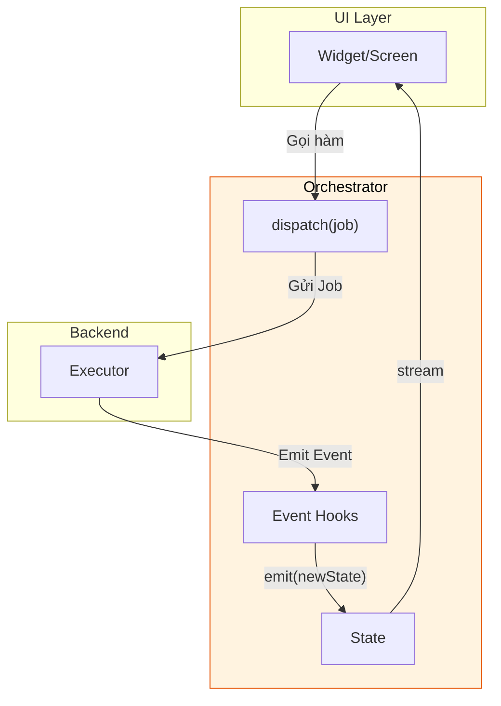
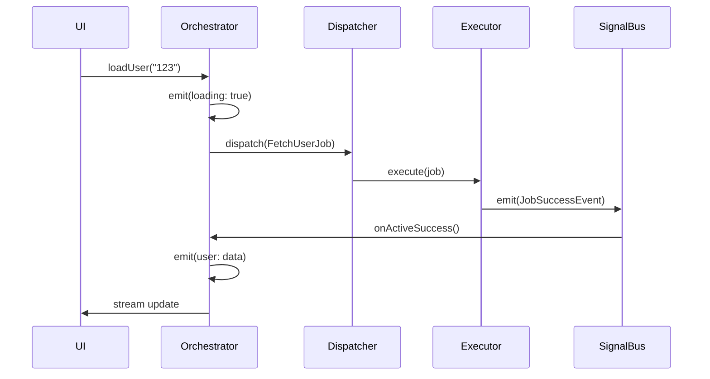
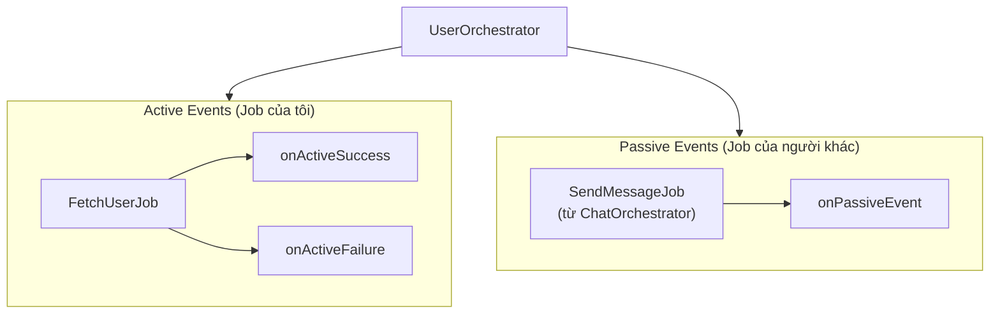
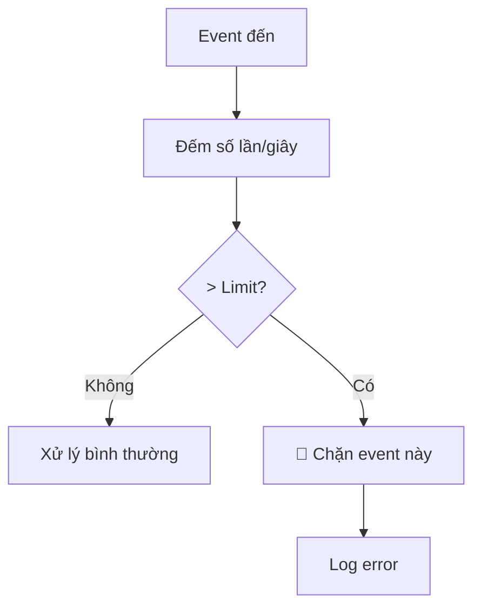

# Orchestrator - Quản lý UI State

Orchestrator là **"Bộ não phản ứng" (Reactive Brain)** của mỗi màn hình/feature. Nó chịu trách nhiệm quản lý State, dispatch Job và xử lý kết quả trả về từ Executor.

> **Vai trò:** Tương đương với ViewModel (MVVM), Cubit (BLoC), hoặc Presenter (MVP) trong các kiến trúc khác.

### Vị trí của Orchestrator trong kiến trúc



---

## 1. Cấu trúc BaseOrchestrator

```dart
abstract class BaseOrchestrator<S> {
  // State hiện tại
  S get state;
  
  // Stream để UI lắng nghe thay đổi
  Stream<S> get stream;
  
  // Kiểm tra có job nào đang chạy không
  bool get hasActiveJobs;
  
  // Emit state mới
  void emit(S newState);
  
  // Dispatch job và tracking
  String dispatch(BaseJob job);
  
  // Hủy tracking job
  void cancelJob(String jobId);
  
  // Cleanup resources
  void dispose();
}
```

---

## 2. Tạo Orchestrator đơn giản

### 2.1. Định nghĩa State

State nên là **immutable** và có method `copyWith`:

```dart
class UserState {
  final User? user;
  final bool isLoading;
  final String? error;
  
  const UserState({
    this.user,
    this.isLoading = false,
    this.error,
  });
  
  UserState copyWith({
    User? user,
    bool? isLoading,
    String? error,
  }) {
    return UserState(
      user: user ?? this.user,
      isLoading: isLoading ?? this.isLoading,
      error: error,  // Cho phép null để xóa error
    );
  }
}
```

### 2.2. Tạo Orchestrator

```dart
class UserOrchestrator extends BaseOrchestrator<UserState> {
  UserOrchestrator() : super(const UserState());
  
  // Public method cho UI gọi
  void loadUser(String userId) {
    emit(state.copyWith(isLoading: true, error: null));
    dispatch(FetchUserJob(userId));
  }
  
  void updateProfile(String name) {
    emit(state.copyWith(isLoading: true));
    dispatch(UpdateProfileJob(name));
  }
  
  // Xử lý kết quả
  @override
  void onActiveSuccess(JobSuccessEvent event) {
    if (event.job is FetchUserJob) {
      final user = event.dataAs<User>();
      emit(state.copyWith(user: user, isLoading: false));
    }
  }
  
  @override
  void onActiveFailure(JobFailureEvent event) {
    emit(state.copyWith(
      isLoading: false,
      error: event.error.toString(),
    ));
  }
}
```

---

## 3. State Management

### 3.1. emit() - Cập nhật State

```dart
// Cú pháp
void emit(S newState)

// Ví dụ
emit(state.copyWith(isLoading: true));
emit(state.copyWith(user: newUser, isLoading: false));
emit(UserState()); // Reset về state mặc định
```

**Lưu ý quan trọng:**
- `emit()` sẽ trigger UI rebuild
- Không emit nếu state không thay đổi (tránh rebuild không cần thiết)
- Luôn dùng `copyWith` thay vì tạo object mới hoàn toàn

### 3.2. stream - UI lắng nghe State

```dart
// Trong Widget
StreamBuilder<UserState>(
  stream: orchestrator.stream,
  builder: (context, snapshot) {
    final state = snapshot.data ?? UserState();
    
    if (state.isLoading) {
      return CircularProgressIndicator();
    }
    
    return Text(state.user?.name ?? 'No user');
  },
)
```

### 3.3. state - Truy cập State hiện tại

```dart
// Đọc state bất cứ lúc nào
final currentUser = orchestrator.state.user;
final isLoading = orchestrator.state.isLoading;
```

---

## 4. Dispatch Job



### 4.1. Dispatch và nhận Job ID

```dart
void loadUser(String userId) {
  // dispatch() trả về job ID để tracking
  final jobId = dispatch(FetchUserJob(userId));
  
  // Có thể lưu lại để cancel sau
  _currentJobId = jobId;
}
```

### 4.2. Dispatch nhiều Job

```dart
void loadDashboard() {
  // Dispatch song song nhiều jobs
  dispatch(FetchUserJob());
  dispatch(FetchNotificationsJob());
  dispatch(FetchStatsJob());
  
  // Tất cả sẽ chạy đồng thời
  // Kết quả về qua các hooks riêng biệt
}
```

---

## 5. Event Hooks

Orchestrator cung cấp **9 hooks** để xử lý các sự kiện từ Executor:

### 5.1. Result Hooks (Kết quả)

| Hook | Event Type | Khi nào gọi |
|------|------------|-------------|
| `onActiveSuccess` | `JobSuccessEvent` | Job thành công |
| `onActiveFailure` | `JobFailureEvent` | Job thất bại |
| `onActiveCancelled` | `JobCancelledEvent` | Job bị hủy |
| `onActiveTimeout` | `JobTimeoutEvent` | Job timeout |

```dart
@override
void onActiveSuccess(JobSuccessEvent event) {
  // Xử lý theo loại job
  if (event.job is FetchUserJob) {
    final user = event.dataAs<User>();
    emit(state.copyWith(user: user, isLoading: false));
  } else if (event.job is UpdateProfileJob) {
    // Reload user sau khi update
    dispatch(FetchUserJob(state.user!.id));
  }
}

@override
void onActiveFailure(JobFailureEvent event) {
  emit(state.copyWith(
    isLoading: false,
    error: _mapError(event.error),
  ));
}

@override
void onActiveTimeout(JobTimeoutEvent event) {
  emit(state.copyWith(
    isLoading: false,
    error: 'Kết nối quá chậm, vui lòng thử lại',
  ));
}
```

### 5.2. Lifecycle Hooks (Vòng đời)

| Hook | Event Type | Khi nào gọi |
|------|------------|-------------|
| `onJobStarted` | `JobStartedEvent` | Job bắt đầu execute |
| `onJobRetrying` | `JobRetryingEvent` | Job đang retry |
| `onProgress` | `JobProgressEvent` | Cập nhật tiến trình |

```dart
@override
void onJobStarted(JobStartedEvent event) {
  // Có thể log hoặc analytics
  analytics.trackJobStarted(event.correlationId);
}

@override
void onJobRetrying(JobRetryingEvent event) {
  emit(state.copyWith(
    statusMessage: 'Đang thử lại... (${event.attempt}/${event.maxRetries})',
  ));
}

@override
void onProgress(JobProgressEvent event) {
  emit(state.copyWith(
    uploadProgress: event.progress,
    statusMessage: event.message,
  ));
}
```

### 5.3. Generic Hooks

| Hook | Mô tả |
|------|-------|
| `onActiveEvent` | Gọi cho TẤT CẢ active events (sau specific hook) |
| `onPassiveEvent` | Gọi cho events từ orchestrator KHÁC |

```dart
@override
void onActiveEvent(BaseEvent event) {
  // Chạy SAU specific hook (onActiveSuccess, onActiveFailure...)
  // Hữu ích cho logging, analytics chung
  logger.logEvent(event);
}

@override
void onPassiveEvent(BaseEvent event) {
  // Lắng nghe events từ orchestrator khác
  if (event is NetworkSyncFailureEvent && event.isPoisoned) {
    // Rollback optimistic UI
    _handleSyncFailure(event);
  }
}
```

---

## 6. Active vs Passive Events



**Active Event:**
- Job được dispatch bởi chính Orchestrator này
- Đi qua các hooks cụ thể: `onActiveSuccess`, `onActiveFailure`...
- Thường dùng để cập nhật State

**Passive Event:**
- Job được dispatch bởi Orchestrator KHÁC
- Chỉ đi qua `onPassiveEvent`
- Thường dùng để đồng bộ state giữa các màn hình

```dart
// Ví dụ: NotificationOrchestrator lắng nghe khi có tin nhắn mới
@override
void onPassiveEvent(BaseEvent event) {
  if (event is JobSuccessEvent && event.job is SendMessageJob) {
    // Tăng badge count khi có tin nhắn mới được gửi
    emit(state.copyWith(
      unreadCount: state.unreadCount + 1,
    ));
  }
}
```

---

## 7. Progress Tracking

### 7.1. Kiểm tra Job đang chạy

```dart
// Kiểm tra có job nào đang chạy không
bool get isLoading => orchestrator.hasActiveJobs;

// Kiểm tra job cụ thể theo ID
bool isThisJobRunning = orchestrator.isJobRunning(jobId);

// Kiểm tra theo loại Job (hữu ích cho loading indicators)
bool isUploadingPhoto = orchestrator.isJobTypeRunning<UploadPhotoJob>();
bool isFetchingUser = orchestrator.isJobTypeRunning<FetchUserJob>();
```

### 7.2. Lấy tiến trình

```dart
// Lấy progress (0.0 → 1.0)
double? progress = orchestrator.getJobProgress(jobId);

// Trong UI
LinearProgressIndicator(
  value: orchestrator.getJobProgress(uploadJobId) ?? 0,
)
```

---

## 8. Cancel Job

```dart
class UploadOrchestrator extends BaseOrchestrator<UploadState> {
  String? _currentUploadJobId;
  
  void startUpload(File file) {
    _currentUploadJobId = dispatch(UploadFileJob(file));
  }
  
  void cancelUpload() {
    if (_currentUploadJobId != null) {
      cancelJob(_currentUploadJobId!);
      emit(state.copyWith(isCancelled: true));
      _currentUploadJobId = null;
    }
  }
}
```

**Lưu ý:** `cancelJob()` chỉ dừng tracking ở Orchestrator. Để thực sự dừng job đang chạy, job cần có `CancellationToken` (xem [Job - Cancellation](job.md#6-cancellationtoken---hủy-job-giữa-chừng)).

---

## 9. Circuit Breaker (Chống vòng lặp vô hạn)

Orchestrator có cơ chế **tự bảo vệ** chống infinite loop:



**Cấu hình:**
```dart
// Mặc định: 100 events/type/giây
OrchestratorConfig.setEventLimit<JobSuccessEvent>(200);
```

---

## 10. Dispose

**BẮT BUỘC** phải gọi `dispose()` khi Orchestrator không còn sử dụng:

```dart
class MyPage extends StatefulWidget {
  @override
  _MyPageState createState() => _MyPageState();
}

class _MyPageState extends State<MyPage> {
  late final UserOrchestrator _orchestrator;
  
  @override
  void initState() {
    super.initState();
    _orchestrator = UserOrchestrator();
  }
  
  @override
  void dispose() {
    _orchestrator.dispose(); // QUAN TRỌNG!
    super.dispose();
  }
}
```

**Dispose sẽ:**
- Hủy subscription với SignalBus
- Đóng state stream
- Clear tracking data

---

## 11. Scoped Bus (Advanced)

Mặc định, Orchestrator dùng **Global SignalBus**. Có thể tạo bus riêng cho testing hoặc module isolation:

```dart
// Tạo orchestrator với scoped bus
final scopedBus = SignalBus.scoped();
final orchestrator = UserOrchestrator(bus: scopedBus);

// Events từ orchestrator này sẽ KHÔNG ảnh hưởng đến các orchestrator khác
```

---

## 12. Best Practices

### ✅ Nên làm

- **Một màn hình = Một Orchestrator**
- **State bất biến** (immutable) với `copyWith`
- **Đặt tên rõ ràng:** `UserOrchestrator`, `CartOrchestrator`
- **Xử lý tất cả failure cases** trong `onActiveFailure`
- **Luôn dispose** khi không dùng nữa

### ❌ Không nên làm

```dart
// ❌ SAI: Đặt business logic trong Orchestrator
class BadOrchestrator extends BaseOrchestrator<State> {
  void loadUser() {
    // KHÔNG! Logic phải ở Executor
    final user = await api.fetchUser();
    emit(state.copyWith(user: user));
  }
}

// ❌ SAI: Mutate state trực tiếp
void addItem(Item item) {
  state.items.add(item);  // KHÔNG! State phải immutable
  emit(state);
}

// ❌ SAI: Quên dispose
// → Memory leak, zombie listeners
```

---

## Xem thêm

- [Job - Định nghĩa hành động](job.md) - Input cho Orchestrator
- [Executor - Xử lý Logic](executor.md) - Nơi nhận Job từ Orchestrator
- [Event - Kết quả trả về](event.md) - Output cho Orchestrator
- [SignalBus - Giao tiếp sự kiện](signal_bus.md) - Cách events truyền đi
