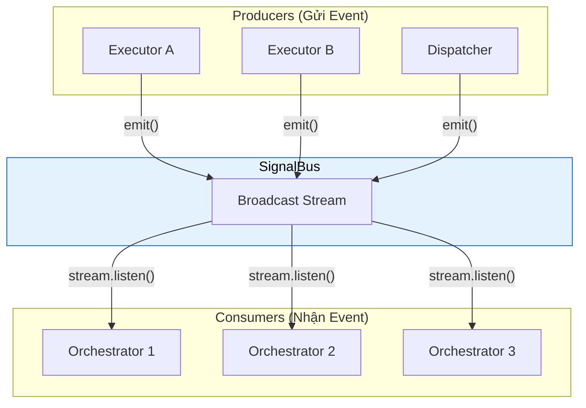
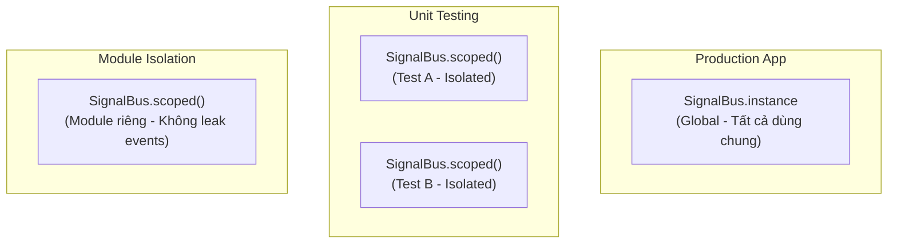
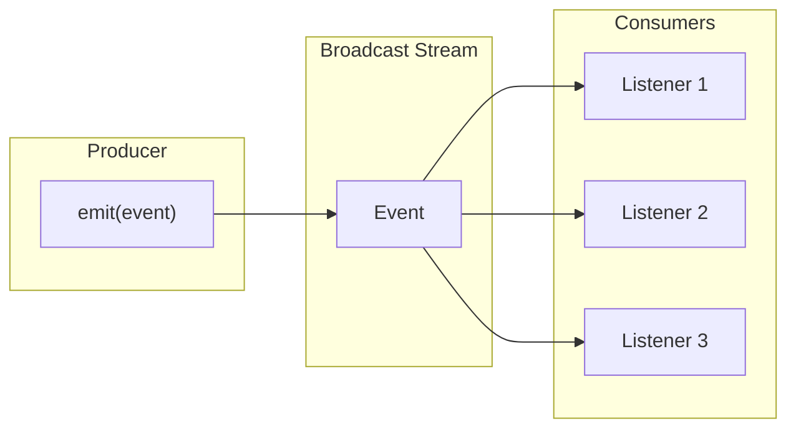
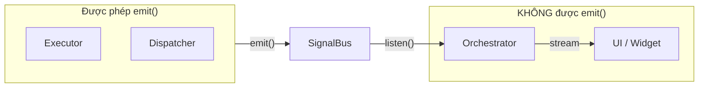

# SignalBus - Hệ thống giao tiếp sự kiện

SignalBus là **"Hệ thống thần kinh trung ương"** của Flutter Orchestrator. Nó là một Event Bus đơn giản, hiệu năng cao, cho phép các thành phần trong hệ thống giao tiếp với nhau mà không cần biết đến nhau trực tiếp.

> **Vai trò:** Tương tự như Message Broker, EventEmitter (Node.js), hoặc RxJS Subject.

### Vị trí của SignalBus trong kiến trúc



---

## 1. Cấu trúc SignalBus

```dart
class SignalBus {
  /// Global singleton instance
  static SignalBus get instance;
  
  /// Factory constructor trả về global instance
  factory SignalBus();
  
  /// Tạo bus riêng biệt (isolated)
  factory SignalBus.scoped();
  
  /// Stream của tất cả events
  Stream<BaseEvent> get stream;
  
  /// Kiểm tra bus đã bị dispose chưa
  bool get isDisposed;
  
  /// Gửi event vào bus
  void emit(BaseEvent event);
  
  /// Đóng bus (cleanup)
  void dispose();
}
```

---

## 2. Singleton Pattern

SignalBus sử dụng **Singleton Pattern** - chỉ có một global instance trong toàn app.

```dart
// Cách 1: Truy cập qua property (khuyến nghị - rõ ràng hơn)
SignalBus.instance.emit(event);
SignalBus.instance.stream.listen(...);

// Cách 2: Qua factory constructor (backward compatible)
SignalBus().emit(event);
SignalBus().stream.listen(...);

// Cả hai đều trả về CÙNG MỘT instance
print(SignalBus.instance == SignalBus()); // true
```

**Tại sao Singleton?**
- Đảm bảo tất cả components dùng chung một bus
- Events từ bất kỳ đâu đều có thể được nhận bởi bất kỳ ai
- Đơn giản hóa wiring giữa các thành phần

---

## 3. Scoped Bus (For Testing & Isolation)

Ngoài global instance, bạn có thể tạo **bus riêng biệt**:

```dart
// Tạo bus isolated
final scopedBus = SignalBus.scoped();

// Events trên bus này KHÔNG ảnh hưởng đến bus khác
scopedBus.emit(MyEvent()); // Chỉ listeners của scopedBus nhận được
```

### 3.1. Khi nào dùng Scoped Bus?



**Use cases:**

1. **Unit Testing:** Mỗi test có bus riêng → không ảnh hưởng lẫn nhau
2. **Module Isolation:** Module độc lập không muốn events leak ra ngoài
3. **Feature Flags:** Tách biệt events cho các features đang experiment

### 3.2. Testing với Scoped Bus

```dart
void main() {
  late SignalBus testBus;
  late MockExecutor executor;
  late TestOrchestrator orchestrator;
  
  setUp(() {
    testBus = SignalBus.scoped();
    executor = MockExecutor();
    orchestrator = TestOrchestrator(bus: testBus);
  });
  
  tearDown(() {
    testBus.dispose(); // QUAN TRỌNG: Cleanup sau mỗi test
  });
  
  test('should receive success event', () async {
    // Emit event vào scoped bus
    testBus.emit(JobSuccessEvent('test-id', 'result'));
    
    // Verify orchestrator nhận được
    expect(orchestrator.lastEvent, isA<JobSuccessEvent>());
  });
}
```

---

## 4. Emit Event

**Chỉ Executor và Dispatcher nên emit events** (Security).

```dart
// Trong Executor
void emitResult<R>(String correlationId, R data) {
  final bus = _activeBus[correlationId] ?? SignalBus.instance;
  bus.emit(JobSuccessEvent<R>(correlationId, data));
}

// Emit failure
void emitFailure(String correlationId, Object error, [StackTrace? stack]) {
  final bus = _activeBus[correlationId] ?? SignalBus.instance;
  bus.emit(JobFailureEvent(correlationId, error, stack));
}

// Emit custom event
void emit(BaseEvent event) {
  final bus = _activeBus[event.correlationId] ?? SignalBus.instance;
  bus.emit(event);
}
```

**Lưu ý:** `emit()` an toàn khi bus đã bị dispose - sẽ silent ignore thay vì crash.

---

## 5. Listen to Events

### 5.1. Orchestrator tự động subscribe

Khi bạn tạo Orchestrator, nó **tự động subscribe** vào SignalBus:

```dart
class MyOrchestrator extends BaseOrchestrator<MyState> {
  MyOrchestrator() : super(MyState()) {
    // BaseOrchestrator tự động gọi:
    // _bus.stream.listen(_routeEvent);
  }
  
  // Bạn chỉ cần override các hooks
  @override
  void onActiveSuccess(JobSuccessEvent event) { ... }
}
```

### 5.2. Manual subscription (Advanced)

```dart
// Subscribe trực tiếp (hiếm khi cần)
final subscription = SignalBus.instance.stream.listen((event) {
  print('Received: $event');
});

// Hủy subscription khi không cần
subscription.cancel();
```

### 5.3. Filter events

```dart
// Lọc theo type
SignalBus.instance.stream
  .where((e) => e is JobSuccessEvent)
  .cast<JobSuccessEvent>()
  .listen((e) {
    print('Success with data: ${e.data}');
  });

// Lọc theo correlation ID
SignalBus.instance.stream
  .where((e) => e.correlationId == myJobId)
  .listen((e) {
    print('Event for my job: $e');
  });

// Lọc multiple types
SignalBus.instance.stream
  .where((e) => e is JobSuccessEvent || e is JobFailureEvent)
  .listen((e) {
    print('Terminal event: $e');
  });
```

---

## 6. Broadcast Stream

SignalBus sử dụng **`StreamController.broadcast()`**:



**Đặc điểm:**
- **Multi-listener:** Nhiều Orchestrators có thể subscribe cùng lúc
- **Fire-and-forget:** Event gửi đi là xong, không chờ phản hồi
- **No buffering:** Nếu không có listener, event bị bỏ qua (không queue)

---

## 7. isDisposed và Error Handling

```dart
// Kiểm tra trước khi sử dụng
if (!bus.isDisposed) {
  bus.emit(event);
}

// Stream throws StateError nếu bus đã disposed
try {
  final stream = disposedBus.stream; // Throws!
} on StateError catch (e) {
  print('Bus already disposed: $e');
}

// emit() an toàn - silent ignore nếu disposed
disposedBus.emit(event); // Không throw, không crash
```

---

## 8. Dispose

### 8.1. Scoped Bus - PHẢI dispose

```dart
final scopedBus = SignalBus.scoped();
// ... sử dụng ...
scopedBus.dispose(); // QUAN TRỌNG!
```

### 8.2. Global Instance - KHÔNG dispose

```dart
// ⚠️ WARNING: Không làm điều này trong production!
SignalBus.instance.dispose(); // Bus sẽ VĨNH VIỄN không hoạt động
```

**Quy tắc:**
- `SignalBus.scoped()` → BẠN tạo → BẠN dispose
- `SignalBus.instance` → Framework quản lý → KHÔNG dispose

---

## 9. Security Best Practices

### ✅ Kiến trúc đúng



### ❌ Không nên làm

```dart
// ❌ SAI: Emit từ UI
class MyWidget extends StatelessWidget {
  void onButtonPressed() {
    SignalBus.instance.emit(SomeEvent()); // KHÔNG!
  }
}

// ❌ SAI: Emit từ Orchestrator
class MyOrchestrator extends BaseOrchestrator<State> {
  void doSomething() {
    SignalBus.instance.emit(CustomEvent()); // KHÔNG!
    // Orchestrator nên dispatch(Job) thay vì emit(Event)
  }
}
```

### ✅ Nên làm

```dart
// ✅ ĐÚNG: Emit từ Executor
class MyExecutor extends BaseExecutor<MyJob> {
  @override
  Future<void> process(MyJob job) async {
    // ... logic ...
    emit(CustomEvent(job.id)); // OK - Executor được phép
    return result;
  }
}
```

---

## 10. API Reference

### Properties

| Property | Type | Mô tả |
|----------|------|-------|
| `instance` | `SignalBus` | Global singleton instance |
| `stream` | `Stream<BaseEvent>` | Stream của tất cả events |
| `isDisposed` | `bool` | true nếu bus đã bị dispose |

### Factory Constructors

| Constructor | Mô tả |
|-------------|-------|
| `SignalBus()` | Trả về global instance |
| `SignalBus.scoped()` | Tạo bus isolated mới |

### Methods

| Method | Mô tả |
|--------|-------|
| `emit(event)` | Gửi event (silent nếu disposed) |
| `dispose()` | Đóng bus (cleanup) |

---

## 11. Best Practices

### ✅ Nên làm

- **Test với Scoped Bus:** Mỗi test dùng bus riêng biệt
- **Dispose Scoped Bus:** Sau khi test xong
- **Chỉ Executor emit:** Giữ kiến trúc clean
- **Không lưu trữ events:** Xử lý ngay khi nhận

### ❌ Không nên làm

- **Emit từ UI:** Làm hỏng kiến trúc
- **Dispose global instance:** Phá vỡ toàn bộ app
- **Subscribe quá nhiều:** Có thể gây performance issues
- **Không cancel subscriptions:** Memory leak

---

## Xem thêm

- [Event - Các loại sự kiện](event.md) - Các events truyền qua SignalBus
- [Executor - Xử lý Logic](executor.md) - Nơi emit events
- [Orchestrator - Event Hooks](orchestrator.md#5-event-hooks) - Nơi nhận events
