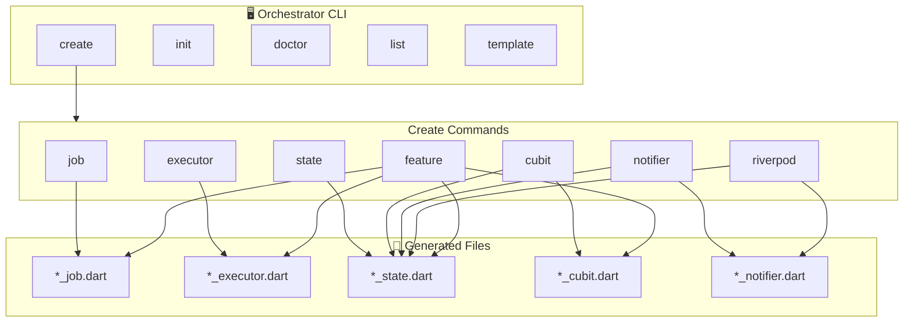
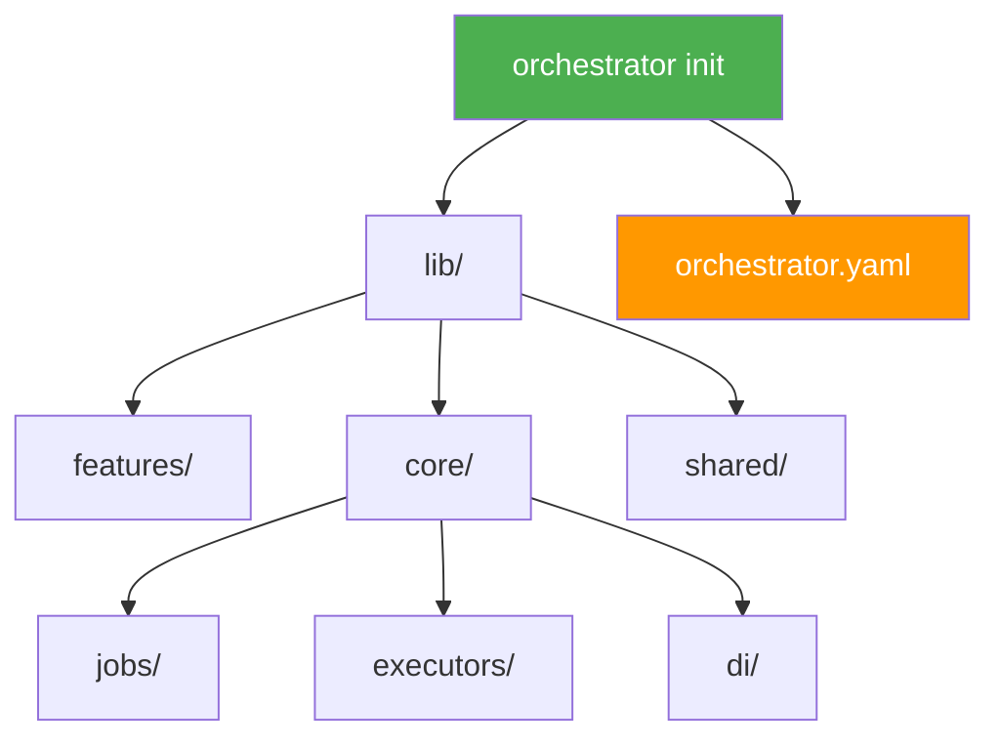
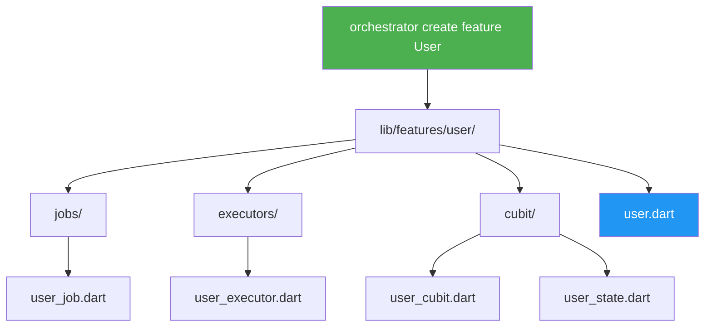
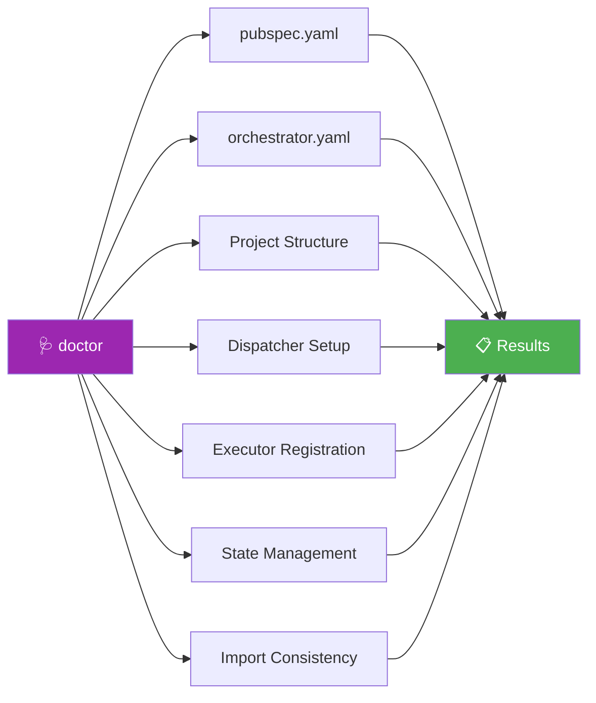
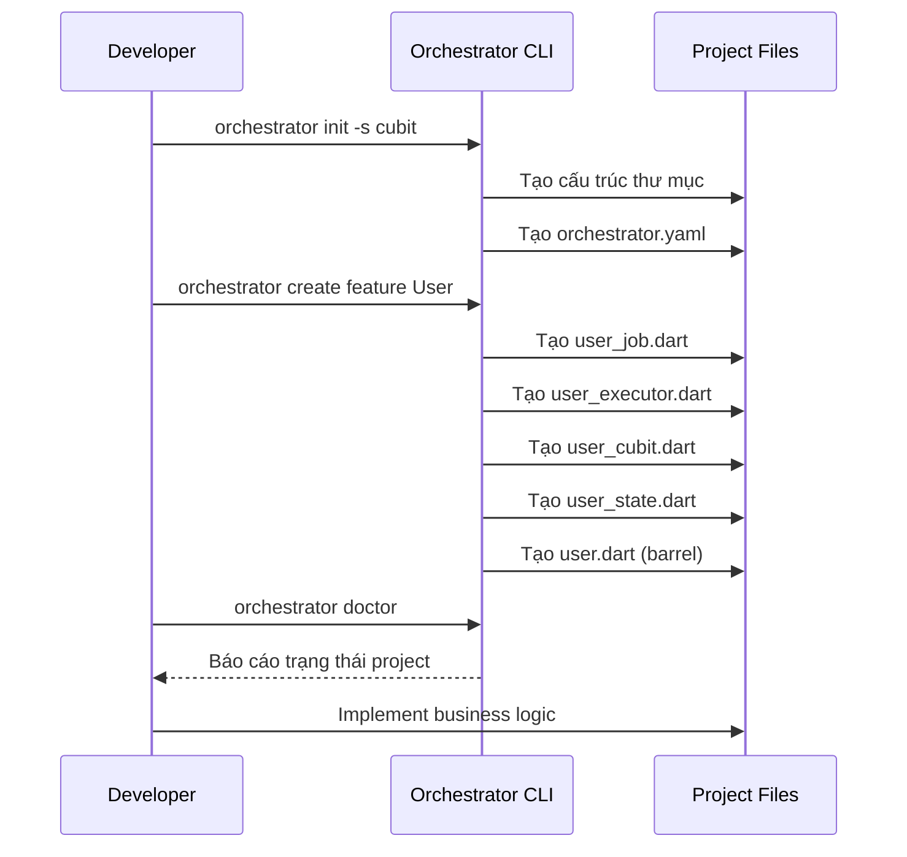

# Orchestrator CLI

CLI tool giúp tạo nhanh các component của Flutter Orchestrator với Mason templates.

## Tổng quan



## Cài đặt

### Từ Source (Development)

```bash
# Từ thư mục orchestrator_cli
cd packages/orchestrator_cli
dart pub get

# Chạy trực tiếp
dart run bin/orchestrator.dart <command>
```

### Global Activation (Sau khi Publish)

```bash
dart pub global activate orchestrator_cli

# Sử dụng global
orchestrator <command>
```

## Commands

### 1. Init - Khởi tạo Project

Tạo cấu trúc thư mục và file cấu hình cho dự án Orchestrator.

```bash
# Khởi tạo cơ bản
orchestrator init

# Với state management cụ thể
orchestrator init -s riverpod

# Ghi đè cấu hình hiện có
orchestrator init -f
```

**Cấu trúc được tạo:**

```
lib/
├── features/           # Feature modules
├── core/
│   ├── jobs/          # Shared jobs
│   ├── executors/     # Shared executors
│   └── di/            # Dependency injection
└── shared/            # Shared utilities
orchestrator.yaml      # CLI configuration
```



### 2. Create - Tạo Components

#### 2.1 Create Job

Tạo class Job - đại diện cho một yêu cầu công việc.

```bash
# Cơ bản
orchestrator create job FetchUser

# Custom output
orchestrator create job FetchUser -o lib/features/user/jobs

# Interactive mode
orchestrator create job -i
```

**File được tạo:** `lib/jobs/fetch_user_job.dart`

```dart
import 'package:orchestrator_core/orchestrator_core.dart';

class FetchUserJob extends BaseJob {
  const FetchUserJob();

  @override
  String get name => 'FetchUserJob';
}
```

#### 2.2 Create Executor

Tạo class Executor - xử lý business logic cho Job.

```bash
orchestrator create executor FetchUser
orchestrator create executor FetchUser -o lib/features/user/executors
```

**File được tạo:** `lib/executors/fetch_user_executor.dart`

```dart
import 'package:orchestrator_core/orchestrator_core.dart';

class FetchUserExecutor extends BaseExecutor<FetchUserJob> {
  @override
  Future<void> execute(FetchUserJob job) async {
    // TODO: Implement business logic
  }
}
```

#### 2.3 Create State

Tạo class State với `copyWith` method.

```bash
orchestrator create state User
orchestrator create state User -o lib/features/user
```

**File được tạo:** `lib/states/user_state.dart`

#### 2.4 Create Cubit (Bloc Integration)

Tạo OrchestratorCubit và State cho Bloc.

```bash
orchestrator create cubit User
orchestrator create cubit User -o lib/features/user/cubit
```

**Files được tạo:**
- `lib/cubits/user_cubit.dart`
- `lib/cubits/user_state.dart`

#### 2.5 Create Notifier (Provider Integration)

```bash
orchestrator create notifier User
orchestrator create notifier User -o lib/features/user/notifier
```

#### 2.6 Create Riverpod Notifier

```bash
orchestrator create riverpod User
orchestrator create riverpod User -o lib/features/user/notifier
```

#### 2.7 Create Feature (Full Scaffold)

Tạo đầy đủ một feature với job, executor, và state management.

```bash
# Cơ bản (sử dụng config hoặc mặc định cubit)
orchestrator create feature User

# Với state management cụ thể
orchestrator create feature User -s riverpod

# Interactive mode
orchestrator create feature -i

# Bỏ qua job hoặc executor
orchestrator create feature User --no-job
orchestrator create feature User --no-executor

# Custom output
orchestrator create feature User -o lib/modules
```

**Cấu trúc được tạo:**



```
lib/features/user/
├── jobs/
│   └── user_job.dart
├── executors/
│   └── user_executor.dart
├── cubit/                  # hoặc notifier/ cho provider/riverpod
│   ├── user_cubit.dart
│   └── user_state.dart
└── user.dart              # Barrel file
```

### 3. Doctor - Kiểm tra Project

Phân tích và phát hiện vấn đề trong cấu hình project.

```bash
# Chạy kiểm tra
orchestrator doctor

# Chi tiết
orchestrator doctor -v

# Tự động fix
orchestrator doctor --fix
```

**Các kiểm tra được thực hiện:**



**Output mẫu:**

```
🩺 Running Orchestrator Doctor...

━━━━━━━━━━━━━━━━━━━━━━━━━━━━━━━━━━━━━━━━━━━━━━━━━━━━━
📋 Diagnostic Results
━━━━━━━━━━━━━━━━━━━━━━━━━━━━━━━━━━━━━━━━━━━━━━━━━━━━━

✓ Orchestrator dependencies
✓ orchestrator.yaml config
✓ Project structure
✗ Dispatcher setup
  └─ No Dispatcher instance found
  └─ 💡 Create a Dispatcher instance in your DI setup
✓ State management integration

━━━━━━━━━━━━━━━━━━━━━━━━━━━━━━━━━━━━━━━━━━━━━━━━━━━━━
📊 Results: 4 passed, 1 failed
```

### 4. List - Liệt kê Templates

Hiển thị các templates có sẵn và components trong project.

```bash
# Liệt kê tất cả
orchestrator list

# Alias ngắn
orchestrator ls

# Chi tiết
orchestrator list -v

# Chỉ custom templates
orchestrator list -c
```

### 5. Template - Quản lý Custom Templates

#### 5.1 Template Init

Tạo custom templates từ bundled templates.

```bash
# Tạo tất cả custom templates
orchestrator template init

# Chỉ tạo template cụ thể
orchestrator template init -t job

# Ghi đè templates hiện có
orchestrator template init -f
```

#### 5.2 Template List

```bash
orchestrator template list
```

**Vị trí custom templates:** `.orchestrator/templates/`

## Configuration

Tạo file `orchestrator.yaml` trong thư mục gốc project:

```yaml
# Orchestrator CLI Configuration

# State management mặc định
# Options: cubit, provider, riverpod
state_management: cubit

# Output paths
output:
  features: lib/features
  jobs: lib/core/jobs
  executors: lib/core/executors

# Feature structure
feature:
  include_job: true
  include_executor: true
  generate_barrel: true
```

## Template Variables

Khi tùy chỉnh templates, các biến sau có sẵn:

| Variable | Ví dụ Input | Output |
|----------|-------------|--------|
| `{{name}}` | FetchUser | FetchUser |
| `{{name.pascalCase()}}` | fetch_user | FetchUser |
| `{{name.camelCase()}}` | FetchUser | fetchUser |
| `{{name.snakeCase()}}` | FetchUser | fetch_user |
| `{{name.constantCase()}}` | FetchUser | FETCH_USER |

## Workflow Đề xuất



## Xem thêm

- [Getting Started](./getting_started.md)
- [Project Structure](./project_structure.md)
- [Core Concepts](./core_concepts.md)
- [CLI Cheatsheet](./cli_cheatsheet.md)
