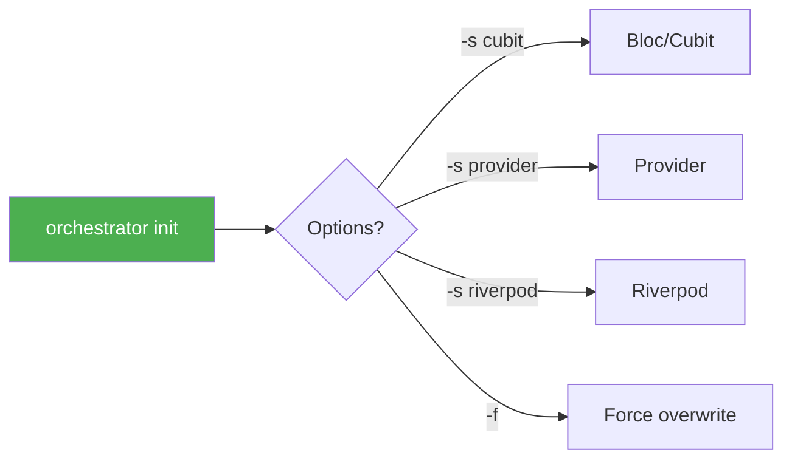
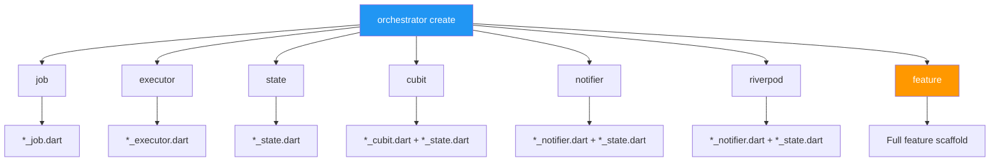
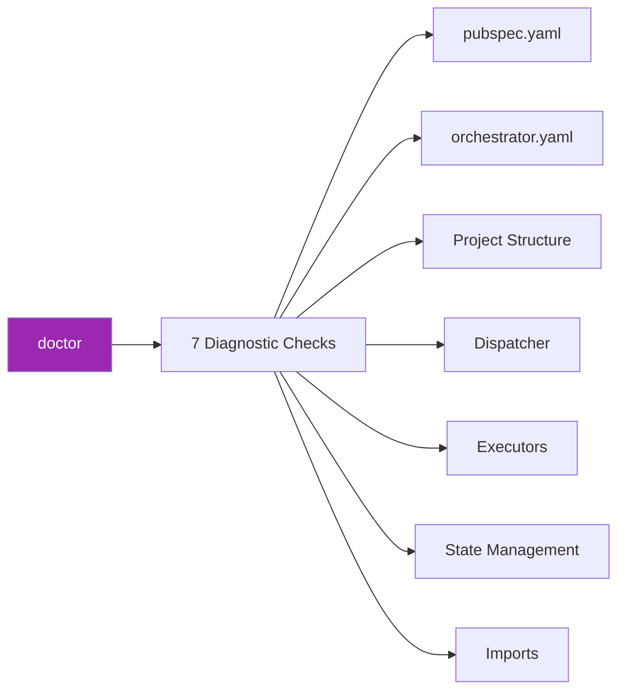
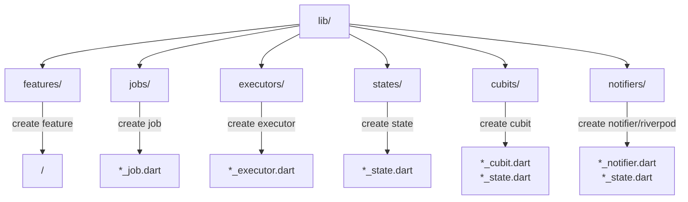

# 📋 Orchestrator CLI Cheatsheet

Tham khảo nhanh các lệnh CLI thường dùng.

## Quick Reference

```
┌─────────────────────────────────────────────────────────────────────────────┐
│                        ORCHESTRATOR CLI CHEATSHEET                          │
├─────────────────────────────────────────────────────────────────────────────┤
│                                                                             │
│  🚀 KHỞI TẠO                                                                │
│  ────────────────────────────────────────────────────────────────────────   │
│  orchestrator init                    Khởi tạo project                      │
│  orchestrator init -s riverpod        Khởi tạo với Riverpod                 │
│  orchestrator init -f                 Ghi đè config hiện có                 │
│                                                                             │
│  📦 TẠO COMPONENTS                                                          │
│  ────────────────────────────────────────────────────────────────────────   │
│  orchestrator create job <name>       Tạo Job class                         │
│  orchestrator create executor <name>  Tạo Executor class                    │
│  orchestrator create state <name>     Tạo State class                       │
│  orchestrator create cubit <name>     Tạo Cubit + State (Bloc)              │
│  orchestrator create notifier <name>  Tạo Notifier + State (Provider)       │
│  orchestrator create riverpod <name>  Tạo Notifier + State (Riverpod)       │
│  orchestrator create feature <name>   Tạo Feature đầy đủ                    │
│                                                                             │
│  🩺 KIỂM TRA                                                                │
│  ────────────────────────────────────────────────────────────────────────   │
│  orchestrator doctor                  Kiểm tra project                      │
│  orchestrator doctor -v               Kiểm tra chi tiết                     │
│  orchestrator doctor --fix            Tự động sửa lỗi                       │
│                                                                             │
│  📋 LIỆT KÊ                                                                 │
│  ────────────────────────────────────────────────────────────────────────   │
│  orchestrator list                    Liệt kê templates                     │
│  orchestrator ls -v                   Liệt kê chi tiết                      │
│  orchestrator ls -c                   Chỉ custom templates                  │
│                                                                             │
│  🎨 CUSTOM TEMPLATES                                                        │
│  ────────────────────────────────────────────────────────────────────────   │
│  orchestrator template init           Tạo custom templates                  │
│  orchestrator template init -t job    Tạo template cụ thể                   │
│  orchestrator template list           Liệt kê custom templates              │
│                                                                             │
│  ℹ️  THÔNG TIN                                                              │
│  ────────────────────────────────────────────────────────────────────────   │
│  orchestrator --help                  Hiển thị trợ giúp                     │
│  orchestrator --version               Hiển thị phiên bản                    │
│  orchestrator <cmd> --help            Trợ giúp lệnh cụ thể                  │
│                                                                             │
└─────────────────────────────────────────────────────────────────────────────┘
```

## Commands Chi tiết

### 🚀 Init



| Command | Mô tả |
|---------|-------|
| `orchestrator init` | Khởi tạo với cấu hình mặc định |
| `orchestrator init -s cubit` | Khởi tạo với Bloc/Cubit |
| `orchestrator init -s provider` | Khởi tạo với Provider |
| `orchestrator init -s riverpod` | Khởi tạo với Riverpod |
| `orchestrator init -f` | Ghi đè cấu hình hiện có |

### 📦 Create



#### Job

```bash
# Cơ bản
orchestrator create job FetchUser

# Custom path
orchestrator create job FetchUser -o lib/features/user/jobs

# Interactive
orchestrator create job -i
```

#### Executor

```bash
orchestrator create executor FetchUser
orchestrator create executor FetchUser -o lib/features/user/executors
```

#### State

```bash
orchestrator create state User
orchestrator create state User -o lib/features/user
```

#### Cubit (Bloc)

```bash
orchestrator create cubit User
orchestrator create cubit User -o lib/features/user/cubit
```

#### Notifier (Provider)

```bash
orchestrator create notifier User
orchestrator create notifier User -o lib/features/user/notifier
```

#### Riverpod

```bash
orchestrator create riverpod User
orchestrator create riverpod User -o lib/features/user/notifier
```

#### Feature (Full Scaffold)

```bash
# Cơ bản
orchestrator create feature User

# Với state management
orchestrator create feature User -s riverpod

# Interactive mode
orchestrator create feature -i

# Skip components
orchestrator create feature User --no-job
orchestrator create feature User --no-executor

# Custom output
orchestrator create feature User -o lib/modules
```

### 🩺 Doctor



| Command | Mô tả |
|---------|-------|
| `orchestrator doctor` | Chạy tất cả kiểm tra |
| `orchestrator doctor -v` | Hiển thị chi tiết |
| `orchestrator doctor --fix` | Tự động sửa lỗi có thể |

### 📋 List

| Command | Mô tả |
|---------|-------|
| `orchestrator list` | Liệt kê tất cả templates |
| `orchestrator ls` | Alias ngắn |
| `orchestrator list -v` | Hiển thị chi tiết |
| `orchestrator list -c` | Chỉ custom templates |

### 🎨 Template

| Command | Mô tả |
|---------|-------|
| `orchestrator template init` | Tạo tất cả custom templates |
| `orchestrator template init -t job` | Chỉ tạo template job |
| `orchestrator template init -f` | Ghi đè templates hiện có |
| `orchestrator template list` | Liệt kê custom templates |

## Common Options

| Option | Short | Mô tả |
|--------|-------|-------|
| `--help` | `-h` | Hiển thị trợ giúp |
| `--version` | | Hiển thị phiên bản |
| `--output` | `-o` | Thư mục output |
| `--state-management` | `-s` | Loại state management |
| `--interactive` | `-i` | Chế độ interactive |
| `--verbose` | `-v` | Output chi tiết |
| `--force` | `-f` | Ghi đè file hiện có |

## Output Directories Mặc định



| Component | Default Path |
|-----------|--------------|
| Feature | `lib/features/<name>/` |
| Job | `lib/jobs/` |
| Executor | `lib/executors/` |
| State | `lib/states/` |
| Cubit | `lib/cubits/` |
| Notifier | `lib/notifiers/` |
| Riverpod | `lib/notifiers/` |

## Workflow Patterns

### 🆕 New Project

```bash
# 1. Khởi tạo project
orchestrator init -s cubit

# 2. Kiểm tra setup
orchestrator doctor

# 3. Tạo feature đầu tiên
orchestrator create feature User
```

### ➕ Add Feature

```bash
# Tạo feature mới
orchestrator create feature Product -s riverpod

# Hoặc interactive mode
orchestrator create feature -i
```

### 🔧 Add Components

```bash
# Thêm job mới
orchestrator create job FetchProducts -o lib/features/product/jobs

# Thêm executor
orchestrator create executor FetchProducts -o lib/features/product/executors
```

### 🎨 Customize Templates

```bash
# 1. Export bundled templates
orchestrator template init

# 2. Edit templates trong .orchestrator/templates/

# 3. Sử dụng custom templates
orchestrator create job MyJob  # Sẽ dùng custom template nếu có
```

### 🔍 Check & Fix

```bash
# Kiểm tra project
orchestrator doctor -v

# Tự động fix
orchestrator doctor --fix
```

## Configuration File

`orchestrator.yaml`:

```yaml
# State management mặc định
state_management: cubit  # cubit | provider | riverpod

# Output paths
output:
  features: lib/features
  jobs: lib/core/jobs
  executors: lib/core/executors

# Feature options
feature:
  include_job: true
  include_executor: true
  generate_barrel: true
```

## Template Variables

| Variable | Input | Output |
|----------|-------|--------|
| `{{name}}` | FetchUser | FetchUser |
| `{{name.pascalCase()}}` | fetch_user | FetchUser |
| `{{name.camelCase()}}` | FetchUser | fetchUser |
| `{{name.snakeCase()}}` | FetchUser | fetch_user |
| `{{name.constantCase()}}` | FetchUser | FETCH_USER |

## Tips & Tricks

### 💡 Sử dụng Interactive Mode

```bash
# Khi không chắc chắn về options
orchestrator create feature -i
```

### 💡 Check trước khi commit

```bash
# Kiểm tra project health
orchestrator doctor
```

### 💡 Tùy chỉnh templates

```bash
# Export và customize
orchestrator template init -t job
# Edit .orchestrator/templates/job/
```

### 💡 Alias hữu ích

```bash
# Thêm vào .bashrc hoặc .zshrc
alias oc='orchestrator'
alias occ='orchestrator create'
alias ocf='orchestrator create feature'
alias ocd='orchestrator doctor'
```

## Exit Codes

| Code | Ý nghĩa |
|------|---------|
| `0` | Thành công |
| `1` | Lỗi chung |
| `64` | Lỗi arguments |
| `66` | File không tồn tại |
| `73` | Không thể tạo file |

## Xem thêm

- [CLI Documentation](./cli.md) - Tài liệu đầy đủ
- [Getting Started](./getting_started.md) - Bắt đầu nhanh
- [Project Structure](./project_structure.md) - Cấu trúc project
