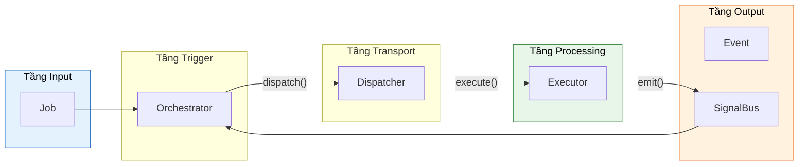

# Cheat Sheet - Các khái niệm cốt lõi

> Trang này cung cấp **tổng quan nhanh** về 6 thành phần chính của Flutter Orchestrator. Click vào link "Chi tiết" để xem đầy đủ.

---

## 🔄 Luồng dữ liệu tổng quan



---

## 🎯 Job (Công việc)

**Là gì:** Data class mô tả hành động cần thực hiện. Chỉ chứa data, **KHÔNG** chứa logic.

```dart
class FetchUserJob extends BaseJob {
  final String userId;
  
  FetchUserJob(this.userId) : super(
    id: generateJobId(),
    timeout: Duration(seconds: 30),
    retryPolicy: RetryPolicy(maxRetries: 3),
  );
}
```

| Tính năng | Mô tả |
|-----------|-------|
| `timeout` | Tự động hủy nếu quá hạn |
| `retryPolicy` | Tự động retry với exponential backoff |
| `cancellationToken` | Cho phép hủy giữa chừng |
| `strategy` | Cache-First, SWR, Placeholder |

📖 **Chi tiết:** [Job - Định nghĩa hành động](../concepts/job.md)

---

## 🎼 Orchestrator (Nhạc trưởng)

**Là gì:** Quản lý UI State. Dispatch Job, lắng nghe kết quả qua Event Hooks, cập nhật State.

```dart
class UserCubit extends OrchestratorCubit<UserState> {
  void loadUser(String id) {
    emit(state.copyWith(isLoading: true));
    dispatch(FetchUserJob(id));
  }
  
  @override
  void onActiveSuccess(JobSuccessEvent event) {
    emit(state.copyWith(user: event.dataAs<User>(), isLoading: false));
  }
  
  @override
  void onActiveFailure(JobFailureEvent event) {
    emit(state.copyWith(error: event.error.toString(), isLoading: false));
  }
}
```

| Hook | Khi nào gọi |
|------|-------------|
| `onActiveSuccess` | Job thành công |
| `onActiveFailure` | Job thất bại |
| `onProgress` | Cập nhật tiến trình |
| `onPassiveEvent` | Event từ nơi khác |

📖 **Chi tiết:** [Orchestrator - Quản lý UI State](../concepts/orchestrator.md)

---

## 🚦 Dispatcher (Điều phối viên)

**Là gì:** Singleton router. Nhận Job, tìm Executor phù hợp, xử lý Offline Queue.

```dart
// Đăng ký trong main()
Dispatcher().register<FetchUserJob>(FetchUserExecutor(api));
Dispatcher().register<LoginJob>(LoginExecutor(api));

// Dispatch (thường qua Orchestrator)
dispatcher.dispatch(FetchUserJob('123'));
```

| Tính năng | Mô tả |
|-----------|-------|
| `register<T>()` | Đăng ký Executor cho Job type |
| `dispatch()` | Gửi Job, trả về job ID |
| NetworkAction | Tự động queue khi offline |
| Poison Pill | Bỏ job sau 5 lần fail |

📖 **Chi tiết:** [Dispatcher - Trung tâm điều phối](../concepts/dispatcher.md)

---

## ⚙️ Executor (Người thực thi)

**Là gì:** Nơi chứa Business Logic. Thuần Dart, dễ test. Nhận Job, return Result hoặc throw.

```dart
class FetchUserExecutor extends BaseExecutor<FetchUserJob> {
  final ApiService _api;
  FetchUserExecutor(this._api);

  @override
  Future<User> process(FetchUserJob job) async {
    job.cancellationToken?.throwIfCancelled();
    return await _api.getUser(job.userId);
  }
}
```

| Tính năng tự động | Mô tả |
|-------------------|-------|
| Error Boundary | Bắt exception, emit Failure |
| Retry | Tự động retry theo RetryPolicy |
| Cache | Đọc/ghi cache tự động |
| Progress | `emitProgress()`, `emitStep()` |

📖 **Chi tiết:** [Executor - Xử lý Logic](../concepts/executor.md)

---

## 📨 Event (Sự kiện)

**Là gì:** Kết quả từ Executor. Được broadcast qua SignalBus.

| Event | Mô tả | Hook |
|-------|-------|------|
| `JobSuccessEvent<T>` | Thành công với data | `onActiveSuccess` |
| `JobFailureEvent` | Thất bại với error | `onActiveFailure` |
| `JobCancelledEvent` | Bị hủy | `onActiveCancelled` |
| `JobTimeoutEvent` | Quá hạn | `onActiveTimeout` |
| `JobProgressEvent` | Tiến trình 0.0-1.0 | `onProgress` |
| `JobRetryingEvent` | Đang retry | `onJobRetrying` |

📖 **Chi tiết:** [Event - Các loại sự kiện](../concepts/event.md)

---

## 📡 SignalBus (Kênh tín hiệu)

**Là gì:** Event Bus trung tâm. Executor emit, Orchestrator listen.

```dart
// Singleton instance (Framework tự quản lý)
SignalBus.instance

// Scoped bus cho testing
final testBus = SignalBus.scoped();
```

| Tính năng | Mô tả |
|-----------|-------|
| Broadcast Stream | Nhiều listeners cùng lúc |
| Fire-and-forget | Gửi đi là xong |
| Scoped Bus | Isolated cho testing |

📖 **Chi tiết:** [SignalBus - Giao tiếp sự kiện](../concepts/signal_bus.md)

---

## 🚀 Tiếp theo

- [Getting Started](getting_started.md) - Hello World step-by-step
- [Integration](integration.md) - Bloc/Provider/Riverpod
- [Offline Support](../advanced/offline_support.md) - NetworkAction
