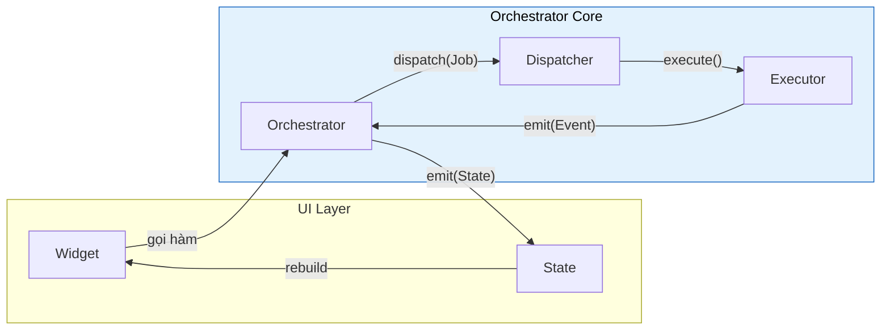
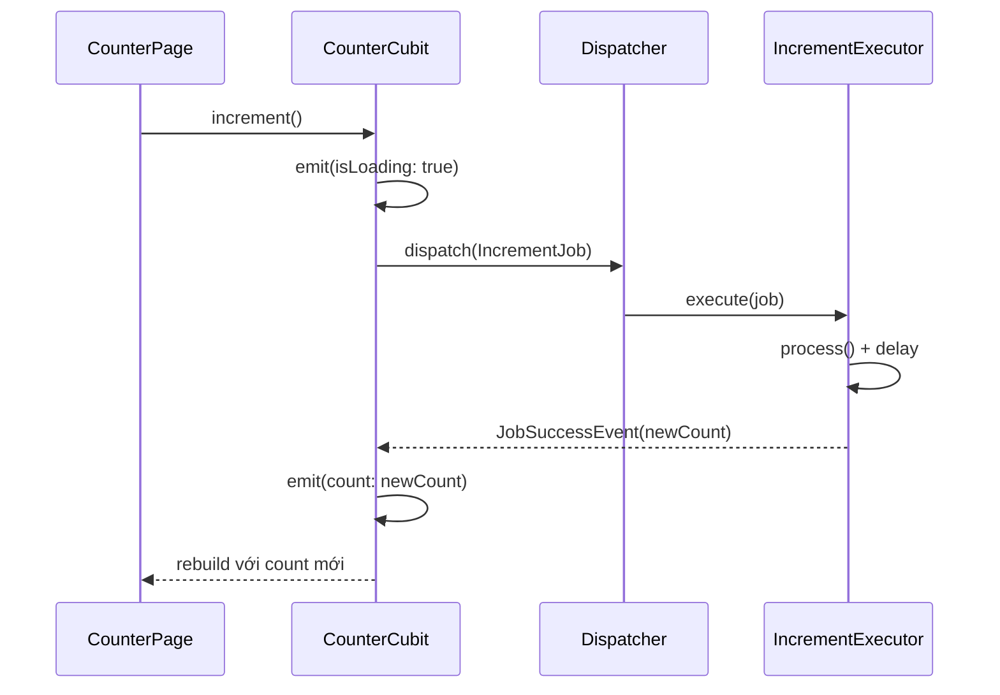

# Bắt đầu với Flutter Orchestrator

Hướng dẫn này sẽ giúp bạn tích hợp **Flutter Orchestrator** vào dự án Flutter chỉ trong vài phút.

### Tổng quan luồng hoạt động



---

## 1. Cài đặt

Thêm các package vào `pubspec.yaml`:

```yaml
dependencies:
  flutter:
    sdk: flutter
  
  # Core framework (BẮT BUỘC)
  orchestrator_core: ^0.3.3
  
  # Chọn 1 integration phù hợp:
  orchestrator_bloc: ^0.3.1      # Nếu dùng flutter_bloc
  # orchestrator_provider: ^0.3.1  # Nếu dùng provider
  # orchestrator_riverpod: ^0.3.1  # Nếu dùng riverpod

  # Flutter platform support (offline queue, cleanup, DevTools observer)
  orchestrator_flutter: ^0.3.2

dev_dependencies:
  build_runner: ^2.4.0
  orchestrator_generator: ^0.3.1  # Tuỳ chọn code generation
```

---

## 2. Setup trong main()

```dart
import 'package:flutter/material.dart';
import 'package:orchestrator_core/orchestrator_core.dart';
import 'package:orchestrator_flutter/orchestrator_flutter.dart';

void main() async {
  WidgetsFlutterBinding.ensureInitialized();

  // 1. Đăng ký tất cả Executors TRƯỚC runApp
  _registerExecutors();

  // 2. (Tuỳ chọn) Flutter integrations (offline queue, cleanup...)
  OrchestratorFlutter.initialize();

  // 3. (Tuỳ chọn) Enable debug logging
  OrchestratorConfig.enableDebugLogging();

  // 4. (Tuỳ chọn) DevTools observer (debug/profile only)
  initDevToolsObserver();
  
  runApp(const MyApp());
}

void _registerExecutors() {
  final dispatcher = Dispatcher();

  final counterService = CounterService();
  
  // Mỗi Job type -> Một Executor
  dispatcher.register<IncrementJob>(IncrementExecutor(counterService));
  dispatcher.register<DecrementJob>(DecrementExecutor(counterService));
  // ... thêm các executors khác
}
```

---

## 3. Hello World - Counter App

Hãy tạo một **Counter App** theo phong cách Orchestrator để hiểu luồng hoạt động.

### Bước 1: Định nghĩa Job

Job là **data class** mô tả hành động cần thực hiện:

```dart
import 'package:orchestrator_core/orchestrator_core.dart';

class IncrementJob extends BaseJob {
  IncrementJob() : super(id: generateJobId('increment'));
}

class DecrementJob extends BaseJob {
  DecrementJob() : super(id: generateJobId('decrement'));
}
```

### Bước 2: Tạo Executor

Executor chứa **business logic** thực tế:

```dart
class CounterService {
  int _count = 0;

  int increment() => ++_count;
  int decrement() => --_count;
}

class IncrementExecutor extends BaseExecutor<IncrementJob> {
  final CounterService _service;

  IncrementExecutor(this._service);

  @override
  Future<int> process(IncrementJob job) async {
    // Giả lập network delay
    await Future.delayed(const Duration(milliseconds: 300));
    return _service.increment();
  }
}

class DecrementExecutor extends BaseExecutor<DecrementJob> {
  final CounterService _service;

  DecrementExecutor(this._service);

  @override
  Future<int> process(DecrementJob job) async {
    await Future.delayed(const Duration(milliseconds: 300));
    return _service.decrement();
  }
}
```

### Bước 3: Định nghĩa State

State phải **immutable** với method `copyWith`:

```dart
class CounterState {
  final int count;
  final bool isLoading;
  final String? error;

  const CounterState({
    this.count = 0,
    this.isLoading = false,
    this.error,
  });

  CounterState copyWith({int? count, bool? isLoading, String? error}) {
    return CounterState(
      count: count ?? this.count,
      isLoading: isLoading ?? this.isLoading,
      error: error,
    );
  }
}
```

### Bước 4: Tạo Orchestrator

Orchestrator quản lý UI State và xử lý kết quả:

```dart
import 'package:orchestrator_bloc/orchestrator_bloc.dart';

class CounterCubit extends OrchestratorCubit<CounterState> {
  CounterCubit() : super(const CounterState());

  void increment() {
    emit(state.copyWith(isLoading: true));
    dispatch(IncrementJob());
  }

  void decrement() {
    emit(state.copyWith(isLoading: true));
    dispatch(DecrementJob());
  }

  @override
  void onActiveSuccess(JobSuccessEvent event) {
    final newCount = event.dataAs<int>();
    emit(state.copyWith(count: newCount, isLoading: false));
  }

  @override
  void onActiveFailure(JobFailureEvent event) {
    emit(state.copyWith(isLoading: false, error: event.error.toString()));
  }
}
```

### Bước 5: Gắn vào UI

```dart
import 'package:flutter_bloc/flutter_bloc.dart';

class CounterPage extends StatelessWidget {
  @override
  Widget build(BuildContext context) {
    return BlocProvider(
      create: (_) => CounterCubit(),
      child: BlocBuilder<CounterCubit, CounterState>(
        builder: (context, state) {
          return Scaffold(
            appBar: AppBar(title: Text('Orchestrator Counter')),
            body: Center(
              child: state.isLoading
                  ? CircularProgressIndicator()
                  : Column(
                      mainAxisAlignment: MainAxisAlignment.center,
                      children: [
                        Text('Count: ${state.count}', style: TextStyle(fontSize: 48)),
                        if (state.error != null)
                          Text('Error: ${state.error}', style: TextStyle(color: Colors.red)),
                      ],
                    ),
            ),
            floatingActionButton: Column(
              mainAxisSize: MainAxisSize.min,
              children: [
                FloatingActionButton(
                  onPressed: () => context.read<CounterCubit>().increment(),
                  child: Icon(Icons.add),
                ),
                SizedBox(height: 8),
                FloatingActionButton(
                  onPressed: () => context.read<CounterCubit>().decrement(),
                  child: Icon(Icons.remove),
                ),
              ],
            ),
          );
        },
      ),
    );
  }
}
```

### Bước 6: Đăng ký Executors

```dart
void main() {
  // QUAN TRỌNG: Đăng ký TRƯỚC runApp
  final dispatcher = Dispatcher();
  final counterService = CounterService();

  dispatcher.register<IncrementJob>(IncrementExecutor(counterService));
  dispatcher.register<DecrementJob>(DecrementExecutor(counterService));
  
  runApp(MaterialApp(home: CounterPage()));
}
```

---

## 4. Kết quả

🎉 **Chúc mừng!** Bạn đã hoàn thành flow cơ bản:



**Lợi ích đạt được:**
- ✅ Business logic tách biệt hoàn toàn khỏi UI
- ✅ Executor có thể test độc lập (thuần Dart)
- ✅ UI chỉ quan tâm đến State
- ✅ Dễ dàng thêm retry, timeout, caching...

---

## 📦 Example Project

> Xem code hoàn chỉnh tại: **[examples/simple_counter](../../../examples/simple_counter)**

```bash
cd examples/simple_counter
flutter pub get
flutter run
```

Cấu trúc project:
```
lib/
├── jobs/counter_jobs.dart        # IncrementJob, DecrementJob, ResetJob
├── executors/counter_executor.dart  # Business logic
├── cubit/
│   ├── counter_state.dart        # Immutable state
│   └── counter_cubit.dart        # Orchestrator
└── main.dart                     # Entry point
```

---

## Tiếp theo

- [Core Concepts](core_concepts.md) - Tổng quan nhanh về các khái niệm
- [Integration](integration.md) - Chi tiết về Bloc/Provider/Riverpod
- [Job](../concepts/job.md) - Tất cả tính năng của Job (Retry, Timeout, Cache...)

