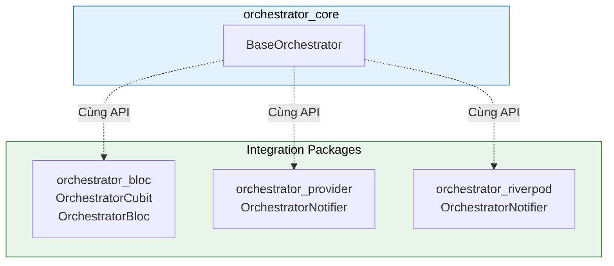
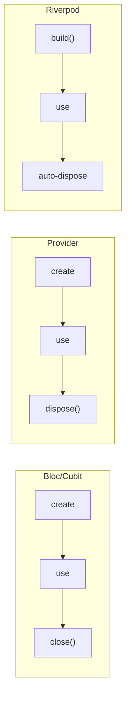

# Tích hợp với State Management Libraries

Flutter Orchestrator cung cấp sẵn các package tích hợp với các thư viện quản lý state phổ biến. Bạn có thể sử dụng **Bloc**, **Provider**, hoặc **Riverpod** mà vẫn giữ được toàn bộ sức mạnh của kiến trúc Orchestrator.

> **Điểm chung:** Tất cả integration packages đều cung cấp **cùng một API** như `BaseOrchestrator` - chỉ khác cách tích hợp với UI.

### So sánh nhanh



---

## 1. Chọn Package nào?

| Package | Thư viện | Khi nào dùng | Learning Curve |
|---------|----------|--------------|----------------|
| `orchestrator_bloc` | flutter_bloc | Dự án lớn, đã quen với Bloc | Trung bình |
| `orchestrator_provider` | provider | Dự án nhỏ-vừa, nhẹ nhàng | Thấp |
| `orchestrator_riverpod` | flutter_riverpod | Cần DI mạnh, compile-time safety | Cao |

**Khuyến nghị:**
- **Mới bắt đầu:** `orchestrator_provider` (đơn giản nhất)
- **Dự án lớn:** `orchestrator_bloc` (nhiều tooling hỗ trợ)
- **Cần DI + Testing mạnh:** `orchestrator_riverpod`

---

## 2. Tích hợp Bloc (`orchestrator_bloc`)

### 2.1. Cài đặt

```yaml
dependencies:
  flutter_bloc: ^8.0.0
  orchestrator_bloc: ^1.0.0
  orchestrator_core: ^1.0.0
```

### 2.2. OrchestratorCubit (Khuyến nghị)

`OrchestratorCubit` extends `Cubit` và tích hợp sẵn toàn bộ Orchestrator functionality.

```dart
// 1. Định nghĩa State
class UserState {
  final User? user;
  final bool isLoading;
  final String? error;
  
  const UserState({this.user, this.isLoading = false, this.error});
  
  UserState copyWith({User? user, bool? isLoading, String? error}) {
    return UserState(
      user: user ?? this.user,
      isLoading: isLoading ?? this.isLoading,
      error: error,
    );
  }
}

// 2. Tạo Cubit
class UserCubit extends OrchestratorCubit<UserState> {
  UserCubit() : super(const UserState());
  
  void loadUser(String userId) {
    emit(state.copyWith(isLoading: true, error: null));
    dispatch(FetchUserJob(userId));
  }
  
  @override
  void onActiveSuccess(JobSuccessEvent event) {
    final user = event.dataAs<User>();
    emit(state.copyWith(user: user, isLoading: false));
  }
  
  @override
  void onActiveFailure(JobFailureEvent event) {
    emit(state.copyWith(isLoading: false, error: event.error.toString()));
  }
}
```

### 2.3. OrchestratorBloc (Event-Driven)

Nếu bạn thích pattern event-driven của Bloc:

```dart
// Custom events
class LoadUserEvent extends OrchestratorBlocEvent {
  final String userId;
  const LoadUserEvent(this.userId);
}

// Bloc
class UserBloc extends OrchestratorBloc<OrchestratorBlocEvent, UserState> {
  UserBloc() : super(const UserState()) {
    on<LoadUserEvent>(_onLoadUser);
  }
  
  void _onLoadUser(LoadUserEvent event, Emitter<UserState> emitter) {
    emitter(state.copyWith(isLoading: true));
    dispatch(FetchUserJob(event.userId));
  }
  
  @override
  void onActiveSuccess(JobSuccessEvent event) {
    emit(state.copyWith(user: event.dataAs<User>(), isLoading: false));
  }
}
```

### 2.4. Widget Integration

```dart
class UserPage extends StatelessWidget {
  @override
  Widget build(BuildContext context) {
    return BlocProvider(
      create: (_) => UserCubit()..loadUser('123'),
      child: BlocBuilder<UserCubit, UserState>(
        builder: (context, state) {
          if (state.isLoading) {
            return CircularProgressIndicator();
          }
          if (state.error != null) {
            return Text('Error: ${state.error}');
          }
          return Text('Hello, ${state.user?.name}');
        },
      ),
    );
  }
}
```

### 2.5. API Reference

| Property/Method | Mô tả |
|-----------------|-------|
| `dispatch(job)` | Gửi Job và tracking |
| `cancelJob(id)` | Hủy tracking job |
| `hasActiveJobs` | true nếu có job đang chạy |
| `getJobProgress(id)` | Lấy tiến trình 0.0-1.0 |
| `emit(state)` | Cập nhật state (từ Cubit) |

---

## 3. Tích hợp Provider (`orchestrator_provider`)

### 3.1. Cài đặt

```yaml
dependencies:
  provider: ^6.0.0
  orchestrator_provider: ^1.0.0
  orchestrator_core: ^1.0.0
```

### 3.2. OrchestratorNotifier

`OrchestratorNotifier` extends `ChangeNotifier`:

```dart
// 1. Định nghĩa State (giống như trên)
class UserState { ... }

// 2. Tạo Notifier
class UserNotifier extends OrchestratorNotifier<UserState> {
  UserNotifier() : super(const UserState());
  
  void loadUser(String userId) {
    state = state.copyWith(isLoading: true, error: null);
    dispatch(FetchUserJob(userId));
  }
  
  @override
  void onActiveSuccess(JobSuccessEvent event) {
    state = state.copyWith(user: event.dataAs<User>(), isLoading: false);
  }
  
  @override
  void onActiveFailure(JobFailureEvent event) {
    state = state.copyWith(isLoading: false, error: event.error.toString());
  }
}
```

**Lưu ý:** Với Provider, bạn gán `state = newState` thay vì gọi `emit()`. Nó sẽ tự động `notifyListeners()`.

### 3.3. Widget Integration

```dart
class UserPage extends StatelessWidget {
  @override
  Widget build(BuildContext context) {
    return ChangeNotifierProvider(
      create: (_) => UserNotifier()..loadUser('123'),
      child: Consumer<UserNotifier>(
        builder: (context, notifier, _) {
          final state = notifier.state;
          
          if (state.isLoading) {
            return CircularProgressIndicator();
          }
          if (state.error != null) {
            return Text('Error: ${state.error}');
          }
          return Text('Hello, ${state.user?.name}');
        },
      ),
    );
  }
}
```

### 3.4. API Reference

| Property/Method | Mô tả |
|-----------------|-------|
| `state` | Getter/Setter cho state hiện tại |
| `dispatch(job)` | Gửi Job và tracking |
| `cancelJob(id)` | Hủy tracking job |
| `hasActiveJobs` | true nếu có job đang chạy |
| `getJobProgress(id)` | Lấy tiến trình 0.0-1.0 |
| `dispose()` | Cleanup (gọi bởi Provider) |

---

## 4. Tích hợp Riverpod (`orchestrator_riverpod`)

### 4.1. Cài đặt

```yaml
dependencies:
  flutter_riverpod: ^2.0.0
  orchestrator_riverpod: ^1.0.0
  orchestrator_core: ^1.0.0
```

### 4.2. OrchestratorNotifier

`OrchestratorNotifier` extends `Notifier` của Riverpod:

```dart
// 1. Định nghĩa State
class UserState { ... }

// 2. Tạo Notifier
class UserNotifier extends OrchestratorNotifier<UserState> {
  @override
  UserState buildState() => const UserState();
  
  void loadUser(String userId) {
    state = state.copyWith(isLoading: true, error: null);
    dispatch(FetchUserJob(userId));
  }
  
  @override
  void onActiveSuccess(JobSuccessEvent event) {
    state = state.copyWith(user: event.dataAs<User>(), isLoading: false);
  }
  
  @override
  void onActiveFailure(JobFailureEvent event) {
    state = state.copyWith(isLoading: false, error: event.error.toString());
  }
}

// 3. Định nghĩa Provider
final userProvider = NotifierProvider<UserNotifier, UserState>(
  UserNotifier.new,
);
```

**Lưu ý:** 
- Override `buildState()` thay vì truyền vào constructor
- Bus subscription được setup TỰ ĐỘNG trong `build()`

### 4.3. Widget Integration

```dart
class UserPage extends ConsumerWidget {
  @override
  Widget build(BuildContext context, WidgetRef ref) {
    final state = ref.watch(userProvider);
    final notifier = ref.read(userProvider.notifier);
    
    // Trigger load on first build
    useEffect(() {
      notifier.loadUser('123');
      return null;
    }, []);
    
    if (state.isLoading) {
      return CircularProgressIndicator();
    }
    if (state.error != null) {
      return Text('Error: ${state.error}');
    }
    return Text('Hello, ${state.user?.name}');
  }
}
```

### 4.4. API Reference

| Property/Method | Mô tả |
|-----------------|-------|
| `buildState()` | Override để cung cấp initial state |
| `state` | Getter/Setter cho state (từ Notifier) |
| `dispatch(job)` | Gửi Job và tracking |
| `cancelJob(id)` | Hủy tracking job |
| `hasActiveJobs` | true nếu có job đang chạy |
| `getJobProgress(id)` | Lấy tiến trình 0.0-1.0 |
| `dispose()` | Cleanup (tự động bởi Riverpod) |

---

## 5. So sánh chi tiết

### 5.1. Cú pháp cập nhật State

| Package | Cách cập nhật State |
|---------|---------------------|
| Bloc | `emit(newState)` |
| Provider | `state = newState` |
| Riverpod | `state = newState` |

### 5.2. Cách cung cấp Initial State

| Package | Cách cung cấp |
|---------|---------------|
| Bloc | `super(initialState)` |
| Provider | `super(initialState)` |
| Riverpod | Override `buildState()` |

### 5.3. Lifecycle



---

## 6. Event Hooks (Giống nhau cho tất cả)

Tất cả integration packages đều cung cấp **cùng hooks** như BaseOrchestrator:

| Hook | Mô tả |
|------|-------|
| `onActiveSuccess` | Job thành công |
| `onActiveFailure` | Job thất bại |
| `onActiveCancelled` | Job bị hủy |
| `onActiveTimeout` | Job timeout |
| `onProgress` | Cập nhật tiến trình |
| `onJobStarted` | Job bắt đầu |
| `onJobRetrying` | Job đang retry |
| `onActiveEvent` | All active events |
| `onPassiveEvent` | Events từ nơi khác |

---

## 7. Migration Guide

### 7.1. Từ Provider sang Bloc

```dart
// Before (Provider)
class UserNotifier extends OrchestratorNotifier<UserState> {
  void loadUser() {
    state = state.copyWith(isLoading: true);
    dispatch(FetchUserJob());
  }
  
  @override
  void onActiveSuccess(JobSuccessEvent event) {
    state = state.copyWith(user: event.dataAs<User>());
  }
}

// After (Bloc)
class UserCubit extends OrchestratorCubit<UserState> {
  void loadUser() {
    emit(state.copyWith(isLoading: true)); // state -> emit
    dispatch(FetchUserJob());
  }
  
  @override
  void onActiveSuccess(JobSuccessEvent event) {
    emit(state.copyWith(user: event.dataAs<User>())); // state -> emit
  }
}
```

### 7.2. Từ Bloc sang Riverpod

```dart
// Before (Bloc)
class UserCubit extends OrchestratorCubit<UserState> {
  UserCubit() : super(const UserState());
}

// After (Riverpod)
class UserNotifier extends OrchestratorNotifier<UserState> {
  @override
  UserState buildState() => const UserState(); // super() -> buildState()
}

final userProvider = NotifierProvider<UserNotifier, UserState>(
  UserNotifier.new,
);
```

---

## 8. Best Practices

### ✅ Nên làm

- **Chọn một package** và dùng xuyên suốt dự án
- **Đăng ký Executors** trong `main()` trước khi setup providers
- **Xử lý tất cả failure cases** trong hooks
- **Dispose đúng cách** (tự động với Bloc/Riverpod, hoặc manual với Provider)

### ❌ Không nên làm

```dart
// ❌ SAI: Trộn lẫn nhiều state management
class MyWidget extends StatelessWidget {
  void build(BuildContext context) {
    // Dùng cả Bloc VÀ Provider trong cùng dự án
    final bloc = context.read<MyBloc>();
    final notifier = context.read<MyNotifier>();
  }
}

// ❌ SAI: Gọi dispatch từ Widget
ElevatedButton(
  onPressed: () {
    Dispatcher().dispatch(MyJob()); // KHÔNG! Dùng Cubit/Notifier
  },
)
```

---

## Xem thêm

- [Getting Started](getting_started.md) - Setup ban đầu
- [Orchestrator](../concepts/orchestrator.md) - Chi tiết về BaseOrchestrator
- [Testing](../advanced/testing.md) - Cách test với mock
